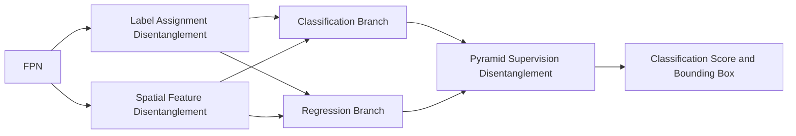

# Disentangle Your Dense Object Detector

**论文**：[官方论文原文](https://arxiv.org/abs/2107.02963)  
**PDF**：[官方 PDF](https://arxiv.org/pdf/2107.02963.pdf)  
**代码**：[官方实现](https://github.com/chenminghao3/DDOD)  
**发表**：ACM MM 2021  
**类别**：General Object Detection · Dense Object Detection

## 一句话总结

DDOD 发现单阶段密集检测器把分类正样本、回归正样本、两支空间采样位置以及各 FPN 层监督强度强行绑定在一起，并用 **Label Assignment Disentanglement、Spatial Feature Disentanglement、Pyramid Supervision Disentanglement** 三个机制分别解除这些约束。

## 研究背景与问题

第一个冲突来自标签分配：常见实现只有被分类分支判为正样本的位置才能训练回归，但“容易识别类别”的位置不一定拥有最准确的边界信息。论文用匹配质量同时观察分类置信度与 IoU，并让两个任务采用不同权重，从而生成两套正负标签。

第二个冲突来自并行检测头：分类和回归通常读取同一 FPN 特征、使用同样规则卷积感受野。DDOD 在两条子网的第一层分别放置 deformable convolution，使分类偏向物体判别区域，回归偏向轮廓与边界，而不是共享固定采样网格。

第三个冲突来自金字塔监督：P3 拥有大量样本，P7 样本稀少，却在总损失中被等权处理。FPN hierarchical loss 根据每层分类、回归正样本数分别计算权重，增强高层特征的梯度，论文观察到最大收益集中在大目标 AP。

## 方法总览

DDOD 不改变 RetinaNet、FCOS、ATSS 的主体范式：FPN 仍产生多尺度特征，检测头仍输出类别与边界框。变化发生在训练样本编码、检测头首层采样和各层损失聚合处，因此可挂接到多种密集检测器，额外推理开销很小。

## 方法详解

### 标签分配解耦

候选预测与第 \(i\) 个真值框的匹配质量写成

\[
C_{i,\pi(i)}=\mathbf{1}[\pi(i)\in\Omega_i]\,\hat p_{\pi(i)}(i)^{1-\alpha}\,\operatorname{IoU}(b_i,\hat b_{\pi(i)}(i))^{\alpha}.
\]

\(\Omega_i\) 是中心落在真值框内的候选集合，\(\hat p\) 是前景概率，\(\hat b\) 是预测框，\(\alpha\) 控制定位质量的比重。每个 FPN 层先取质量最高的 top-\(K\) 候选，再像 ATSS 一样使用批统计自适应阈值。分类采用 \(\alpha_{cls}=0.8\)，回归采用 \(\alpha_{reg}=0.5\)：前者更重 IoU、后者保留更多分类信息参与编码，实质上得到两套正样本集合。

### 空间特征解耦

deformable convolution 在位置 \(p_i\) 的输出为

\[
F(p_i)=\sum_{p_n\in R}w(p_n)x(p_i+p_n+\Delta p_n),
\]

其中 \(R\) 是规则卷积网格，\(\Delta p_n\) 是任务分支自行预测的偏移。DDOD 只把分类、回归子网的第一层卷积替换为 DCN；这比在后层替换更有效，因为两支从 FPN 输出开始就形成不同采样区域。

### 金字塔监督解耦

设 \(n^i_{cls}\)、\(n^i_{reg}\) 是第 \(i\) 层正样本数，\(N_{cls}\)、\(N_{reg}\) 是所有层计数集合，则权重由计数线性映射到 \([1,2]\)：样本越少，权重越大，最终 \(L=w_{cls}L_{cls}+w_{reg}L_{reg}\)。计数采用截至当前迭代的移动累计，避免单批标签分布造成剧烈波动；实验中 P3 通常取 1，P7 通常取 2。

## 实验与证据

- **数据与基线**：COCO 2017 上以 MMDetection 默认 1×、ResNet-50 为主，分别接入 RetinaNet、FCOS、ATSS；另在 WIDER FACE 验证迁移能力。
- **通用增益**：RetinaNet 从 36.5 AP 到 38.5，FCOS 提升 2.4 AP，ATSS 从 39.4 到 41.6；三种检测器的大目标收益最明显。
- **组件消融**：ATSS 基线 39.4 AP；仅标签分配解耦 40.4，仅空间特征解耦 40.6，仅监督解耦 40.0，三者同时为 41.6。监督解耦单独使 \(AP_L\) 从 49.6 提到 52.6。
- **关键选择**：首层 DCN 为 40.6 AP，放到第 2/3/4 层分别为 40.3/40.1/40.1；移动平均 Linear-Interpolate 达 40.0，优于 Sum-Reweight 与 Linear-Reweight 系列。
- **强模型**：COCO test-dev 上 DDOD-X + Res2Net-101-DCN 单尺度 52.5 AP，多尺度测试、Soft-NMS 与更强增强后为 55.0 AP；DDOD-Face 在 WIDER FACE easy/medium/hard 为 97.0/96.4/93.5 AP。

## 对 YOLO-Agent 的启发

可把 DDOD 注册为 `ddod_head_adapter`：在 YOLO 的多尺度输出层分别维护 `cls_assigner(alpha=0.8)` 与 `reg_assigner(alpha=0.5)`；把分类头、回归头接收 FPN/PAN 特征后的第一层卷积替换为独立 DCN；损失聚合器按每个尺度的两类正样本累计数生成层权重。主对照必须是完全相同的 YOLO 权重初始化、增强、输入尺寸、epoch 与 NMS，仅关闭这三处改动，并另跑三个单组件分支。

Harness 记录 COCO AP、AP50、AP75、APS/M/L、FPS、显存和正样本层分布。升级门槛建议为三种随机种子平均 AP 至少增加 1.5，且 \(AP_L\) 至少增加 2.0；若额外推理时延超过 5%、分类与回归正样本重合率仍接近 100%、关闭任一组件后收益不变，或增益只来自更换训练 recipe，则判定接入失败。

## 优点

- 三个改动对应三种可测量的绑定关系，能独立开关并定位收益来源。
- 对 RetinaNet、FCOS、ATSS 都有超过 2 AP 的提升，说明不依赖单一标签分配器。
- 训练期重加权与少量 DCN 即可工作，未引入新的后处理流程。

## 局限

- DCN、双标签分配与累计统计会增加实现复杂度，部署端未必支持可变形卷积。
- 最优 \(\alpha\) 与层权重范围来自 COCO/ATSS 消融，换成无锚 YOLO 需要重新校准。
- WIDER FACE 结果还叠加 SSH、DIoU、DCN 等配置，不能把全部增益归因于 DDOD。

## 评分

- **创新性：8.5/10**：把密集检测器中的三类隐式绑定转化为清晰的解耦设计。
- **实验充分性：9/10**：包含多检测器、组件、超参数、位置和重加权策略验证。
- **工程可迁移性：8/10**：接口明确，但 DCN 与双 assigner 需要改造训练框架。
- **综合评分：8.5/10**：适合作为 YOLO 多任务冲突诊断与改进的高优先级候选。
