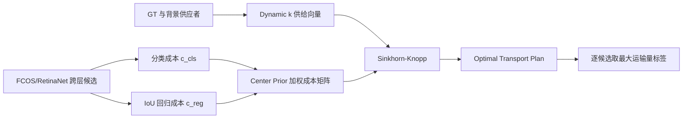

# OTA: Optimal Transport Assignment for Object Detection

**论文**：[官方论文页面](https://arxiv.org/abs/2103.14259)  
**代码**：[官方代码](https://github.com/Megvii-BaseDetection/OTA)  
**发表**：CVPR 2021

## 一句话总结

OTA（Optimal Transport Assignment）把一张图像内所有 GT、背景与跨 FPN 层候选点放进同一个最优传输问题，用分类损失和回归损失构成运输成本，再由 Sinkhorn-Knopp 迭代求出全局标签分配，并以 Dynamic k 为不同目标自适应决定正样本供给量。

## 研究背景与问题

FCOS、ATSS、PAA 等密集检测器通常先为每个 GT 独立挑选候选，再用中心区域、最大 IoU 或最小损失解决一个候选同时匹配多个 GT 的冲突。OTA 指出，这种逐 GT 的局部决策忽略了其他目标：在遮挡或目标紧邻时，把歧义候选交给某个 GT，会同时改变它相对其他 GT 和背景的训练梯度。

论文因此不再询问“某个 GT 最适合哪些点”，而是询问“全图标签如何以最小总代价运到所有候选”。GT 被视为正标签供应者，背景是负标签供应者，每个 anchor/point 是需求为 1 的接收者；anchor-free 点也被统一称作 anchor。这样，正负划分与歧义消解成为同一次全局优化，而非两个互相割裂的规则。

## 方法总览

对图像中的 $m$ 个 GT 和 $n$ 个候选，OTA 构造 $(m+1)\times n$ 成本矩阵：前 $m$ 行对应 GT，最后一行对应背景。每个 GT 的供给量由 Dynamic k 估计，背景供给剩余的 $n-\sum_i s_i$ 个负标签；Sinkhorn-Knopp 输出连续运输计划，最终把每个候选分给运输量最大的供应者。Center Prior 只作为成本惩罚稳定早期训练，不负责最终冲突裁决。

## 方法详解

### 1. 最优传输形式

一般 OT 在供应量 $s_i$、需求量 $d_j$ 和单位成本 $c_{ij}$ 下求运输计划 $\pi$：

$$
\min_{\pi}\sum_{i=1}^{m}\sum_{j=1}^{n}c_{ij}\pi_{ij},\quad
\sum_i\pi_{ij}=d_j,\quad \sum_j\pi_{ij}=s_i,\quad \pi_{ij}\ge 0.
$$

$\pi_{ij}$ 是供应者 $i$ 向候选 $j$ 运送的标签量；约束保证每个候选收到完整需求，且每个供应者用完供给。检测中的大规模线性规划通过 Sinkhorn-Knopp 矩阵迭代近似求解。

### 2. 检测成本与背景供应者

GT $i$ 到候选 $j$ 的前景成本为：

$$
c^{fg}_{ij}=\mathcal L_{cls}(P^{cls}_j,G^{cls}_i)+
\alpha\mathcal L_{reg}(P^{box}_j,G^{box}_i).
$$

$P^{cls}_j、P^{box}_j$ 是候选预测的类别与框，$G^{cls}_i、G^{box}_i$ 是 GT 类别与框；论文默认以 Focal Loss 和 IoU Loss 构造成本，$\alpha=1.5$ 平衡分类与定位。背景到候选的成本 $c^{bg}_j=\mathcal L_{cls}(P^{cls}_j,\varnothing)$，只衡量其成为背景的分类代价。求解后，训练损失和反向传播沿用 FCOS/ATSS，OTA 仅改变 assigner；论文报告训练时间增加低于 20%，测试阶段无额外成本。

### 3. Center Prior 与 Dynamic k

每个 GT 在每个 FPN 层选择中心距离最近的 $r^2$ 个候选，名单外位置在成本矩阵中加常数惩罚。它限制早期搜索区域，却允许 OT 在候选集合内依据全局总成本处理重叠目标。Dynamic k 则对每个 GT 取预测框 IoU 最高的 $q=20$ 个候选并求 IoU 和，将其作为该 GT 的正标签供给量 $s_i$；可良好回归某目标的候选越多，该目标获得的正样本越多。

运输计划并不是直接作为软标签参与最终检测损失。论文在求得 $\pi^*$ 后，对每个候选比较所有供应者送达的标签量，选择最大者作为离散标签；随后仍按原 FCOS 流程计算分类和回归损失。这样 OT 求解器只负责监督关系，既不会改变推理头，也避免把连续运输量与分类置信度混为一谈。背景供应量显式补齐总需求，还保证未被任何 GT 低成本解释的候选能够稳定落入负类。

## 实验与证据

实验使用 COCO 2017（118k train、5k val、20k test-dev）与 CrowdHuman。默认消融为 ImageNet 预训练 ResNet-50-FPN、FCOS、90k 次迭代、batch 16；对比包括 FCOS、ATSS、FreeAnchor、AutoAssign、PAA、LLA 等。

训练默认初始学习率 0.01，在 60k、80k 次迭代各衰减十倍，使用 8 张 GPU 和 SGD。成本矩阵中的回归项采用 IoU Loss，真正反向传播的框回归改用 GIoU Loss 并乘 2；论文还使用 IoU branch。这个区分很重要：assigner 的“匹配成本”与检测器最终优化的“训练损失”可以不同，复现时不应把两者误写成同一个公式。

- COCO val 上，FCOS 基线为 38.3 AP；OTA 在无辅助分支时为 39.2 AP，加入 IoU branch 与 Center Prior 后为 40.3 AP，再加入 Dynamic k 达到 40.7 AP。相同 OTA 用于单 anchor RetinaNet 也得到 40.7 AP，说明方法不依赖 anchor-free 表达。
- 固定 $k=10$ 或 12 时均为 40.3 AP；Dynamic k 为 40.7 AP。$k=1$ 的一对一分配只有 36.5 AP，说明短训练日程下密集检测仍需要一对多监督。
- 当中心半径 $r$ 从 3 增至 7，ATSS 的平均歧义候选数由 2.1 增至 36.3，AP 从 39.4 降至 37.2；OTA 的歧义数仅由 0.2 变为 0.3，AP 为 40.6、40.7、40.4。预先用 Min Area、Max IoU、Min Loss 人工消歧后再做 OTA，AP 分别为 40.0、40.3、40.3，均低于完整 OTA 的 40.7。
- COCO test-dev 上，ResNet-101-FPN 的 OTA 为 45.3 AP，高于 ATSS 43.6、AutoAssign 44.5、PAA 44.6；CrowdHuman val 上 OTA 的 MR/AP/Recall 为 46.6/88.4/95.1，优于 LLA 的 47.9/88.0/94.0，体现全局分配在拥挤场景的优势。

## 对 YOLO-Agent 的启发

接入点应放在 YOLO 检测头输出解码后、分类与框损失计算前的 assigner：保留现有 backbone、neck、增强、回归损失和 NMS，只把逐 GT 匹配替换为 OTA 成本矩阵与 Sinkhorn 求解。对照组至少设为当前 assigner、固定 $k=10$ 的 OTA、Dynamic k OTA；同时记录 COCO AP/AP75、每图歧义候选数、assigner 耗时和峰值显存，拥挤数据再记录 CrowdHuman MR。

建议失败阈值与论文证据绑定：若 Dynamic k 相对固定 $k$ 的 AP 增益低于 0.2，说明当前预测 IoU 尚不足以估计供给；若 $r=3\rightarrow7$ 时 AP 下降超过 0.5 或歧义候选明显上升，说明成本权重、背景供给或 Sinkhorn 数值稳定性有问题；若总训练耗时增加超过 20%，则应先做候选裁剪和矩阵批处理，而不是改变检测头。

## 优点

- 正负划分、正样本数量与多 GT 冲突在统一的全局目标中求解。
- 同时适用于 anchor-based 与 anchor-free 检测器，推理图不变。
- Dynamic k 利用当前模型的回归能力为不同尺度、遮挡程度目标分配不同数量的监督。
- CrowdHuman 结果直接证明其对密集遮挡和歧义候选的处理能力。

## 局限

- Sinkhorn 与全候选成本矩阵增加训练时间和实现复杂度，候选过多时显存压力明显。
- Center Prior、$\alpha$、迭代设置等仍需配置，并非完全无先验。
- Dynamic k 依赖训练中的预测 IoU，冷启动阶段仍需要 Center Prior 稳定搜索。

## 评分

- **方法创新：9/10**——首次把密集检测标签分配系统化为全局最优传输。
- **实验充分：9/10**——覆盖 COCO、CrowdHuman、固定/动态供给与歧义候选分析。
- **工程可用：8/10**——推理免费且有官方代码，但训练求解器需要额外优化。
- **综合评分：8.8/10**。
