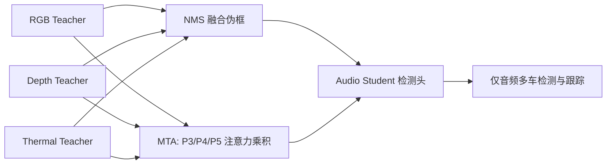

# There Is More Than Meets the Eye: Self-Supervised Multi-Object Detection and Tracking With Sound by Distilling Multimodal Knowledge

**论文**：[CVF 论文页](https://openaccess.thecvf.com/content/CVPR2021/html/Valverde_There_Is_More_Than_Meets_the_Eye_Self-Supervised_Multi-Object_Detection_CVPR_2021_paper.html)  
**代码**：官方代码链接未提供  
**会议**：CVPR 2021

## 一句话总结

MM-DistillNet 用 RGB、depth、thermal 三个 EfficientDet-D2 教师产生融合伪框，并以 Multi-Teacher Alignment（MTA）对齐 P3/P4/P5 注意力分布，把多传感器视觉知识蒸馏到仅输入 8 通道音频频谱图的学生，实现移动平台上的多车检测与跟踪。

## 研究背景与问题

以往声源视觉定位多依赖静止相机、单目标或 RGB 辅助，在夜间、恶劣天气和遮挡场景中容易失效。本文关注更困难的设定：平台自身可以移动，场景中有多辆车，而推理阶段只能读取声音。训练时虽然有同步 RGB、深度、热成像和音频，但没有为音频手工标注检测框。

作者利用不同模态事件的时间共现：视觉教师先在各自模态中定位车辆，经过融合后的框作为音频学生的伪标签；中间特征层则通过 MTA 把多个教师对车辆区域的注意力共同传给学生。论文同时发布 MAVD 数据集，包含超过 113,000 帧时间同步的 RGB、depth、thermal、audio 数据，来自 24 次车辆行驶、持续采集 3 个月。

## 方法总览

三个教师与音频学生都采用 EfficientDet-D2。教师输入分别为 768×768 的 RGB、三通道深度、单通道热图；学生输入由 8 个单声道麦克风的 STFT 频谱图拼接而成，并缩放到 768×768。教师各自预测车辆框，经 IoU=0.5 的 NMS 合并为统一伪标签；学生同时优化输出层 Focal Loss 与 P3/P4/P5 上的 MTA Loss。推理时只保留音频学生。

## 方法详解

### 音频预训练任务与伪标签

8 通道频谱图不能直接复用三通道 ImageNet 权重。作者先设计自监督 pretext task：使用多个视觉教师预测场景中的车辆数量，再让 EfficientNet+MLP 从音频频谱图分类车辆数。得到的 backbone 权重用于初始化最终音频检测器，使网络先学会“声学模式与车辆数量”的联系。

检测输出以教师融合框为监督，使用

\[
L_{focal}=-\alpha(1-p_t)^\gamma\log p_t,
\]

其中 \(p_t\) 是正确类别概率，\(\alpha=0.25\) 为难例权重，\(\gamma=2.0\) 控制对易分类背景的降权。NMS 解决三个教师预测框数量和位置不一致的问题，而不是简单平均框坐标。

### Multi-Teacher Alignment

对层 \(j\in\{P3,P4,P5\}\)，先沿通道平均激活并取指数 \(r\)，得到学生注意力 \(Q_s^j=F_{avg}^r(A_s)\)。第 \(i\) 个教师模态也产生对应分布；多教师注意力不是求均值，而是计算各模态激活分布的乘积：

\[
Q_t^j=\prod_{i=1}^{N}F_{avg}^r(A_{t_i}).
\]

乘积会强化多个模态共同支持的车辆区域，同时仍允许单一模态提供较弱但非零的独占线索。归一化学生和教师注意力后，以 KL divergence 对齐：

\[
L_{MTA}=\beta\sum_j KL_{div}\left(
\frac{Q_s^j}{\|Q_s^j\|_2},
\frac{Q_t^j}{\|Q_t^j\|_2}\right),\quad \beta=0.5.
\]

总目标为 \(L_{total}=\delta L_{focal}+\omega L_{MTA}\)。输出层伪框负责“检测什么和在哪里”，MTA 负责在多尺度中间表示上整合不同传感器的互补证据。

MTA 的乘积聚合也解释了平均激活基线为何较弱：平均会让某个模态的大面积高响应稀释其他教师的局部证据，乘积则突出共同高响应区域；同时归一化后的非零独占响应仍能传递热成像夜间车辆等单模态信息。复现时应先保证各传感器投影到统一视觉坐标，否则注意力乘积会把标定误差误认为教师分歧。

## 实验与证据

RGB 教师使用 COCO、PASCAL VOC、ImageNet 的车辆标签训练；depth 教师使用由 Argoverse 双目生成的深度及映射到 2D 的车辆框；thermal 教师使用 FLIR。主要对手是 StereoSoundNet，以及单教师 2M-DistillNet、教师激活平均和 Ranking/Pairwise/AFD 等蒸馏损失。

在 MAVD 多目标检测上，StereoSoundNet 的 mAP、AP50、AP75 分别为 44.05、62.38、41.46；完整 MM-DistillNet 达到 61.62、84.29、59.66，中心距离误差指标由 3.00/2.24 降到 1.27/0.69。简单平均三个教师激活只得到 51.63 mAP，说明收益来自 MTA 的联合分布，而非教师数量本身。

损失比较中，RGB 单教师的 Ranking、Pairwise、AFD、MTA 分别得到 44.05、40.45、44.27、44.58 mAP；三教师平均 Ranking、平均 AFD、平均 MTA 为 56.16、58.50、59.46，直接多教师 MTA 达到 61.62。跟踪上，MOTA 从 StereoSoundNet 的 16.94% 提升至 26.96%，ID switches 从 1327 降到 1078，FP 从 3696 降到 2758。

模态消融表明 RGB+thermal 为 55.81 mAP，三模态为 61.10；加上车辆数 pretext task 后达到 61.62，即 +0.52，并使平均训练损失降低 27.55%。RGB 和 thermal 分别主导日间和夜间收益，depth 单独贡献较弱，但加入三模态后仍有正作用。

## 对 YOLO-Agent 的启发

可将 YOLO 教师改为三条同步模态分支，而学生使用音频 spectrogram 输入；接入点有两个：检测头用 NMS 融合伪框，neck 的 P3/P4/P5 用 MTA 对齐。若现有 YOLO-Agent 没有多模态数据，先用 RGB+thermal 双教师验证，再加入 depth，避免一次性引入全部传感器误差。

对照组应包含仅 RGB 教师、RGB+thermal、三教师平均注意力、三教师 MTA，以及是否使用车辆数量 pretext。论文相关验收阈值为：完整方案若不能超过三教师平均 MTA 的 59.46 mAP，说明联合注意力实现无效；若加入 pretext 后增益低于 0.52 AP 或训练损失未明显下降，则初始化任务没有迁移价值；跟踪 MOTA 若不高于 16.94% 基线，需检查音频时间同步与检测框关联。还应把白天/夜晚分别统计，若 thermal 在夜间不增益，应停止加入该教师，排查标定与同步偏移。

## 优点

- 推理只用音频，能补足夜间、遮挡及视觉传感器退化场景。
- MTA 明确利用 RGB、深度、热成像在 P3/P4/P5 的互补注意力。
- 无需音频人工框标注，教师预测与车辆计数任务都提供自监督信号。
- 同时验证多目标检测与跟踪，并发布大规模同步多模态数据集。

## 局限

- 训练依赖昂贵且严格同步、标定的多传感器系统，伪标签会继承教师错误。
- 模态独立假设用于注意力概率乘积，但现实传感器观测并非真正独立。
- 数据与任务集中在移动车辆，迁移到低声或静止物体并不直接。
- 音频定位容易受混响、环境噪声和麦克风阵列几何变化影响。

## 评分

**9.0/10**。论文的问题设定、专用损失和数据集高度一致，音频-only 推理结果有说服力；主要限制是数据采集门槛和车辆场景专用性。
