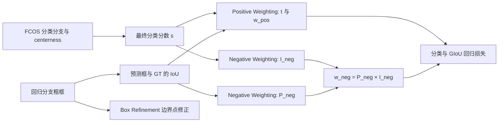

# A Dual Weighting Label Assignment Scheme for Object Detection

**论文**：[arXiv 页面](https://arxiv.org/abs/2203.09730)  
**代码**：未提供  
**发表**：CVPR 2022

## 一句话总结

Dual Weighting（DW）不再由同一个软标签同时推导正、负损失权重，而是用分类分数与 IoU 的一致性确定正权重，再把负权重拆成“成为负样本的概率”和“负样本条件下的重要性”，从而给模糊 anchor 更细粒度的监督。

## 研究背景与问题

密集检测器在每个位置产生大量候选框，训练时必须决定每个候选对分类正项、分类负项和回归项贡献多大。GFL、VFL、TOOD 等软标签分配方法通常先构造质量量度，再令正负权重高度耦合；两个候选即使错误类型不同，只要综合质量相近，也可能得到近似相同的正负权重。

DW 从 COCO 的排序与匹配规则反推监督：真正有价值的正候选必须同时具有高分类排序分数和高定位 IoU；负候选是否危险则取决于两件事——它有多大概率无法满足 IoU 标准，以及它当前是否以高分排在前面。论文因此把正、负权重分别建模，而不是把负权重简单写成正权重的补集。

该方法以 FCOS 为实现载体。每个 GT 先通过中心先验形成 candidate bag，袋外位置直接按普通负样本处理；袋内 anchor 才计算独立的 `w_pos`、`w_neg` 与回归权重。论文还加入可选的 Box Refinement，用预测边界点修正粗框，使用于分配的 IoU 更可靠。

## 方法总览

DW 的核心关系是：候选袋限定可信统计范围；Positive Weighting 选择分类、定位同时可靠的 anchor；Negative Weighting 专门压制“高分但定位差”的危险候选；Box Refinement 则提升 IoU 估计质量，但不是 DW 生效的必要条件。

## 方法详解

### 1. 正权重：分类与定位的一致性

对袋内候选，论文定义

$$
t=s\cdot \mathrm{IoU}^{\beta},\qquad
w_{pos}=e^{\mu t}\cdot t.
$$

`s` 是分类分支与 centerness 相乘后的最终分类分数；`IoU` 是预测框与对应 GT 的交并比；`β` 控制定位质量在一致性指标中的比重；`μ` 放大不同候选之间的权重差异。每个实例的 `w_pos` 最后在 candidate bag 内按权重和归一化，且回归权重取同一 `w_pos`，让高分且高 IoU 的位置同时主导分类正项和回归学习。

### 2. 负权重：概率与困难度解耦

COCO 在 IoU 0.5 到 0.95 上评估 AP，因此论文令负样本概率 `P_neg` 随 IoU 单调下降：IoU 小于 0.5 时为 1，大于 0.95 时为 0，中间区间使用通过 `(0.5,1)` 与 `(0.95,0)` 的函数 `-k·IoU^{γ1}+b`。这里 `k、b` 由端点约束确定，`γ1` 调节曲线形状。

候选已经是负样本时，其危害由排序分数决定：

$$
I_{neg}=s^{\gamma_2},\qquad w_{neg}=P_{neg}\cdot I_{neg}.
$$

`γ2` 控制对高分困难负样本的偏好。于是同样具有较小 `w_pos` 的两个候选中，IoU 更低且分类分数更高者会得到更大的 `w_neg`，被更强地向背景方向压制。

### 3. 损失与框修正

检测总损失为 `L_det=L_cls+βL_reg`。袋内 `N` 个 anchor 的分类项使用 `-w_pos log s-w_neg log(1-s)`，回归项使用 `w_pos·GIoU(b,b*)`；袋外 `M` 个位置使用面向背景的 Focal Loss。这里 `b`、`b*` 分别是预测框和 GT 框。

Box Refinement 从粗回归图的左、上、右、下四条边出发，为每条边预测一个边界点及偏移，再在相应位置采样回归图并聚合为精框。它的作用是改善参与 `w_pos/w_neg` 计算的 IoU，而不是另起一套标签分配规则。

从优化行为看，DW 同时处理两种排序错误：`w_pos` 把“分类和定位都好”的位置推到列表前方，`w_neg` 把“分类很自信但框不合格”的位置压到后方。低分但定位尚可的候选不会因为与后一类候选拥有相近综合质量而受到同样惩罚，这正是解耦权重相对 GFL、VFL 的信息增量。袋内归一化还使不同目标的正监督总量可比较，避免大目标仅因覆盖更多位置而获得更大损失占比。

从优化行为看，DW 同时处理两种排序错误：`w_pos` 把“分类和定位都好”的位置推到列表前方，`w_neg` 把“分类很自信但框不合格”的位置压到后方。低分但定位尚可的候选不会因为与后一类候选拥有相近综合质量而受到同样惩罚，这正是解耦权重相对 GFL、VFL 的信息增量。袋内归一化还使不同目标的正监督总量可比较，避免大目标仅因覆盖更多位置而获得更大损失占比。

## 实验与证据

论文在 MS COCO 上训练，train/val/test-dev 分别使用约 115K、5K、20K 图像；主要消融采用 FCOS、ResNet-50-FPN、12 epoch（1×）日程。对比包括 FCOS、ATSS、PAA、OTA、AutoAssign、GFL、VFL、GFLv2、MuSu 与 TOOD。

- FCOS 基线为 38.6 AP；DW 达到 41.5 AP、59.8 AP50、45.0 AP75，加入 Box Refinement 后为 42.2 AP。
- 仅保留正权重时为 39.5 AP；去掉 `I_neg` 或 `P_neg` 分别为 40.5、40.0 AP；把负权重改回 `1-w_pos` 为 40.7 AP，证明双因素负权重不可被简单补集替代。
- candidate bag 使用距离阈值、各 FPN 层 top-k 或软中心先验时，AP 在 41.1—41.5 间，说明收益不是依赖某个固定候选选择规则。
- `β=5、μ=5、γ1=2、γ2=2` 为默认设置；负权重超参数组合的 AP 位于 41.0—41.5，敏感性较低。
- COCO test-dev 多尺度训练下，DW-ResNet-101 为 46.2 AP；加入 Box Refinement 为 46.8 AP。ResNet-101-DCN 下对应 49.3 与 49.5 AP。

## 对 YOLO-Agent 的启发

明确接入点应放在 YOLO 的正负样本分配与分类损失之间：保留现有候选生成和回归参数化，用当前类别置信度 `s` 与解码框 IoU 计算 DW 权重，并让 `w_pos` 同时加权分类正项与 IoU 类回归项。若模型没有独立 centerness，可直接使用类别分数或对象性与类别分数的乘积，但两种定义必须作为独立实验。

建议设置三个对照组：原始 YOLO 分配器；只使用 `w_pos` 的一致性加权；完整 `w_pos+w_neg`。主指标使用 COCO AP、AP75 与 APS，并记录高分误检数量，因为论文收益直接来自排序质量和困难负样本抑制。验收阈值可设为：完整 DW 相对原始分配器 AP 至少提升 0.5，且必须优于“只用 `w_pos`”至少 0.3 AP；若 AP75 不升、APS 下降超过 0.3，或高分误检增加，则判定接入失败。论文已提示 DW 会减少有效训练样本，小目标退化应优先尝试按目标尺寸调整 `β/μ`，而不是直接扩大 candidate bag。

## 优点

- 正、负权重具有不同统计含义，能够区分“低分好框”和“高分差框”。
- 不依赖额外质量预测分支，基础 DW 不增加 FCOS 的参数与训练成本。
- 对 candidate bag 构造和负权重超参数较稳健，并能迁移到不同 backbone 与检测头。

## 局限

- 权重依赖训练中实时预测的分类分数与 IoU，早期噪声仍需 candidate bag 隔离。
- 高权重集中在目标中心会减少有效样本，论文观察到小目标收益低于大目标。
- Box Refinement 增加了特定的边界点预测结构，迁移到不同回归表示时需要重新设计。

## 评分

- **创新性：9/10**——把长期耦合的正负标签权重拆成两个可解释目标。
- **实验充分性：9/10**——包含权重组成、候选袋、超参数、框修正和多骨干验证。
- **可迁移性：8/10**——双权重易接入密集检测器，框修正部分则更依赖具体回归头。
- **综合评分：8.7/10**
