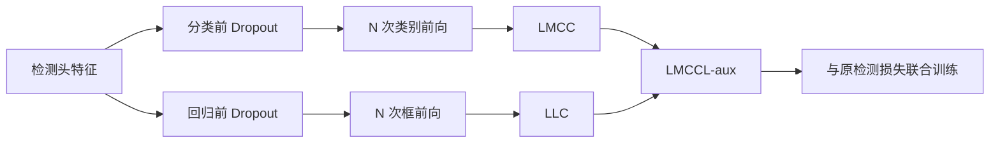

# Multiclass Confidence and Localization Calibration for Object Detection

**论文**：[CVF 官方论文页面](https://openaccess.thecvf.com/content/CVPR2023/html/Pathiraja_Multiclass_Confidence_and_Localization_Calibration_for_Object_Detection_CVPR_2023_paper.html)  
**代码**：未提供官方代码链接  
**发表**：CVPR 2023  
**类别**：训练期置信度与定位校准

## 一句话总结

Multiclass Confidence and Localization Calibration（MCCL）在分类层和回归层前加入 Monte-Carlo Dropout，通过多次随机前向得到类别 logits 与框参数分布，再以 Multi-Class Confidence Calibration（MCC）约束多类别置信度、以 Localization Calibration（LC）约束框 IoU 与定位确定性，从训练阶段同时降低域内和域外 D-ECE。

## 研究背景与问题

目标检测的置信度不仅应对应类别是否正确，还应反映框的位置是否可靠。传统 ECE 只按分数分箱，无法体现中心坐标、宽高等框属性；Temperature Scaling 又只用一个温度缩放密集预测图中的所有 logits，难以适配不同类别、位置和尺度。论文用 location-dependent D-ECE 表明，FCOS 等检测器在图像边界、不同宽高区域的校准误差明显不同，并且域偏移后问题更严重。

MCCL 的核心不是直接最小化 D-ECE，而是先估计预测分布的均值与方差。类别分支需要校准完整 $K$ 维置信度，而非只校准 argmax 类；回归分支需要让“框参数预测是否稳定”与“框实际重叠是否准确”一致。两类信息分别建模，最后作为辅助损失与原检测任务联合优化。

## 方法总览

对每个正位置执行 $N$ 次带 dropout 的随机前向，得到类别 logits 矩阵 $z_n\in\mathbb R^{N\times K}$ 和框参数矩阵 $r_n\in\mathbb R^{N\times J}$。类别均值经 softmax 得到 $\bar s_n$，类别方差映射为确定性 $c_n$；框参数均值用于原回归损失，框参数方差及各维均值差异合成定位确定性 $g_n$。MCC 对齐类别融合量与 mini-batch 类别出现率，LC 对齐 $g_n$ 与预测框 IoU。

## 方法详解

### 1. 类别与定位确定性

类别 logits 的方差为 $d_n\in\mathbb R^K$，确定性定义为

$$c_n=1-\tanh(d_n).$$

方差越大，$c_n$ 越低。框的第 $j$ 个参数均值和方差为 $\mu_{n,j},\sigma_{n,j}^2$，组合均值为 $\mu_{n,com}=\frac{1}{J}\sum_j\mu_{n,j}$，联合不确定性为

$$u_n=\frac{1}{J}\sum_{j=1}^{J}\left[\sigma_{n,j}^2+(\mu_{n,j}-\mu_{n,com})^2\right],$$

定位确定性 $g_n=1-\tanh(u_n)$。第一项反映随机前向的不稳定，第二项汇总框参数均值间的离散程度。

### 2. Multi-Class Confidence Calibration

类别 $k$ 的均值置信度与确定性融合为

$$v_{l,n}[k]=\frac{\bar s_{l,n}[k]+c_{l,n}[k]}{2}.$$

在 mini-batch 的 $N_b$ 张图与所有正位置上，MCC 损失为

$$L_{MCC}=\frac{1}{K}\sum_{k=1}^{K}\left|\frac{1}{M}\sum_{l,n}v_{l,n}[k]-\frac{1}{M}\sum_{l,n}q_{l,n}[k]\right|,$$

其中 $M=N_bN_{pos}$，$q_{l,n}[k]$ 是类别 $k$ 是否为该正位置真值的指示量。它同时约束预测类和非预测类，而不是只处理最高分标签。

### 3. Localization Calibration

定位损失比较实际重叠与确定性：

$$L_{LC}=\frac{1}{N_b}\sum_{l=1}^{N_b}\frac{1}{N_{pos}^l}\sum_n\left|\operatorname{IoU}(\hat b_{n,l},b_{n,l}^{*})-g_{n,l}\right|.$$

总辅助项为

$$L_{MCCL-aux}=L_{MCC}+\beta L_{LC},$$

$\beta$ 控制定位校准贡献。原分类和回归损失接收多次前向的均值 logits 与均值框参数，使任务预测与校准统计使用同一中心估计。

MCC 与 LC 的监督对象不同：MCC 在 mini-batch 内按类别汇总，目标是让融合置信度跟类别出现频率一致；LC 则逐个正框比较 IoU 与定位确定性。前者可以校准未被选为最高分的类别，后者让同一分类分数在不同位置、宽高条件下体现不同的框可靠程度。论文因此使用多维 D-ECE，而不是只按置信度的一维 ECE。

训练时 dropout 放在分类层和回归层之前，多次前向共同形成分布；推理并不要求继续做 Monte-Carlo 采样。该设置把额外成本集中在训练阶段，但均值 logits、均值框参数、MCC 和 LC 必须来自同一组随机前向，否则确定性与任务输出会失去对应关系。

论文的 D-ECE 分箱同时包含置信度、中心横纵坐标、宽和高，因此边界区域的过度自信会被单独暴露。若复现只计算普通一维 ECE，即使损失实现正确，也无法验证 LC 是否改善了位置相关校准。

## 实验与证据

- **数据集**：域内使用 Sim10K、KITTI、Cityscapes、COCO、PASCAL VOC 2012；域外包含 Sim10K→Cityscapes、KITTI→Cityscapes、Cityscapes→Foggy Cityscapes、COCO→Cor-COCO、Cityscapes→BDD100K，以及 VOC→Clipart/Watercolor/Comic。
- **主要基线**：CNN 检测器 FCOS、ViT 检测器 Deformable DETR；校准对比 Temperature Scaling、MDCA、AvUC。指标为 IoU 0.5 下、同时按置信度及框中心/宽高分箱的 D-ECE，并报告 AP@0.5 或 mAP。
- **FCOS 域内**：VOC 的 D-ECE 从 11.88 降到 6.02，Cityscapes 从 9.40 到 7.64，COCO 从 15.42 到 14.94；检测精度大体保持。
- **FCOS 域外**：Sim10K→Cityscapes 从 9.51 降到 6.60，Cityscapes→Foggy Cityscapes 从 11.18 到 8.97，COCO→Cor-COCO 从 15.90 到 14.45。
- **Deformable DETR**：KITTI 域内 D-ECE 从 6.31 降到 3.87；其余域内与域外设置也一致下降，说明方法不局限于 FCOS。
- **组件消融**：在 Sim10K→Cityscapes 上，基线 9.51，只有均值输入为 8.87，只用 MCC 为 8.63，只用 LC 为 9.12，完整 MCCL 为 6.60；两项互补。COCO→Cor-COCO 上完整方法为 14.45，优于 TS、AvUC、MDCA。
- **MC 次数**：训练单次迭代从 $N=1$ 的 0.143 秒增到 $N=15$ 的 0.463 秒；COCO-Corr 的 D-ECE 在 $N=10$ 时为 15.87，但更多前向并非始终继续改善。

## 对 YOLO-Agent 的启发

YOLO-Agent 可在 decoupled head 的分类卷积末端和 DFL/框回归末端前插入 dropout，仅在训练时执行多次随机前向；正样本集合沿用 YOLO assigner，类别均值进入原分类损失，框均值进入 IoU/DFL 损失，另加 $L_{MCC}$ 与 $L_{LC}$。对照组应包含原 YOLO、只用均值预测、仅 MCC、仅 LC、完整 MCCL、以及验证集 Temperature Scaling；评估必须分域内和至少一种腐蚀域外集。

失败判据应使用 D-ECE 与 AP 双指标：若完整组合在 Sim10K→Cityscapes 类场景不能优于单项并接近论文 9.51→6.60 的降幅，说明两种确定性没有互补；若 AP@0.5 的损失超过论文域内观察到的最大 0.98，则校准代价过高。MC 前向数不应盲目增加，论文在 COCO-Corr 上 $N=10$ 的 15.87 优于 $N=15$ 的 16.17；若训练时间接近 0.463 秒级却无进一步 D-ECE 改善，应回退。

## 优点

- 同时处理完整类别向量和框定位，不是分类校准方法的直接移植。
- 在 FCOS 与 Deformable DETR、域内与域外场景均验证有效。
- MCC、LC、均值预测与 MC 次数都有独立消融。

## 局限

- 多次 Monte-Carlo 前向显著增加训练时间，且收益随次数并不单调。
- 定位不确定性把不同框参数的方差与均值差异压成单一标量，物理含义较粗。
- 方法降低 D-ECE，但部分数据集的 AP 有轻微下降，不能替代精度约束。

## 评分

- **方法完整性：高**：类别、定位和不确定性形成闭环。
- **实验广度：高**：覆盖多数据集、多域偏移和两类检测器。
- **训练成本：较高**：MC Dropout 多次前向是主要负担。
- **综合评价：推荐审慎接入**：适合安全敏感 YOLO 的训练期校准研究，但需严格控制开销。
