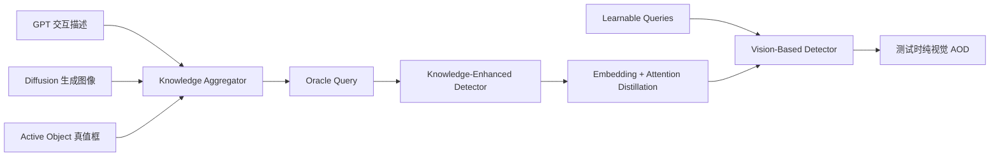

# Active Object Detection with Knowledge Aggregation and Distillation from Large Models

**论文**：[CVF 论文页](https://openaccess.thecvf.com/content/CVPR2024/html/Yang_Active_Object_Detection_with_Knowledge_Aggregation_and_Distillation_from_Large_CVPR_2024_paper.html)  
**代码**：官方代码链接未提供  
**会议**：CVPR 2024

## 一句话总结

KAD 用 GPT 交互描述、扩散模型生成图像和真值框组成 oracle query，训练 Knowledge-Enhanced Detector 精确关注正在发生状态变化的对象，再把其 decoder embedding 与 cross-attention 蒸馏给无需额外知识输入的 Vision-Based Detector。

## 研究背景与问题

Active Object Detection（AOD）要定位正在被人操作、因交互而发生状态变化的对象。难点不是识别类别，而是在同类静止干扰物中找出真正“活跃”的实例：切胡萝卜、开瓶盖或使用工具造成的外观变化可能很细微，仅靠单帧尺寸、形状和手—物关系并不稳定。

论文观察到，状态变化通常由可描述的交互触发。大语言模型可以给出对象可能参与的动作与工具，扩散模型可以把这些交互变成视觉示例，真值框则提供明确的空间先验。训练时这些知识能构成一个知道答案类别和位置的 oracle query；测试时答案未知，因此作者采用教师—学生蒸馏，让纯视觉学生模仿知识增强教师的定位方式。

## 方法总览

KAD 包含 Vision-Based Detector（学生）、Knowledge Aggregator、Knowledge-Enhanced Detector（教师）和 Knowledge Transfer。两套检测器共享 Transformer decoder 与检测头，区别在于学生输入 \(m\) 个可学习 queries，教师输入聚合三类先验后的单个 oracle query。训练结束后教师与外部知识全部移除，只保留学生推理。

## 方法详解

### Vision-Based Detector 与检测目标

图像经视觉 backbone 和 Transformer encoder 得到 \(E\in\mathbb R^{H\times W\times d}\)。学生 decoder 接收 \(Q_s\in\mathbb R^{m\times d}\)，输出候选 \(O_s\)，检测头预测 active confidence \(\hat s\) 与归一化框 \(\hat b\)。通过二分图匹配选择代价最低的预测，训练目标为

\[
L_v=BCE(s,\hat s_i)+\lambda\left(L_{giou}(b,\hat b_i)+\|b-\hat b_i\|_1\right),
\]

其中数据只标注 active object，故匹配目标 \(s=1\)；\(L_{giou}\) 和 L1 分别约束框重叠与坐标距离。

### Knowledge Aggregator 与 oracle query

Semantic Interaction Priors 由 GPT 为每个对象生成多条可能状态变化描述，例如“carrot is cutting using a knife”，语言编码器得到 \([t_1,\ldots,t_p]\)。Fine-grained Visual Priors 把这些描述作为扩散模型 prompt，生成图像并提取 \([v_1,\ldots,v_q]\)。作者分别用 self-attention 后 max-pooling 自适应选择重要概念：

\[
T=pool(self\_attn([t_1,\ldots,t_p])),
\]

视觉先验同理得到 \(V\)。Spatial Prior 是 active object 的归一化真值框 \(b\)。三者拼接为 \(Q_t=[T;V;b]\)，作为教师 decoder 的 oracle query，使其同时知道可能交互、对应外观和精确关注位置。

### Decoder 内部蒸馏

学生和教师共享 decoder/head 参数。对学生二分图匹配得到的第 \(i\) 个候选，在每个 decoder 层 \(l\) 对齐教师单 query 与学生候选：

\[
L_{attn}=\sum_l KL(A_t^l,A_{s_i}^l),\qquad
L_{emb}=\sum_l\left(1-\frac{(O_t^l)^TO_{s_i}^l}{\|O_t^l\|\|O_{s_i}^l\|}\right).
\]

\(A_t^l,A_{s_i}^l\) 是 cross-attention，KL 让学生学习教师“看哪里”；\(O_t^l,O_{s_i}^l\) 是中间 decoder embeddings，余弦损失让学生学习教师“如何表达 active object”。\(L_{distill}=L_{emb}+\eta L_{attn}\)，总目标 \(L=L_v+L_k+\alpha L_{distill}\)，其中 \(L_k\) 是知识增强教师的检测损失。

蒸馏只对学生二分图匹配到的候选执行，这一点避免了把教师单个 oracle candidate 强行复制给全部学生 queries。参数共享还使差异集中在 query 所携带的信息：教师的优势来自聚合先验，而不是更大的 decoder 或不同检测头。若复现时教师分支使用额外容量，学生提升将无法区分是知识聚合还是普通大模型蒸馏造成的。

训练与测试的边界必须严格分开。语义描述、生成图像与真值框只允许进入 Knowledge-Enhanced Detector；Vision-Based Detector 的输入仍是普通图像和 learnable queries。最终部署若仍查询对象类别或外部生成模型，就违背了 KAD 通过知识转移消除额外先验输入的核心设定。

## 实验与证据

论文在 Ego4D、Epic-Kitchens、MECCANO、100DOH 上评估 AP、AP50、AP75 等指标。Ego4D 的主要比较显示 KAD 达到最优；在不具备外部文本/图像知识的 MECCANO 和 100DOH 上，作者只使用空间 oracle query，仍分别相对先前最佳在 AP75/AP50/AP25 上提升 1.4/2.5/1.3 和 1.3/0.9/1.7 个百分点，说明教师—学生结构本身可利用空间提示。

Ego4D 知识消融中，纯 VBD 为 35.9 AP；仅 visual、semantic、spatial 分别为 36.0、36.5、36.1。visual+semantic 达 39.8，visual+spatial 为 38.5，spatial+semantic 为 37.9，三类全部加入达到 40.5 AP、60.6 AP50、41.9 AP75，证明先验互补而非单一模态主导。

蒸馏消融中，VBD 为 35.9 AP，只对齐 embedding 达到 38.3，再加 attention 达到 40.5。描述数量从 0、1、10 增加时 AP 为 37.3、37.5、40.5；生成图像数为 0、1、10、100 时 AP 为 37.9、38.1、39.5、40.5。聚合方式 max、avg、attentive 分别为 39.2、39.1、40.5，说明 self-attention 后池化比静态池化更有效。

## 对 YOLO-Agent 的启发

YOLO-Agent 可把 KAD 拆成训练期 oracle teacher 与部署 student：教师分支额外接收类别相关文本 embedding、生成图像 embedding 和 GT box embedding，学生仍使用正常 YOLO 图像特征。由于 YOLO 无 Transformer decoder，可在 neck 后增加轻量 query decoder 作为训练辅助头，或只在已有 transformer-YOLO 版本中对齐 matched query 的 embedding 与 cross-attention；导出时删除教师和知识聚合器。

对照组必须包括纯视觉 VBD、仅空间 oracle、空间+语义、三先验教师、仅 embedding KD、embedding+attention KD。论文给出的失败阈值很明确：完整方案若未超过 35.9 AP 基线，或 attention KD 未在 38.3 AP 的 embedding-only 上继续增益，则蒸馏接入失败；10 条描述若不能明显优于 1 条，或 attentive aggregation 不超过 max 的 39.2 AP，应停止扩大生成知识库并排查编码/聚合。对 YOLO 还应约束部署 FPS：教师删除后学生延迟必须与原模型基本一致，否则没有实现论文的“测试时无外部知识”。

## 优点

- 将 AOD 的状态变化机制显式表示为交互语义、视觉外观和空间位置三类知识。
- oracle query 只服务训练，通过 embedding 与 attention 蒸馏消除部署依赖。
- 消融完整验证先验类型、蒸馏位置、描述/图像数量和聚合方式。
- 在四个第一视角/交互数据集上验证，并能在缺少外部知识时退化为空间提示版本。

## 局限

- 训练使用真值框构造空间 oracle，教师获得了学生测试时不可能直接拥有的强提示。
- GPT 描述和扩散图像可能包含错误或偏差，知识生成成本也随类别数增长。
- 方法依赖 Transformer query/attention 结构，迁移到纯卷积密集检测头并不直接。
- 论文每幅图聚焦单个 active object，复杂多 active-instance 场景仍需扩展匹配与 oracle query。
- 生成描述和图像的覆盖度依赖预设对象类别，开放词汇或新工具交互时需要重新构建先验库。

## 评分

**8.9/10**。KAD 对 AOD 的问题建模具体，蒸馏使大模型知识真正可部署；扣分点是训练期 oracle 较强、生成知识质量不可控，以及对 Transformer 检测器的结构依赖。
