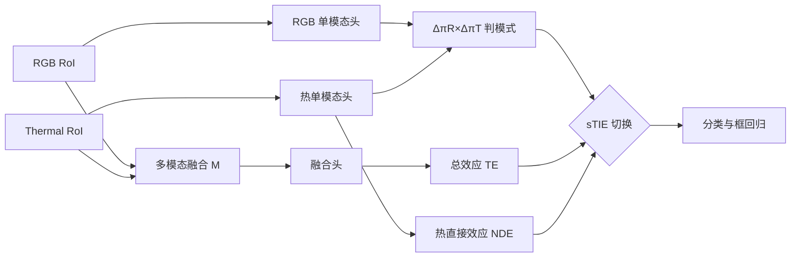

# Causal Mode Multiplexer: A Novel Framework for Unbiased Multispectral Pedestrian Detection

**论文**：[官方论文页面](https://openaccess.thecvf.com/content/CVPR2024/html/Kim_Causal_Mode_Multiplexer_A_Novel_Framework_for_Unbiased_Multispectral_Pedestrian_CVPR_2024_paper.html)  
**代码**：[官方代码与数据](https://github.com/ssbin0914/Causal-Mode-Multiplexer)  
**发表**：CVPR 2024  
**类别**：多光谱行人检测

## 一句话总结

Causal Mode Multiplexer（CMM）为融合特征、RGB 特征和热特征各接分类头，通过两单模态预测判断样本属于两模态都可见的 ROTO，还是只有一侧可靠的 RXTO/ROTX；前者学习 Total Effect，后者从融合分数中减去 thermal direct effect，形成 switchable Total Indirect Effect（sTIE），阻止模型把“热响应出现”等同于“有人”。

## 研究背景与问题

KAIST、CVC-14、FLIR 等多光谱行人数据主要由白天 `ROTO`（RGB 可见、热可见）和夜间 `RXTO`（RGB 不可见、热可见）构成，标签长期与热轮廓共现。检测器因而可能绕过真正的跨模态证据，直接依赖热分支；当白天行人隔着玻璃或穿隔热服形成 `ROTX`（RGB 可见、热不可见）时，这条捷径失效。论文新建 1000 图 ROTX-MP，其中 737 张为玻璃窗后行人、263 张为隔热服行人，专门测量这种分布外失败。

CMM 在已有多光谱检测器的 RoI 阶段保留融合变量 $M$，同时新增 RGB 直接路径 $X_R\to Y$ 和热直接路径 $X_T\to Y$。Common Mode 用融合、RGB、热三个分数的 Log-Harmonic 组合学习总效应；Differential Mode 将融合路径中的多模态间接效应与热直接效应分离，通过反事实 no-treatment 值估计 Natural Direct Effect（NDE），再从总效应中减去 NDE。

## 方法总览

模式不是由白天/夜间元数据指定，而由两个单模态分类头产生。将 RGB、热预测经零噪声 Gumbel-softmax 得近似 one-hot，令 $\Delta\pi$ 为前景概率减背景概率，$K_{mode}=\Delta\pi_R\Delta\pi_T$：ROTO 两侧同判前景，$K=1$，使用 TE；RXTO 或 ROTX 一侧判背景、一侧判前景，$K=-1$，使用 TIE。最终 $sTIE=TE-ReLU(-K_{mode})NDE$，并以交叉熵监督 sTIE 及两个单模态头。

## 方法详解

### 1. Common Mode

ROTO 中两模态均提供行人证据，融合头 $Y_m$、RGB 头 $Y_{x_R}$、热头 $Y_{x_T}$ 的 sigmoid 概率相乘后取 log，形成 Log-Harmonic 分数。与所有变量 no-treatment 状态相比得到 TE，允许模型利用单模态和融合信息的完整作用。

### 2. Differential Mode

RXTO/ROTX 中单模态证据冲突。作者将 $X_R$ 与 $M$ 设为 no-treatment，只保留热输入的直接路径，估计 NDE；TIE=TE−NDE 相当于剪掉最容易形成偏置的热直接效应，要求预测依赖经融合中介形成的证据。该规则虽为 ROTX 测试设计，但训练可从常规 ROTO/RXTO 自动学习两种模式。

### 3. CMM Loss

分类损失为 $L_Y(sTIE,y)+L_Y(Y_{x_R},y)+L_Y(Y_{x_T},y)$，再与原检测器的框回归、RPN 和 uncertainty module 损失相加。两个辅助头既提供模式判别，也防止其退化成不可解释的开关。

三类输入的模式符号具有具体含义：ROTO 中 RGB 与热头都偏向前景，两个 margin 同号，乘积为正；RXTO 中 RGB 偏背景、热偏前景，ROTX 则相反，两者乘积都为负。CMM 因而不是识别“白天或夜晚”，而是识别两模态是否对当前 RoI 给出一致证据。若一张图同时包含正常行人与玻璃后行人，模式可在 RoI 级分别切换，这比整图昼夜标签更符合检测任务。

反事实减法只作用于分类分数，不直接改变候选框几何。RPN 和框回归仍从原多模态特征学习，因此实验中 ROTX 的主要改善应表现为被热捷径漏掉的行人重新获得前景分数，而不是凭空移动框。复现时若定位误差主导失败，需要另查配准或特征融合，不能把所有问题归因于模态偏置。

辅助头的单模态准确率也必须单独报告，否则错误开关可能被最终融合分数掩盖。

## 实验与证据

现有数据上使用 KAIST/CVC-14 的 log-average Miss Rate 与 FLIR AP。CMM 在 KAIST All/Day/Night 为 8.54/9.60/5.93 MR，在 CVC-14 为 17.13/27.81/7.71 MR，在 FLIR 为 87.80 AP，说明去偏没有以全面牺牲同分布性能为代价。更关键的是跨 ROTX-MP：从 KAIST 训练时，HFF、CFT、MBNet、原 Kim 等方法为 36.95、3.64、18.88、21.69 AP，CMM 达 70.44；从 CVC-14 训练为 34.96，从 FLIR 训练为 57.09，而对应原基线仅 13.36、12.23。

去偏策略消融显示，KAIST 训练的 baseline 在 ROTX-MP 为 21.69 AP、KAIST All 为 8.67 MR；TE 训练/TIE 测试虽把 ROTX 提到 57.05，却使同域 MR 恶化到 27.27；TIE/TIE 为 56.45 与 12.10；sTIE 达 70.44，同时同域 8.54。CVC-14 与 FLIR 也呈同样趋势，说明按输入切换而非固定使用 TIE 是保持两类分布的关键。

## 对 YOLO-Agent 的启发

- **对照组**：固定同一 RGB-T 检测器、配准、增强与框分支，比较普通融合、固定 `TE→TIE`、固定 `TIE→TIE`、用真值可见性指定模式，以及由 RGB/热单模态头预测 $K_{mode}$ 的 CMM/sTIE，单独检验因果模式复用而非骨干容量。
- **指标**：记录 ROTO/RXTO/ROTX 的 AP、Recall 与 MR，外加 $K_{mode}$ 混淆矩阵、RGB/热单模态前景 margin、NDE/TE 比值、sTIE 中被减去的 thermal direct effect，以及模式切换前后的 FP/FN。
- **切片评估**：分别报告两模态都可见的 ROTO、仅 RGB 可靠的 RXTO 和热模态产生捷径的 ROTX，再按目标尺度、遮挡、玻璃/隔热材料、朝向和拥挤度分桶；ROTX 小目标专门检查 sTIE 是否误减真实行人响应。
- **成本指标**：测两个单模态辅助头、反事实分数与 RoI 级 $K_{mode}$ 开关增加的参数、显存和延迟，并验证 Gumbel-softmax/离散模式在导出后是否保持与训练时相同的 TE/TIE 路由。
- **失败判断**：若 CMM 相对普通融合对照组的 ROTX AP 提升不足 10 点，或 ROTO/RXTO 的 MR 恶化超过 1 点；若 $K_{mode}$ 塌缩为单一值、NDE 接近零、遮蔽热分支后 sTIE 无响应，或小目标 ROTX Recall 下降超过 3 点，则判定 CMM 未消除热模态直接效应偏置。

## 优点

- 明确指出数据组合缺口，并用 ROTX-MP 构造可证伪的分布外测试。
- 模式由单模态证据自动决定，不需要昼夜标签或测试时人工规则。
- 同时保留常规数据性能与 ROTX 泛化，优于固定因果效应切换。
- 辅助头、TE、NDE、模式值均可观测，便于诊断模态捷径。

## 局限

- 将热直接效应视为主要偏置较强；在真正只有热模态可靠的场景，过度削弱可能伤害召回。
- 单模态头本身可能受域偏移影响，错误模式判断会把后续因果计算全部带偏。
- ROTX-MP 仅 1000 图且场景集中于玻璃和隔热服，不能覆盖全部热失效机制。
- 因果图是任务建模假设，网络分数差分不等同严格可识别的现实因果效应。

## 评分

- **问题重要性**：★★★★★
- **方法清晰度**：★★★★☆
- **实验可验证性**：★★★★★
- **工程可迁移性**：★★★★☆
- **YOLO-Agent 参考价值**：★★★★★
