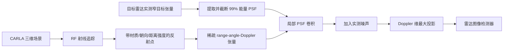

# RadSimReal: Bridging the Gap Between Synthetic and Real Data in Radar Object Detection With Simulation

**论文**：[官方论文页面](https://openaccess.thecvf.com/content/CVPR2024/html/Bialer_RadSimReal_Bridging_the_Gap_Between_Synthetic_and_Real_Data_in_CVPR_2024_paper.html)  
**代码**：论文给出官方项目页 `yuvalhg.github.io/RadSimReal`  
**发表**：CVPR 2024  
**类别**：雷达仿真与域迁移检测

## 一句话总结

RadSimReal 用 CARLA 场景和 RF 射线追踪产生带材质、朝向、距离反射强度的稠密散射点，再以目标雷达实测 Point Spread Function（PSF）对稀疏反射张量做卷积并加入噪声，从而绕过专有波形、天线阵列、采样与波束形成细节，直接生成可训练检测器的 range–azimuth 雷达图。

## 研究背景与问题

雷达擅长远距、雨雾和弱光，但这些场景的真实采集与框标尤其困难。GAN 可以从无标注雷达图学习外观，却仍需为每种雷达、安装位姿和环境收集大量真实数据；传统物理仿真则必须知道发射波形、阵列、采样率和完整信号处理链，而供应商通常不公开。论文的关键判断是：目标检测并不需要重现每个底层 ADC 样本，只要重现反射点在最终雷达张量中的空间扩散和噪声统计。

RadSimReal 将环境与传感器拆开。环境端在 CARLA 中生成 3D 场景，RF 路径从雷达到物体再返回，按表面材料、法向和距离计算反射点强度；传感器端不模拟收发链，而从窄杆或角反射器的真实张量中测得特定雷达的多维 PSF。把场景反射点栅格化为 range–azimuth–Doppler 张量，与 PSF 卷积、加噪，再沿 Doppler 取最大值即可得到检测网络使用的二维雷达图。

## 方法总览

每个理想点反射在真实雷达中都呈现以自身坐标为中心的 PSF，因此多目标图像等价于“反射点张量 * PSF”。作者截断 PSF，仅保留 99% 能量；卷积域从完整雷达张量缩小到局部 PSF 体积，使复杂度相对传统逐信号模拟约降低 1000 倍。换雷达时只需重新测一次 PSF 和噪声分布，不需知道硬件实现。

## 方法详解

### 1. 环境反射建模

射线追踪输出高密度反射点，而非相机纹理。点强度由传播距离、入射方向和材料 RF 反射率决定，因此车辆、地面、建筑、灯杆会形成不同回波。场景标注可直接从仿真真值得到，避免远距目标人工框标。

### 2. PSF 传感器代理

PSF 同时编码角、距离和 Doppler 分辨率、旁瓣以及信号处理造成的扩散。它可从单个窄目标的真实雷达张量提取，是 RadSimReal 适配具体传感器的唯一关键测量。与完整 FMCW 仿真相比，这一代理把未知专有流程压缩为可观测的输入—输出响应。

### 3. 合成到真实训练

作者生成 10,000 张仿真图训练 U-Net、Probabilistic Model 和 RADDet Model，并直接在 RADDet、CARRADA、CRUW 真实测试集评估，不做域适配。分析重点不是只看同数据集，而是比较真实训练跨数据集时的域过拟合与仿真数据的覆盖性。

这一设置还把“场景分布”和“传感器响应”分离：CARLA 可扩展车辆布局与环境，PSF 则固定目标雷达的分辨率和旁瓣。若跨数据集结果更好，可解释为仿真场景覆盖减少了对单一真实采集路线的过拟合，而不是网络见过目标测试集。

## 实验与证据

RADDet 训练集与测试集 FID 为 6.76，RADDet 训练集与 RadSimReal 10,000 图的 FID 为 6.54，统计差异与真实划分内部差异相当。RADDet 测试上，U-Net 用真实/仿真训练的 AP@0.1/0.3/0.5 分别为 84.76/83.01/55.53 与 85.63/82.16/57.64；Probabilistic Model 为 83.31/74.80/40.68 与 82.75/75.83/52.36；RADDet Model 为 83.69/72.96/47.95 与 83.48/73.91/46.63。

跨数据集更能体现结论。CARRADA 测试上，U-Net 使用 CARRADA、RadSimReal、RADDet 训练的 AP@0.3 为 49.00、62.47、56.84；RADDet Model 为 26.65、65.65、61.63。CRUW 测试上，真实 CRUW 与仿真训练结果接近：U-Net AP@0.5 为 56.54 与 55.47。把 RADDet 真实数据加入仿真，U-Net 在 RADDet 仅由 85.63/82.16/57.64 升至 86.09/83.38/58.13，在 CARRADA 由 70.77/62.47/43.96 升至 71.11/62.63/44.52，说明额外真实数据收益有限。

## 对 YOLO-Agent 的启发

- **对照组**：固定同一雷达图检测器、训练轮次和场景清单，比较真实数据训练、纯射线追踪图、`射线追踪+实测 PSF`、`射线追踪+PSF+噪声` 的完整 RadSimReal、错误雷达 PSF、纯仿真与真实+仿真；同雷达和跨雷达测试分开统计。
- **指标**：除 AP@0.1/0.3/0.5 外，量化真实/仿真雷达图的强度直方图、实测 PSF 主瓣宽度与旁瓣能量、FID、距离条件强度曲线、目标尺寸/距离联合分布、虚警纹理，以及 PSF 卷积前后的能量变化。
- **切片评估**：按距离、方位角、车辆朝向、材质、遮挡、天气和拥挤度分桶；小目标与斜向车辆必须单列，因为 RadSimReal 的射线命中密度和 PSF 角向扩散最容易在这两类样本上偏离真实雷达。
- **成本指标**：记录场景射线追踪、复数散射累积、实测 PSF 卷积、噪声注入与数据落盘的单帧耗时和场景吞吐，并与真实采集及信号级仿真的人时/算力成本对照。
- **失败判断**：若完整 RadSimReal 纯仿真训练的同域 AP@0.5 比真实训练低超过 3 点，或跨雷达测试不优于“另一真实雷达数据训练”对照组；若 PSF 主瓣/旁瓣、距离强度曲线或虚警纹理超出预设容差，且加入真实数据仍不能缩小差距，则判定实测 PSF 卷积与噪声建模没有弥合 sim-to-real 差异。

## 优点

- 只需可测 PSF，不依赖供应商专有雷达设计和处理细节。
- 物理环境可控，能廉价生成远距、恶劣天气和稀有场景标注。
- 三种检测器、三个真实数据集均验证纯仿真训练，跨数据集结果尤其有说服力。
- 截断 PSF 将传感器模拟复杂度约降低三个数量级。

## 局限

- 单一或少量 PSF 可能忽略随距离、角度、温度和硬件状态变化的非平稳响应。
- CARLA 几何、材料反射率、多径和遮挡模型仍可能与真实世界不符。
- FID 使用自然图像特征衡量雷达图统计，其感知含义有限，不能替代任务切片。
- 论文主要处理二维 range–azimuth 图，结论未自动覆盖原始 ADC、完整 4D 张量或点云检测。

## 评分

- **问题重要性**：★★★★★
- **方法清晰度**：★★★★★
- **实验可验证性**：★★★★★
- **工程可迁移性**：★★★★☆
- **YOLO-Agent 参考价值**：★★★★★
