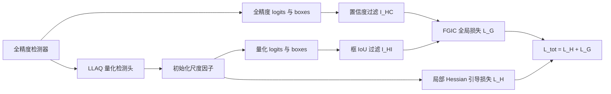

# Reg-PTQ: Regression-specialized Post-training Quantization for Fully Quantized Object Detector

**论文**：[CVF 论文页面](https://openaccess.thecvf.com/content/CVPR2024/html/Ding_Reg-PTQ_Regression-specialized_Post-training_Quantization_for_Fully_Quantized_Object_Detector_CVPR_2024_paper.html)  
**代码**：未提供  
**发表**：CVPR 2024

## 一句话总结

Reg-PTQ 为检测回归结构设计 Filtered Global Loss Integration Calibration（FGIC）和 Learnable Logarithmic-Affine Quantizer（LLAQ），使检测头也能参与低比特后训练量化，而不再只量化 backbone 与 neck。

## 研究背景与问题

现有 PTQ 多以分类网络为对象，通过最小化层级重建误差或近似 Hessian 误差选择量化尺度。论文的 toy experiment 表明，回归器对 Gaussian 与 uniform 参数扰动都比分类器敏感，尤其普通 rounding 近似的 uniform 噪声破坏更大；更关键的是，局部量化误差最低的尺度并不对应回归任务性能最优。

检测回归头还有不同于分类器的参数分布。距离类回归损失会使权重聚集在中心附近，呈准 Laplace/Gaussian 的非均匀分布，而 uniform quantizer 假设数值在截断范围中较均匀。只保留高精度检测头会漏掉可观计算和存储：论文对 Faster R-CNN、YOLOF、RetinaNet 的分析显示，head 占比不可忽略。

Reg-PTQ 先给检测头应用 LLAQ，再按常规搜索初始化量化尺度，最后用 FGIC 微调所有可学习量化参数。论文所称 full quantization 是：中间层按 `WwAa` 量化，第一层 8-bit，最后预测层保持全精度，加法为全精度，BN 折叠到前一卷积。

## 方法总览

## 方法详解

### 1. 局部误差为什么不够

校准第 `k` 层时，论文采用对角 Fisher 近似的 Hessian 引导损失：

$$
L_H^k=\sum_i(\hat O_i^k-O_i^k)^T
\left(\frac{\partial L}{\partial O_i^k}\right)^2
(\hat O_i^k-O_i^k).
$$

`O_i^k、Ô_i^k` 是第 `k` 层全精度与量化输出；`L` 是检测任务损失；梯度平方近似二阶敏感度。精确 Hessian 与回归性能趋势一致，但对角近似存在不可忽略误差，因此仅靠 `L_H^k` 仍可能选错量化尺度。

### 2. FGIC：经过滤的全局任务对齐

Global-Loss Integration Calibration 直接比较全精度与量化检测头输出：

$$
L_G=\frac1n\sum_i[L_{CE}(y_i,\hat y_i)+\lambda L_p(b_i,\hat b_i)],
\qquad L_{tot}^k=L_H^k+L_G.
$$

`n` 是预测框数；`y、ŷ` 是两模型分类 logits；`b、b̂` 是回归框；`λ` 平衡分类与回归；`L_p` 是框坐标的 p 范数损失。直接对齐全部框会被低置信度和错配框污染，因此 FGIC 引入两步过滤：`I_HC=1[y≥θ_C]` 只保留全精度模型高置信框；`I_HI=1[IoU(b,b̂)≥θ_I]` 再保留两模型中可能对应同一物体的框。回归项最终比较 `b·I_HC·I_HI` 与 `b̂·I_HC·I_HI`，分类 CE 保持参与。

### 3. LLAQ：为中心聚集分布重参数化

若权重近似 Laplace 分布 `f(x|μ,λ)=1/(2λ)·exp(-|x-μ|/λ)`，LLAQ 先以位置参数 `μ` 为界，把两侧分别映射到对数空间：

$$
\phi(x)=k^{\pm}\log x+a^{\pm}.
$$

`k^+,a^+` 用于 `x≥μ` 一侧，`k^-,a^-` 用于另一侧，四个参数在校准中学习。该变换把原本中心密集、尾部稀疏的权重拉伸为更接近均匀的分布，再使用 uniform quantization；反变换回线性空间后，量化级在中心附近更密。论文把变换后的整数权重和逆变换尺度预存到 checkpoint，推理乘法可结合整数乘与 BitShift，避免在线计算对数。

FGIC 与 LLAQ 对应论文的两条观察：前者解决“局部最优不等于任务最优”，后者解决“uniform level 不适合回归权重分布”。校准算法按层打开量化，从校准集缓存全精度输出、量化输入和全局损失梯度，随后反复采样这些缓存，联合更新 `L_H^k` 与过滤后的 `L_G`。因此它不是用最终 COCO 标注重新训练检测器，而是在少量校准数据上对齐全精度模型的中间表示和检测输出。

两步过滤的顺序也有具体含义：先按全精度分类分数去掉部署时本就会被抛弃的候选，再检查量化框与全精度框是否有足够交集。若直接对低 IoU 框做坐标回归，它们可能实际对应不同物体，产生方向错误的校准梯度；这也是普通蒸馏式全局对齐在检测 PTQ 中不稳定的来源。

## 实验与证据

实验在 COCO 上覆盖 RetinaNet、YOLOF、Faster R-CNN、Mask R-CNN，骨干为 ResNet-50/101，并对比 AdaRound、AdaQuant、BRECQ、QDrop、PD-Quant、SubSetQ。校准采用 backbone block-wise、其他结构 layer-wise，每块/层 2000 次迭代，batch size 256。

- W4A8 下 RetinaNet-R101 为 38.6 AP，仅比全精度 38.9 低 0.3；Faster R-CNN-R50/R101 为 37.8/39.1，而全精度为 38.5/39.8。
- W4A4 下 RetinaNet-R50 为 36.7 AP，全精度 37.4；YOLOF-R50 为 34.3，全精度 37.5；Faster R-CNN-R50 为 36.7，全精度 38.5。
- 更低的 W2A4 下，RetinaNet-R50 达到 23.9 AP，QDrop 为 19.9、PD-Quant 为 19.3、BRECQ 为 14.0。
- FGIC 消融的 RetinaNet-R50 W2A4 基线仅局部损失为 23.0；加入未过滤全局损失为 23.5；加入过滤后最佳 23.9。默认 `θ_C=2×10^-4、θ_I=0.1`。
- 在检测头量化器对比中，RetinaNet-R50 W2A4 的 uniform/LLAQ 为 23.0/23.6；Faster R-CNN-R50 W3A3 为 28.8/31.7，LLAQ 对两阶段头增益 2.9 AP。
- Faster R-CNN-R50 W2A4 全量化为 12.14 GFLOPs、5.97M storage；全精度为 171.8 GFLOPs、46.91M，对应约 14.2× 与 7.8×。摘要汇总 INT4 下计算、存储降低 7.6×、5.4×且精度退化较小。

表 1 还说明低比特优势不是单一架构现象：W3A3 下 Reg-PTQ 在 RetinaNet-R50、YOLOF-R50、Faster R-CNN-R50、Mask R-CNN-R50 上分别达到 28.1、27.3、28.1、28.4 AP；对应 QDrop 为 26.5、25.8、23.6、24.4。两阶段模型在相同比特下提升更大，符合其 RPN 与 RoI head 都包含敏感回归结构的分析。RetinaNet 的全量化计算下降相对有限，但 storage 从全精度 66.60M 降至 W4A4 的 18.42M，说明检测头量化对模型占用仍有明确价值。

## 对 YOLO-Agent 的启发

接入点是 YOLO 的 PTQ 校准器：backbone/neck 可继续使用现有 uniform PTQ，分类与回归 head 使用 LLAQ；每层校准时同时读取全精度 teacher 与量化模型的 logits、解码框，按 `θ_C、θ_I` 生成 FGIC mask。YOLO 的预测数量很大，过滤必须在 decode 后、NMS 前完成，且需保持候选索引一一对应。

对照组建议为：只量化 backbone+neck；全模型 uniform PTQ；uniform+GIC 无过滤；uniform+FGIC；LLAQ+FGIC。指标使用 COCO AP、AP75、整数 FLOPs、模型存储和真实硬件延迟。验收阈值建议：W4A8 AP 下降不超过 1.0，W4A4 不超过 3.0；完整 Reg-PTQ 至少优于全模型 uniform 1.0 AP，并比“仅量化 backbone+neck”再降低 20% head 相关存储。若 FGIC 过滤后 AP 不高于无过滤 GIC，或真实延迟没有改善，则判定接入失败；低比特下优先检查框索引对齐和 LLAQ 逆变换，而不是继续放宽阈值。

## 优点

- 从回归敏感性、局部误差失配和权重分布三方面解释检测头 PTQ 难点。
- FGIC 直接优化检测级输出，同时过滤无意义和错配候选。
- LLAQ 对一阶段 bbox head 和两阶段 RPN/RoI head 均有增益。

## 局限

- 校准需要全精度与量化模型并行前向、存储 hook 信息并逐层微调，成本高于简单 PTQ。
- “全量化”仍保留最后预测层及加法为全精度，硬件端收益取决于算子支持。
- LLAQ 依据准 Laplace/Gaussian 假设设计，遇到多峰或强偏斜参数分布时未必最优。

## 评分

- **创新性：9/10**——首次系统针对检测回归结构设计 PTQ 校准与量化器。
- **实验充分性：9.2/10**——覆盖多检测器、多比特、消融和效率分析。
- **可迁移性：8.2/10**——框架通用，但校准实现和硬件落地复杂。
- **综合评分：8.8/10**
