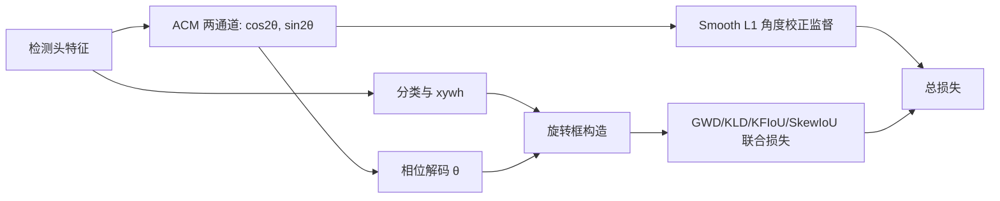

# Rethinking Boundary Discontinuity Problem for Oriented Object Detection

**论文**：[官方论文页面](https://openaccess.thecvf.com/content/CVPR2024/html/Xu_Rethinking_Boundary_Discontinuity_Problem_for_Oriented_Object_Detection_CVPR_2024_paper.html)  
**代码**：[官方代码仓库](https://github.com/hangxu-cv/cvpr24acm)  
**发表**：CVPR 2024  
**类别**：旋转目标检测

## 一句话总结

论文指出边界不连续的根因不是 IoU 类损失在角度端点不够平滑，而是网络仍被迫直接拟合锯齿状框角度；Angle Correct Module（ACM）让检测头预测 $e^{j2\theta}$ 的二维复数编码，以 Smooth L1 校正周期角，再解码角度送入 GWD、KLD、KFIoU 或 SkewIoU，与中心和宽高联合优化。

## 研究背景与问题

物体内容旋转 $2\pi$ 才回到原状态，但无内容矩形旋转 $\pi$ 已等价，因此标注满足 $\theta_{box}=\theta_{obj}\bmod\pi$。连续网络若直接从旋转物体图像回归 $[0,\pi)$ 框角度，就必须拟合在 $\pi$ 处从接近 $\pi$ 跳到 0 的锯齿函数，边界附近必然产生急剧变化。以往 GWD、KLD、KFIoU、SkewIoU 把框编码为平滑分布或几何量，只在损失计算时平滑角度差，却没有改变检测头直接输出不连续 $\theta$ 的事实。

作者区分显式与隐式编码：显式联合优化仍输出角度，平滑函数只包在 loss 外；CSL、PSC 等隐式方法让网络输出连续编码，再经逆变换得到角度，因而真正移除了输出空间断点，但往往与框 IoU 联合程度不足。双优化范式同时保留两条监督：一条约束可逆角度编码，负责边界正确；另一条把解码角与 `x,y,w,h` 送入原 IoU 类损失，负责定位一致性。

## 方法总览

ACM 选择复指数 $z=e^{j\omega\theta}$。为了让框的 $\theta$ 与物体的 $\theta+\pi$ 编码完全相同，同时在 $[0,\pi)$ 内可逆，取 $\omega=2$，此时 $e^{j2(\theta+\pi)}=e^{j2\theta}$。实现中复数等价为实部、虚部两个通道，固定编码长度 2；检测头输出 $f_p$，Smooth L1 对齐 $f_t$，再用复对数/相位解码 $\theta_p$，与框参数进入任一联合定位损失。

## 方法详解

### 1. 编码模式而非损失形状

若模型输出仍是 $\theta_p$，再计算 $\ell(g(\theta_p),g(\theta_t))$，网络函数本身仍拟合不连续标注。ACM 改为直接最小化编码 $f_p$ 与连续目标 $f(\theta_t)$ 的距离，推理时才逆变换。论文用相同编码函数的显式/隐式对照证明，差异来自预测对象而非编码公式本身。

### 2. 复指数 ACM-Coder

实数域内无法同时做到端点相同、区间连续且一一可逆；复平面单位圆提供天然周期。$\omega=1$ 仍在物体跨 $\pi$ 时产生符号断点，其他频率难以保证框—物体一致，$\omega=2$ 恰好编码矩形的半周对称性。相比 CSL 的长离散向量和 PSC 的可选长度，ACM 长度固定为 2。

### 3. 双优化损失

总损失为 $L_{cls}+\lambda_{box}L_{box}+\lambda_{acm}L_{acm}$，默认 $\lambda_{box}=1$、$\lambda_{acm}=0.2$。`correct supervision` 是编码 Smooth L1，防止预测频率与解码频率错配；`refine supervision` 是解码框的 IoU 类损失。前者决定边界是否真正修复，后者提高框级定位。

对近方形框，Gaussian 编码中的协方差趋于各向同性，旋转后分布几乎不变，因而 GWD/KLD/KFIoU 单独使用时无法给角度提供有效梯度。ACM 的单位圆编码不依赖宽高差，即使 $w\approx h$，`cos2θ/sin2θ` 仍随角度连续变化。这解释了论文为何在飞机类别上 AP50 几乎不动、AP75 却大幅提升：宽松 IoU 已把方框判对，严格定位才暴露方向误差。

复现还应绘制同一实例连续旋转时的预测角曲线；只有跨越零度边界仍连续，才算真正修复，而非靠框宽高交换偶然维持 IoU。

## 实验与证据

实验使用 CenterNet、ImageNet 预训练 ResNet-50，Adam 训练 140 epoch，在 100、130 epoch 降学习率；评估 DOTA-v1.0、HRSC2016、UCAS-AOD，强调对角度更敏感的 AP75。DOTA 上 ACM-GWD/KLD/KFIoU/SkewIoU 的 AP75 分别为 41.97、42.97、40.49、42.83，相对原方法提升 6.99、7.72、14.38、4.37；AP50 则集中在 73.71–74.51，说明修复后几种联合损失差距显著缩小。

HRSC2016 船舶上，GWD 的 AP75 61.87→86.71，KFIoU 62.95→87.77；UCAS-AOD Plane 的方形目标最能暴露 Gaussian 退化，GWD/KLD/KFIoU 的 AP75 从 38.22/29.19/16.81 提升到 76.00/75.65/74.48，而 AP50 几乎不变，因为方框即使角度错误也常保持 IoU>0.5。编码长度消融显示 ACM 固定 2 维最佳；去掉 refinement 有下降但仍优于基线，去掉 correction 则严重退化。

## 对 YOLO-Agent 的启发

- **对照组**：固定同一旋转 YOLO/CenterNet、assigner 与增强，比较直接角度回归、CSL/PSC、同一 $e^{j2\theta}$ 只用于损失的显式方案、`ACM correction only`，以及把 ACM 解码角送入原 GWD/KLD/KFIoU/SkewIoU 的双优化方案。
- **指标**：除 AP50/AP75 外，按真实角度距 0/$\pi$ 边界的距离统计角误差、预测跳变幅度和连续旋转等变曲线；按长宽比分桶报告近方形目标 AP75，并监测 ACM 二维复编码的幅值、相位误差与解码零向量比例。
- **切片评估**：把飞机、储罐等近方形目标与船舶、桥梁等长条目标分开，再按尺度、方向、密集度和类别报告；该切片直接验证 $e^{j2\theta}$ 是否既修复角度端点，也避免 Gaussian 类联合损失在 $w\approx h$ 时失去方向梯度。
- **成本指标**：记录 ACM 新增两个角度通道、复相位解码、FP16 数值稳定性和导出兼容性，重点检查 0/$\pi$ 端点及零向量附近的 NaN、梯度尖峰和角度翻转。
- **失败判断**：若边界角误差曲线仍有尖峰，或 `ACM+同一联合损失` 相对对应对照组的 AP75 提升不足 2 点；若 AP50 上升但近方形 AP75 不升、解码零向量超过 0.5%，或部署后角度翻转增加，则判定 ACM 的复指数校正没有解决边界不连续。

## 优点

- 从输出编码根因解释边界问题，而非继续设计更复杂的 IoU 平滑函数。
- ACM 仅两维，可插入多种联合框损失，额外结构很小。
- 在长条船舶、矩形车辆、近方形飞机和复杂 DOTA 场景均有针对性证据。
- AP75、旋转可视化与监督消融共同验证“角度被修复”而非仅总体分数变化。

## 局限

- 方法依赖矩形 $\pi$ 周期假设，若任务需要物体头尾方向，$e^{j2\theta}$ 会主动消除该信息。
- 复对数表述在实现中需稳定的 `atan2` 与归一化，论文对零幅值边界讨论有限。
- ACM 修复角度编码，不解决密集目标匹配、尺度回归或类别混淆。
- DOTA 最终 SOTA 比较受多尺度、骨干和训练策略影响，核心价值应看同基线消融。

## 评分

- **问题重要性**：★★★★★
- **方法清晰度**：★★★★★
- **实验可验证性**：★★★★★
- **工程可迁移性**：★★★★★
- **YOLO-Agent 参考价值**：★★★★★
