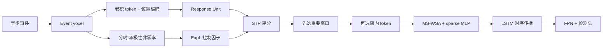

# Scene Adaptive Sparse Transformer for Event-based Object Detection

**论文**：[官方论文页面](https://openaccess.thecvf.com/content/CVPR2024/html/Peng_Scene_Adaptive_Sparse_Transformer_for_Event-based_Object_Detection_CVPR_2024_paper.html)  
**代码**：[官方代码仓库](https://github.com/Peterande/SAST)  
**发表**：CVPR 2024  
**类别**：事件相机目标检测

## 一句话总结

SAST 将事件 voxel 送入四级层次骨干，在每个 SAST layer 中先依据 token 响应与分时间/极性的事件非零率评分，再顺序选择重要窗口和窗口内 token，最后用 Masked Sparse Window Self-Attention（MS-WSA）对不等长稀疏窗口并行注意力；场景越复杂就自动保留更多 token，而非使用固定剪枝率。

## 研究背景与问题

事件相机只在亮度变化时输出异步事件，传感器本身功耗低且时间分辨率高，但将事件转成 voxel 后再用稠密 Transformer，会在大量空区域执行注意力，抵消低功耗优势。图像稀疏 Transformer 也不直接适用：token 级剪枝常保留全局注意力，窗口级剪枝虽快却可能整窗删掉小目标；固定稀疏率又无法同时适应空旷道路和密集交通。

SAST 的主干从事件流构造 voxel，四个 SAST block 逐级下采样；每个 block 含两个共享选择结果的 SAST layer，尾部 LSTM 传播时间状态。第 2、3、4 级特征送入 FPN 和检测头。其独有数据流是先在窗口粒度竞争，保证重要目标所在窗口不被粗暴删除，再在保留窗口内部做 token 竞争，兼顾窗口注意力的并行效率和细粒度稀疏性。

## 方法总览

Scoring Module 有两条支路：Response Unit 用 Linear+ReLU 从 token 得响应 $R$；另一支路从原事件 voxel 按多尺度池化，计算不同时间区间和极性的 $B$ 个非零率，经过 Exponential Linear 得控制因子 $F$。初始分数近似 $R/F$，再通过空间—时间—极性（STP）加权、p-norm 与 softmax 形成 token/window 分数。Selection Module 先选窗再选 token；MS-WSA 对各窗变长 token 做 padding，但用 mask 同时隔离 batch 与填充 token，避免 context leakage。

## 方法详解

### 1. 场景自适应评分

事件稀疏率不是简单全图事件数，而按 voxel bin 的时间范围和极性分别统计。它调制 token 响应，使同样激活在不同事件密度场景中获得不同竞争强度；STP weighting 又利用邻域的空间、时间和正负极性关系，避免只按单点幅值选择噪声事件。

### 2. 窗口—token 联合选择

只选窗口会保留大量无用 token，只选 token 后做全局注意力成本仍高。SAST 的两级过滤让重要窗口先获得配额，再从中保留关键 token；同一 block 的两层共享选择，减少重复打分。可选 Context Broadcasting（SAST-CB）把稀疏处理后的全局上下文回传，以小计算换取更高精度。

### 3. MS-WSA

不同窗口保留 token 数不同，普通 WSA 无法直接批处理。简单 padding 会让真实 token 关注填充值，或让不同 batch 上下文泄漏。MS-WSA 用显式 mask 隔离所有无效位置，在保持窗口局部注意力和 GPU 并行的同时，把注意力 FLOPs 真正随保留 token 数下降。

选择后的 token 经 sparse MLP 处理，再 scatter 回原网格，未选位置保持稀疏占位，随后进入下一级下采样与 LSTM。这个回填步骤保证 FPN 仍接收规则多尺度张量，而计算密集的注意力和 MLP 只发生在保留集合上。论文还让同一 block 的连续 SAST layer 共用选择索引，避免第二层重新评分导致额外开销和时序抖动。

适应性分析显示，事件非零率相近的样本仍形成不同保留率簇，说明控制器并非简单按事件数设阈值；车辆类别、数量和尺度也通过 token response 影响选择。复杂场景主动降低稀疏度是设计目标，最坏场景计算上升不应被误判为失效，真正要检查的是增加的 token 是否集中在目标及运动边缘。

## 实验与证据

论文在 1Mpx 与 Gen1 使用官方划分，1Mpx 输入缩放到 640×360，报告 COCO mAP、参数、backbone FLOPs、attention FLOPs（A-FLOPs）和运行时间。1Mpx 上 SAST 为 48.3% mAP，SAST-CB 为 48.7%；SAST-CB 仅用 AEC 约 11% 的 FLOPs，并把相对 RVT 的 A-FLOPs 降到 40%。Gen1 上 SAST/SAST-CB 为 47.9/48.2 mAP，比 RVT 高 0.7/1.0，SAST 的总 FLOPs与 A-FLOPs仅为 RVT 的 60% 和 36%。

与稀疏基线相比，AViT 因全局注意力 A-FLOPs 很高且 mAP 低 2.9；固定 50% 窗口剪枝的 SViT mAP 低 2.1；SparseTT 的注意力 mask 并未实际省计算。SAST 达 48.3 mAP、1.8G A-FLOPs。评分消融中 L2 Activation/Attention Mask/Head Scores/Head Importance 为 45.1/45.8/46.8/46.5，SAST Scoring 为 48.3。只选窗口、只选 token、二者联合分别为 46.3/47.7/48.3 mAP，A-FLOPs 3.7/3.0/1.8G。S-WSA 有 token 泄漏，46.2 mAP、2.0G；MS-WSA 无泄漏，48.3、1.8G。

## 对 YOLO-Agent 的启发

- **对照组**：固定事件 voxel、FPN、检测头、LSTM 与训练预算，比较 dense WSA、固定比例窗口剪枝、仅 token 选择、仅窗口选择、SAST 窗口-token 联合选择、`+MS-WSA` 和 `+Context Broadcasting`，使每一步对应论文的一项稀疏机制。
- **指标**：除 mAP/AP_small 外，逐层记录窗口与 token 保留率、A-FLOPs、事件非零率、目标框内 token 保留召回、空背景保留率、MS-WSA padding mask 命中率，以及 Context Broadcasting 前后的跨窗口 context leakage。
- **切片评估**：按事件稀疏度、目标数、运动速度、尺度、朝向、昼夜/强光、遮挡和密集度分桶；稀疏空场景检查评分模块是否主动降低保留率，复杂场景检查保留率是否随目标数上升且不漏删小目标。
- **成本指标**：在目标硬件分别测 SAST 评分、排序、窗口/token gather-scatter、MS-WSA 不等长 mask 和 Context Broadcasting 的真实延迟，报告平均、P95、最坏场景吞吐及相对 A-FLOPs 的兑现比例。
- **失败判断**：若窗口-token 联合选择相对 dense WSA 对照组的 mAP 下降超过 0.5 或 AP_small 下降超过 1；若复杂场景保留率不随目标数增加、框内 token 保留召回低于 95%，或 A-FLOPs 已下降但端到端延迟未降低至少 20%，则判定 SAST 的场景自适应稀疏与 MS-WSA 不成立。

## 优点

- 同时利用事件统计和学习响应，稀疏率随场景而变，而非人工固定。
- 窗口与 token 两级选择兼顾细粒度、容错性和并行注意力效率。
- MS-WSA 明确处理不等长窗口的上下文泄漏，消融证据完整。
- 在 1Mpx、Gen1 同时提高 mAP 并显著降低注意力计算。

## 局限

- 动态筛选包含排序、索引和不规则访存，FLOPs 优势未必等价于边缘芯片延迟与功耗优势。
- 评分依赖 voxel 化参数和事件噪声，换传感器、时间窗或极性统计后需重新验证。
- 被删除 token 后的信息不可恢复，极小、低速或与背景同稀疏模式的目标仍有漏删风险。
- LSTM、FPN 与检测头仍是稠密部分，整体系统的可压缩上限受其制约。

## 评分

- **问题重要性**：★★★★★
- **方法清晰度**：★★★★★
- **实验可验证性**：★★★★★
- **工程可迁移性**：★★★★☆
- **YOLO-Agent 参考价值**：★★★★★
