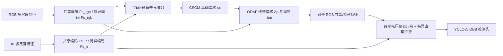

# Weakly Misalignment-free Adaptive Feature Alignment for UAVs-based Multimodal Object Detection

**论文**：[官方论文页面](https://openaccess.thecvf.com/content/CVPR2024/html/Chen_Weakly_Misalignment-free_Adaptive_Feature_Alignment_for_UAVs-based_Multimodal_Object_Detection_CVPR_2024_paper.html)  
**代码**：论文正文未给出可确认的官方代码地址  
**发表**：CVPR 2024  
**类别**：UAV 多模态旋转目标检测

## 一句话总结

Offset-guided Adaptive Feature Alignment（OAFA）先用 Cross-modality Spatial Offset Modeling（CSOM）把 RGB/IR 特征拆成共享的模态不变部分与各自特异部分，只从共享特征估计基础偏移；再由 Offset-guided Deformable Alignment and Fusion（ODAF）在该偏移附近学习残差采样和调制权重，不追求像素级严格重合，而寻找最利于车辆分类与旋转框回归的融合位置。

## 研究背景与问题

UAV 的 RGB 与红外传感器分辨率、视场、成像时刻不同，裁剪和仿射预配准后仍会因飞行、目标运动产生局部弱失配。现有图像级或特征级方法通常把跨模态差异都解释成空间偏移，但颜色纹理与热辐射本就存在巨大模态鸿沟，直接匹配容易得到错误位移；同时，强制严格对齐需要额外对应监督或复杂变形场，而检测真正需要的是能为类别和框提供互补证据的位置。

OAFA 基于双流 YOLOv5s。RGB 与 IR 多尺度特征进入 Decoupled Multimodal Learning：共享参数的浅层编码器产生 $F^c_{rgb},F^c_{ir}$，独立且更深的 C3 编码器产生 $F^s_{rgb},F^s_{ir}$。Central Moment Discrepancy 拉近共享分布，Frobenius 差异约束让特异分支彼此不同并与共享分支正交，辅助 YOLO 分类/回归/objectness 监督保证共享特征仍含目标语义。

## 方法总览

CSOM 对两侧共享特征先做空间注意力，再拼接而非相减，以免复杂 UAV 背景的非对应区域形成大噪声；随后平均/最大池化加共享 MLP 做通道差异增强，融合两模态后预测基础偏移 $\phi_c$。ODAF 以 IR 为参考、RGB 为 sensed modality，把 $\phi_c$ 当作可变形卷积的初始化先验，再学习每个 3×3 核位置的残差 $\Delta p_k$ 和调制标量 $\Delta m_k$，采样位置为 $p+\phi_c+p_k+\Delta p_k$。

## 方法详解

### 1. 共享—特异特征解耦

共享编码器仅 Conv+SiLU 且两模态共享参数，偏向低层空间结构；特异编码器含 Conv、C3 和 bottleneck，保留更深模态特征。$L_{sim}$ 用一到 $K$ 阶中心矩匹配共享分布；$L_{dif}$ 抑制共享—特异及两模态特异特征相关；$L_{sem}$ 在共享特征上加 YOLO 辅助检测。权重为 0.03、0.01、0.03，辅助分支推理时删除。

### 2. CSOM 偏移建模

共享特征先以通道 max/mean 拼接、7×7 卷积和 sigmoid 得空间注意力，突出车辆与关键背景。两模态增强特征拼接后再用平均池化、最大池化和共享 MLP 构造通道注意力，压制与位移无关的模态噪声，最后非线性层输出 $\phi_c$。偏移没有像素真值监督，而由最终检测损失间接塑形。

### 3. ODAF 自适应对齐与训练

ODAF 不把 $\phi_c$ 当最终严格位移，而让 deformable convolution 在其附近学习任务残差和位置权重。对齐后的两侧共享特征先经 1×1 卷积融合去除因相似约束产生的冗余，再与 RGB/IR 特异特征拼接。训练分两阶段：先只训练双流提取和普通拼接检测，获得充分单模态表示；第二阶段加载这些权重并联合训练 CSOM、ODAF 与总损失，避免偏移模块在贫弱特征上不稳定。

双线性插值允许采样落在亚像素位置，因此基础偏移不必量化为整数。

## 实验与证据

DroneVehicle 含 RGB-IR UAV 图，论文使用 17,990 对训练图并以 OBB 头评估 Car、Truck、Freight-car、Bus、Van 的 mAP。OAFA 各类 AP 为 90.3、76.8、73.3、90.3、66.0，mAP 79.4，比次优 SLBAF-Net 的 76.1 高 3.3；速度为 33.1 FPS（RTX A6000、640×640、batch 1），低于基线 63.2 FPS但仍实时。对易混 Truck/Freight-car 的增益尤其明显。

消融以 SLBAF-Net 76.1 为基线：仅 Spatial Offset Modeling 为 76.5，仅 Decoupled Multimodal Learning 为 77.7，组合成 CSOM 为 78.2；仅 ODAF 为 77.8。CSOM+ODAF 若直接单阶段训练只有 77.3，加入两阶段训练后 OAFA 达 79.4，证明可靠偏移先验和初始化缺一不可。鲁棒性实验固定 IR、将 RGB 在 x/y 方向各人工平移 −15 到 15 像素；OAFA 的 mAP 曲面随偏移波动较小，基线明显下降。

## 对 YOLO-Agent 的启发

- **基线**：固定双流 YOLOv5 OBB、划分和增强，比较普通拼接、仅 DML、仅 SOM、完整 CSOM、仅 ODAF、`CSOM+ODAF 单阶段`、`OAFA 两阶段`；另做显式严格 warp 对照。
- **机制指标**：除 mAP/AP75 外，记录预测 $\phi_c$ 与人工位移的误差、残差 $\Delta p$ 幅度、调制权重熵、共享特征 CMD、共享—特异相关性、对齐前后同目标特征相似度。
- **切片评估**：按人工 x/y 偏移、目标尺度、旋转方向、遮挡、每图车辆数和类别分桶；DroneVehicle 小车密集场景重点看 AP_small、重复框与相邻目标错配，Truck/Freight-car 单独看混淆矩阵。
- **成本指标**：测双流、CSOM、deformable sampling、两阶段训练的参数、FLOPs、峰值显存、训练时长和部署算子支持；辅助语义头应确认导出前删除。
- **失败判断**：若完整 OAFA 相对普通拼接三种子 mAP 提升不足 1.5，或 ±15 像素偏移下平均优势不足 2 点；若 $\phi_c$ 与已知平移无相关、$\Delta p$ 无界增大或共享特征语义 AP 下降，判机制失败。端到端 FPS 低于部署门槛或小目标错配增加也不采用。

## 优点

- 把模态鸿沟与空间偏移分开建模，避免从 RGB/IR 原始差异直接猜位移。
- 偏移只作 deformable sampling 先验，不要求不现实的严格配准或额外对齐标注。
- 共享、特异、基础偏移、残差偏移和调制权重均有明确接口，便于消融。
- 人工位移曲面直接验证弱失配鲁棒性，而非只报告原始数据总体 mAP。

## 局限

- DroneVehicle 主要是平移型弱失配，旋转、尺度变化、非刚体局部变形的覆盖有限。
- 以 IR 为参考、RGB 为 sensed modality 是固定选择，红外质量较差时未必最优。
- 无偏移真值监督意味着高 mAP 不保证 $\phi_c$ 具有几何可解释性，ODAF 可能以纹理捷径补偿。
- 两阶段训练和可变形卷积增加训练流程、显存与部署复杂度，速度低于简单拼接基线。

## 评分

- **问题重要性**：★★★★★
- **方法清晰度**：★★★★★
- **实验可验证性**：★★★★☆
- **工程可迁移性**：★★★★☆
- **YOLO-Agent 参考价值**：★★★★★
