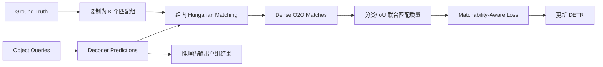

# DEIM: DETR with Improved Matching for Fast Convergence

**会议**: CVPR 2025  
**论文**: [arXiv](https://arxiv.org/abs/2412.04234)  
**代码**: [ShihuaHuang95/DEIM](https://github.com/ShihuaHuang95/DEIM)  
**任务**: 实时端到端目标检测 / DETR 快速收敛

## 一句话总结

DEIM 认为实时 DETR 收敛慢的根源之一是训练早期 Hungarian one-to-one 匹配过于稀疏且不稳定，于是先用 Dense O2O 为每个目标复制匹配组、提高正查询利用率，再用 Matchability-Aware Loss 根据分类与定位联合质量重新分配监督强度，使“更可能成为最终匹配”的查询得到更明确的优化。

## 背景与问题

DETR 通过集合预测消除 NMS，但标准 one-to-one 匹配只给每个 GT 一个正查询。训练早期预测尚未成形，少量匹配容易在不同 epoch 之间跳动，大量查询得不到正监督，分类和定位学习都偏慢。增加 decoder 层或预训练能缓解问题，但会增加训练和部署成本。

已有 one-to-many 辅助分支可以增加正样本，却可能引入与最终 one-to-one 目标不一致的匹配规则。DEIM 选择直接改造 one-to-one 匹配的密度与损失权重。

## 方法总览

## 方法详解

### 1. Dense One-to-One Matching

标准 O2O 中每个 GT 只匹配一个查询。Dense O2O 将查询划分为多个组，并在每个组内独立执行 Hungarian matching，相当于在训练时让每个 GT 获得最多 $K$ 个一对一匹配。组内仍保持集合预测约束，因此不同于无约束的密集正样本分配。

其作用包括：

- 提高正查询比例，尤其改善训练早期监督稀疏；
- 让更多候选学习到目标位置与类别；
- 保持端到端推理形式，额外匹配只存在于训练阶段。

### 2. Matchability-Aware Loss

并非所有 Dense O2O 匹配都同样可靠。DEIM 使用分类置信度和定位质量构造 matchability，令高质量候选获得更强正监督、低质量候选受到抑制。论文将该权重引入分类损失，并用超参数 $\gamma$ 控制重加权强度。

可将其抽象为：

$$
q_i=p_i^{\alpha}\operatorname{IoU}(\hat b_i,b_i)^{\beta},\qquad
\mathcal{L}_{MAL}=w(q_i;\gamma)\,\mathcal{L}_{cls}(p_i,y_i),
$$

其中 $q_i$ 同时反映“类别对不对”和“框准不准”。这能缓解分类分数与定位质量错位的问题。

### 3. 与基础检测器解耦

DEIM 是训练策略而非全新主干，可接入 D-FINE、RT-DETRv2 等实时 DETR。论文通过多个基础模型验证方法并不依赖单一架构。

## 实验与证据

- 主要在 COCO val2017 上评估，比较 YOLO、RT-DETR、D-FINE 等实时检测器。
- 论文报告将 DEIM 接入 D-FINE-L 后，在较短训练日程下获得显著收敛收益；36 epochs 已能达到具有竞争力的结果。
- 消融独立比较 Dense O2O、MAL、复制组数与 $\gamma$，完整组合优于只增加匹配或只重加权损失。
- 训练 GPU hours 对比用于说明收益不是简单来自更长训练。
- Object365 预训练后的微调实验表明该策略也能用于预训练模型，而非只适合从零训练。

## 对 YOLO-Agent 的启发

- 若实验对象是 DETR 系列，优先把 Dense O2O 作为**训练期匹配插件**，无需修改推理接口。
- Harness 应记录每张图正查询数、匹配 IoU、匹配跨 epoch 的稳定率和分类—定位相关性。
- 组数 $K$ 不应只按 AP 选择，还要监控显存、Hungarian 匹配耗时和重复监督是否饱和。
- MAL 必须与普通 focal/varifocal 类质量感知损失进行匹配设置比较，避免把质量加权的一般收益归因于特定公式。

## 优点

- 直接针对 DETR 训练早期匹配稀疏与不稳定。
- 与主干和解码器相对解耦，适合作为训练配方迁移。
- 同时提供短训练日程、消融和训练成本证据。

## 局限

- Dense 匹配会增加训练期 Hungarian 计算和正样本数量。
- Matchability 依赖当前分类与 IoU，训练早期质量估计仍可能有噪声。
- 对极密集场景、长尾类别和开放词汇 DETR 的收益需要额外验证。

## 评分

- **创新性**: ★★★★☆
- **实验充分度**: ★★★★☆
- **工程可迁移性**: ★★★★★
- **YOLO-Agent 参考价值**: ★★★★★
