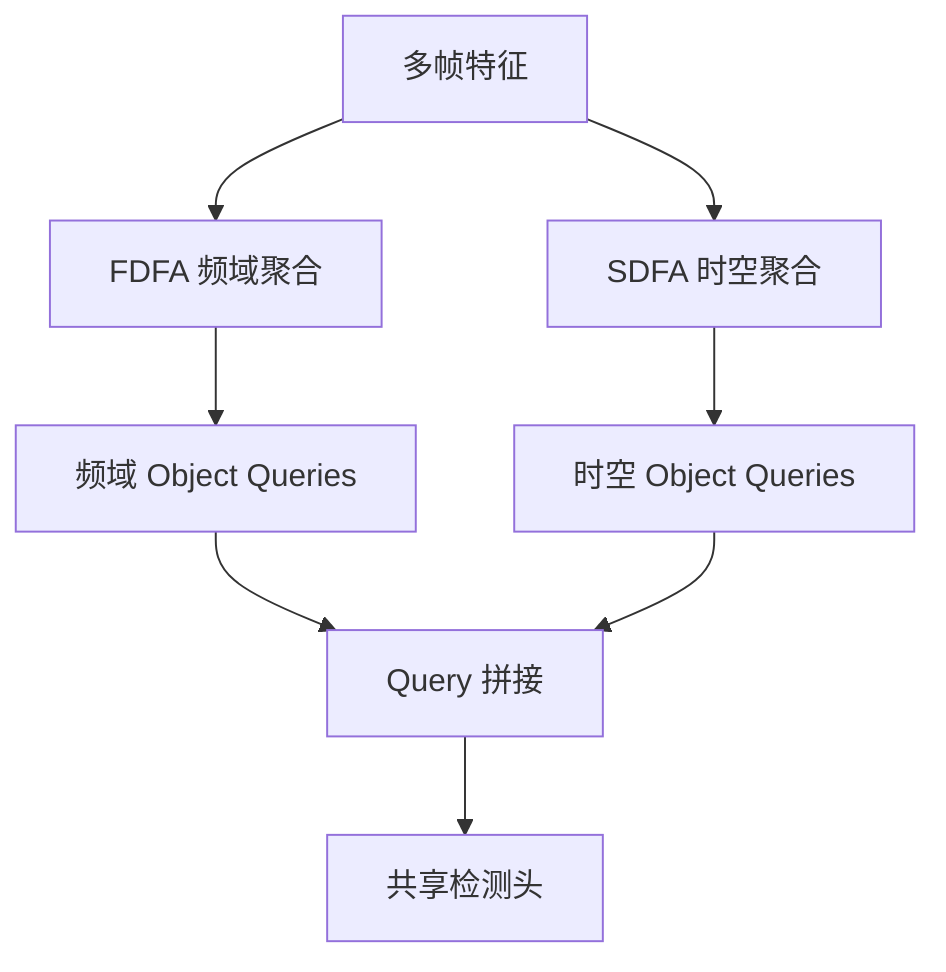

# D2FANet: Enhancing Video Object Detection with Dual-Domain Feature Aggregation Network

**论文**: [CVF Open Access](https://openaccess.thecvf.com/content/CVPR2026/html/Qi_D2FANet_Enhancing_Video_Object_Detection_with_Dual-Domain_Feature_Aggregation_Network_CVPR_2026_paper.html)  
**任务**: 视频目标检测

## 一句话总结

D2FANet 不再只在像素/时空域堆叠邻帧，而是并行建立频域聚合 FDFA 与重要性引导时空聚合 SDFA：前者分离并交互高低频运动与结构信息，后者按区域重要性压缩 key/value token，最后融合两域 object query 完成逐帧检测。

## 背景与问题

视频检测需要利用邻帧消除模糊、遮挡和外观变化。传统特征聚合通常对全部空间区域采用相同计算，背景占用大量算力；同时只在时空域处理，容易忽略频率成分中稳定结构与快速变化细节的互补关系。

## 方法总览

### FDFA：频域特征聚合

特征被分解为高频与低频分量。高频保留边缘、快速运动与局部细节，低频反映主体结构和缓慢变化。模块在同尺度内交互两类频率，并在相邻尺度间融合，避免每个金字塔层独立处理造成语义割裂，最终产生频域 object query。

### SDFA：重要性引导的时空聚合

模块根据局部 token 特征和全局池化上下文预测重要性图。重要区域采用较低聚合率以保留细节，背景区域采用较高聚合率压缩冗余。Query 长度保持不变，仅压缩注意力中的 key/value，因此输出仍可对齐原空间位置。

### 双域融合

频域与时空域 query 直接拼接后送入共享 FFN 检测头。设计简单，但能让频率结构线索与目标区域时序线索互补。

## 实验与证据

- 在 ImageNet VID 和 EPIC-KITCHENS 上评估，并使用多个 backbone。
- ResNet-101 配置在 ImageNet VID 达到 87.7 mAP、24.6 ms；Swin-Base 配置达到 91.8 mAP。
- 基线 78.5 mAP；单独 FDFA 达到 85.8，单独 SDFA 达到 86.4，联合达到 87.7。
- 重要性图同时使用局部与全局线索优于只使用其中一种；高低频通道比例存在明确最优点。

## 对 YOLO-Agent 的启发

- 视频 YOLO 可先迁移 SDFA 的区域重要性压缩，不必同时引入完整 DETR query 流程。
- Harness 应统计不同运动速度、遮挡程度和背景占比下的 AP，以及每帧缓存和聚合延迟。
- 频域分支需要与普通时域卷积、光流对齐和简单邻帧平均比较。
- 对重要性图检查目标覆盖率，防止压缩策略误删小目标或短暂出现目标。

## 局限

- 双分支和多帧缓存增加系统复杂度。
- 两域仅用 query 拼接融合，跨域交互仍较浅。
- 视频窗口长度、帧采样和硬件内存会显著影响实际实时性。

## 评分

- **创新性**: ★★★★☆
- **实验充分度**: ★★★★☆
- **YOLO-Agent 参考价值**: ★★★★☆
