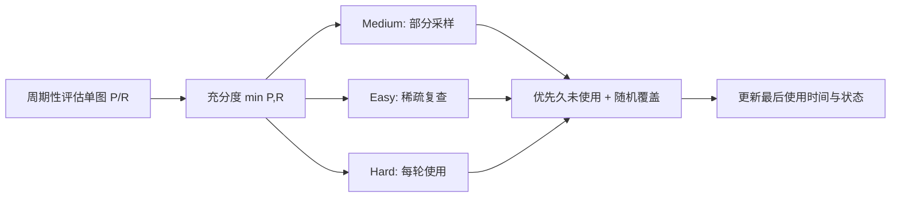

# Does YOLO Really Need to See Every Training Image in Every Epoch?

**论文**: [arXiv](https://arxiv.org/abs/2603.17684)  
**任务**: YOLO 训练加速 / 动态样本选择

## 一句话总结

AFSS 不再让 YOLO 每个 epoch 遍历全部图片，而是用单图检测 precision 与 recall 的较小值衡量学习充分度，将样本动态分为简单、中等、困难三档：困难样本始终训练，已学会样本稀疏复查，并优先召回长时间未出现的图片以防遗忘。

## 研究背景与问题

实时检测器推理很快，但训练仍反复处理大量已经稳定预测的图片。固定难例挖掘无法反映样本状态随训练变化，直接丢弃简单样本又可能造成灾难性遗忘。论文希望在不改变模型推理结构的前提下减少训练图像次数。

## 方法总览

AFSS 为每张训练图维护学习充分度、难度状态和最近使用时间。每个采样周期先更新图片状态，再根据 hard/medium/easy 三档形成下一轮训练子集；连续复查机制保证被跳过的图片仍会周期性返回训练，避免长期遗忘。

## 方法详解

设图片 $I_i$ 当前检测 precision、recall 分别为 $P_i,R_i$，学习充分度定义为：

$$
s_i=\min(P_i,R_i).
$$

取较小值可避免模型只靠高 precision 或高 recall 被误判为“已学会”。根据阈值把样本划分为 easy、medium、hard。

- **Hard**：每个 epoch 都使用，保证未学会样本获得充分优化。
- **Medium**：部分选择，兼顾近期未使用样本与随机覆盖。
- **Easy**：降低频率，但按连续复查机制优先选取长时间未训练的样本。
- **状态更新**：并非每步重新评估，而是按间隔更新充分度，控制评估开销。

## 实验与证据

- 在 COCO、VOC、DOTA-v1.0 和 DIOR-R 上测试多个 YOLO 系列检测器。
- 论文报告总体训练加速超过 1.43 倍，同时多数设置精度不降反升。
- YOLO11s 示例中达到约 1.54 倍训练加速并提高检测精度。
- 消融覆盖充分度公式、复查间隔、短期覆盖窗口和状态更新间隔。
- 与随机采样、固定比例采样和常见课程学习策略比较，验证收益来自动态状态与防遗忘机制的组合。

## 对 YOLO-Agent 的启发

- 这是最适合直接加入 Harness 的训练策略之一，不改变模型结构和部署图。
- 记录每图使用次数、最近使用 epoch、充分度轨迹和类别覆盖，防止长尾类别被当作简单样本跳过。
- 必须以 GPU hours、实际读取图片数和最终 AP 三者联合评价，而不是只比较 epoch 数。
- 对强数据增强场景，应基于原图还是增强实例计算充分度进行单独消融。

## 优点

- 不改变检测器结构、损失和推理图，接入成本低。
- 同时减少训练图片数并维持防遗忘覆盖，而非永久删除简单样本。
- 在自然图像和遥感检测数据上验证，覆盖水平框与旋转框 YOLO。

## 局限

- 单图 precision/recall 需要周期性推理与匹配，会产生额外管理成本。
- 数据增强会使“同一图片是否学会”变得不稳定。
- 阈值和复查间隔可能随数据规模、类别不平衡程度变化。

## 评分

- **创新性**: ★★★★☆
- **工程可迁移性**: ★★★★★
- **YOLO-Agent 参考价值**: ★★★★★
