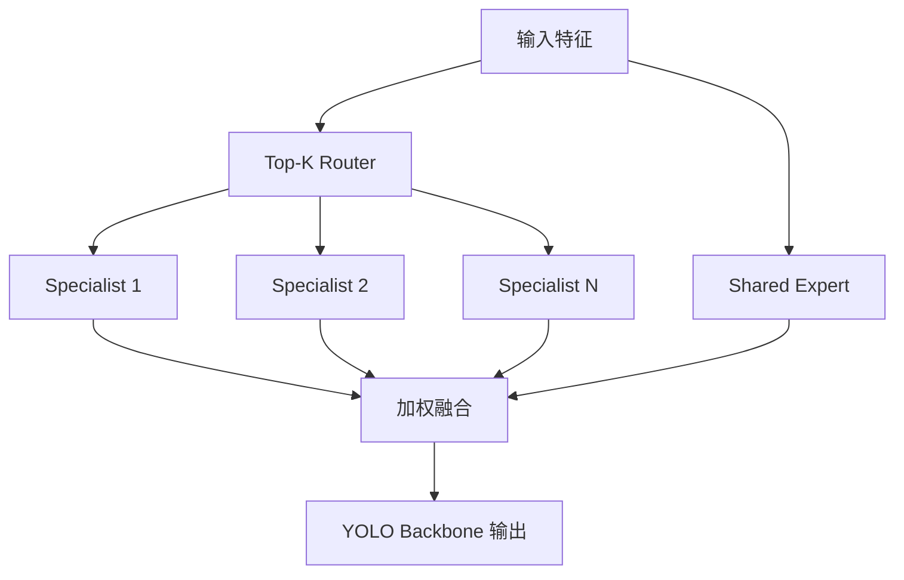

# YOLO-Master: MOE-Accelerated with Specialized Transformers for Enhanced Real-time Detection

**论文**: [CVF Open Access](https://openaccess.thecvf.com/content/CVPR2026/html/Lin_YOLO-Master_MOE-Accelerated_with_Specialized_Transformers_for_Enhanced_Real-time_Detection_CVPR_2026_paper.html)  
**任务**: Nano 级实时目标检测

## 一句话总结

YOLO-Master 在 YOLO 主干中放入 ES-MoE：路由器为每个输入选择少量专门 Transformer experts，并保留共享专家提供稳定通路，使模型参数容量增加但每次只激活 Top-K 专家；同时用负载均衡损失避免专家塌缩。

## 背景与问题

Nano 检测器受参数和 FLOPs 限制，单一路径需要同时处理纹理、形状、尺度和复杂背景，表达能力容易饱和。直接增加 Transformer 会提高全部样本的计算量。MoE 可以扩大容量而保持稀疏激活，但若路由不稳定，少数专家会被过度使用，实时性和训练效果都会恶化。

## 方法总览

## 方法详解

### 专门专家与共享专家

Specialized experts 使用轻量 Transformer 表达不同视觉模式，路由器只激活 Top-K。共享专家对所有样本执行，为训练早期和路由错误提供稳定基础表征。输出由路由概率加权融合。

### 放置策略

论文比较只放 Backbone、只放 Neck 和两处同时放置。Backbone-only 在精度和成本之间最好：较早阶段形成专门表征，Neck 保持简单多尺度融合；两处都放会增加路由与访存开销。

### 路由与损失

除检测损失外，模型加入 MoE 负载均衡项，约束不同专家获得相近训练机会。论文还比较 DFL 与 MoE loss 的组合，说明专家训练目标和框回归损失需要协调，而不能只增加路由器。

## 实验与证据

- 在五个检测基准上比较 Nano 级检测器，并扩展到分类和分割任务。
- 消融显示 Backbone-only 优于 Neck-only 和双位置放置。
- 专家数量并非越多越好；Top-2 路由在论文设置中取得最佳精度—成本平衡。
- 论文分别研究 expert 数、Top-K、共享专家、负载均衡损失和 DFL 组合。
- 多任务结果用于验证 ES-MoE 不是只对单一检测数据集有效。

## 对 YOLO-Agent 的启发

- Harness 需记录每个 expert 的调用率、类别分布、梯度范数和路由熵，及时发现专家塌缩。
- 以实际激活 FLOPs 和 batch=1 延迟评价稀疏模型，不能用总参数量推断运行成本。
- 先固定 Backbone-only，扫描 experts 数与 Top-K，再决定是否尝试 Neck。
- 加入同等激活计算量的普通 Transformer/卷积宽化基线，验证收益来自条件计算。

## 优点

- 通过稀疏激活扩大模型容量，而不是让所有样本承担完整专家计算。
- 系统研究专家数量、Top-K、放置位置和负载均衡损失。
- 扩展到检测、分类和分割，说明专家模块具有一定任务通用性。

## 局限

- 稀疏路由在 GPU 上未必产生与理论激活量一致的加速。
- 动态专家选择增加导出、量化和批处理调度难度。
- 专家语义是否真正专门化仍需更细的可解释性分析。

## 评分

- **创新性**: ★★★★☆
- **部署价值**: ★★★☆☆
- **YOLO-Agent 参考价值**: ★★★★★
