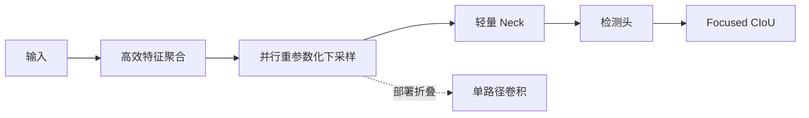

# YOLO-ULM: Ultra-Lightweight Models for Real-Time Object Detection

**论文**: [CVF Open Access](https://openaccess.thecvf.com/content/CVPR2026/html/Han_YOLO-ULM_Ultra-Lightweight_Models_for_Real-Time_Object_Detection_CVPR_2026_paper.html)  
**任务**: 超轻量实时目标检测

## 一句话总结

YOLO-ULM 不依赖重注意力，而是联合优化三个常见瓶颈：用大核深度卷积构造高效特征聚合模块，用可重参数化并行分支完成低损失下采样，再以更聚焦的 CIoU 变体动态提高困难框权重；Turbo 版本进一步针对真实延迟精简网络。

## 背景与问题

现有 C2f/C3k2/A2C2f 在深层低分辨率特征上仍有重复瓶颈和拼接成本。普通 stride convolution 下采样参数大，极轻的 depthwise 下采样又容易破坏局部相关性。CIoU 对所有样本使用近似固定处理，简单样本可能主导梯度，困难框得不到足够关注。

## 方法总览

### 高效特征聚合

模块以大核 depthwise convolution 扩大深层感受野，通过通道分流和较少重复瓶颈保留语义，同时避免在低分辨率层使用昂贵注意力。大核只作用于 depthwise 路径，因此参数增长有限。

### 并行下采样与重参数化

训练时使用多条互补路径分别保留局部细节和完成通道变换，部署时将可合并分支折叠成简单卷积图。该设计试图在标准卷积的高成本与纯 depthwise 下采样的信息损失之间折中。

### Focused CIoU

损失在 CIoU 的重叠、中心距离和宽高比约束上加入样本难度感知权重，降低已高度重叠简单框的主导作用，把更多梯度分给定位较差的困难样本。

## 实验与证据

- 在 COCO 上提供 N/S/M/L/X 五个规模及 Turbo 系列，并与 YOLOv8—v13、RT-DETR 等比较。
- YOLO-ULM-S 相比 RT-DETR-R18 提高 1.6 mAP，同时减少 64.7% FLOPs 和 63% 参数。
- YOLO-ULM-L/X 相比 YOLOv13-L/X 分别提高 0.7/0.8 mAP。
- Turbo-N 相比 YOLOv12-Turbo-N 提高 0.3 mAP并减少 16% 参数。
- 消融覆盖聚合模块、下采样、损失、卷积核、分组大小和推理硬件。

## 对 YOLO-Agent 的启发

- 将聚合、下采样和损失拆成三个独立 adapter，按单变量顺序验证。
- 重参数化模块必须验证训练图与部署折叠图的数值误差和导出一致性。
- Focused CIoU 要按目标尺寸、IoU 区间和遮挡程度统计收益，检查是否牺牲简单样本稳定性。
- 对 Turbo 版本使用真实端到端延迟，而不是根据 FLOPs 自动认定更快。

## 局限

- 多个结构和损失同时变化，完整模型的提升归因较复杂。
- 大核 depthwise 卷积在部分 CPU/NPU 上未必高效。
- 难度权重需要在长尾、噪声标签和旋转框任务上重新校准。

## 评分

- **创新性**: ★★★★☆
- **部署价值**: ★★★★★
- **YOLO-Agent 参考价值**: ★★★★★
