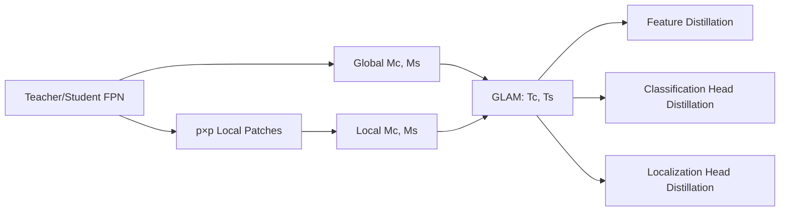

# GLAMD: Global and Local Attention Mask Distillation for Object Detectors

**论文**：[官方论文页面](https://www.ecva.net/papers/eccv_2022/papers_ECCV/html/6328_ECCV_2022_paper.php)  
**代码**：未提供  
**发表**：ECCV 2022

## 一句话总结

GLAMD 用 GLAM（Global and Local Attention Mask）同时从整幅 FPN 特征和固定大小局部 patch 生成通道、空间注意力，再把掩码用于中间特征、注意力特征、分类头与定位头蒸馏，使学生既学习全局语义，也不会漏掉小目标、边缘和局部背景线索。

## 研究背景与问题

目标检测蒸馏不能直接照搬分类 KD：背景远多于前景，定位知识又不会完整出现在类别 logits 中。已有掩码方法因此只蒸馏 GT 附近前景，或用全局注意力给特征位置加权。GLAMD 观察到，全局 softmax 往往被单个显著大目标占据，其他小目标、遮挡边界和有用背景几乎得不到权重。

论文提出的修正非常具体：同一张 FPN 特征既保留完整视野，又切成多个 $p\times p$ patch。局部注意力在每个 patch 内独立竞争，迫使掩码发现全局峰值之外的局部结构；最终将局部与全局掩码平均，因此 GLAM 不是两个平行蒸馏器，而是统一控制后续特征蒸馏和 head 蒸馏的权重生成器。

## 方法总览

教师与学生的每层 FPN 特征先计算 global channel/spatial mask，同时切成 $N$ 个 patch 计算 local channel/spatial mask；二者合并成最终 $T_c,T_s$。$T_c,T_s$ 加权教师—学生特征差，另有 attention feature loss 约束学生产生相近注意力。分类头用 BCE 蒸馏 logits，定位头用有界的 IoU loss 蒸馏框响应，二者均乘空间掩码 $T_s$。

## 方法详解

### 1. GLAM 掩码

对特征 $x\in\mathbb R^{H\times W\times C}$，通道注意力对每个通道的空间绝对值均值做带温度 $\tau$ 的 softmax，空间注意力则对每个位置的通道绝对值均值做 softmax：

$$
M_c(x)=HW\cdot\mathrm{softmax}left(\frac{1}{HW}\sum_{i,j}|x_{i,j}|/\tau
ight),
$$
$$
M_s(x)=C\cdot\mathrm{softmax}left(\frac{1}{C}\sum_k|x_k|/\tau
ight).
$$

教师 $T$ 与学生 $S$ 的第 $n$ 个 patch 产生 $L_{c,n}=M_c(f_n^T)+M_c(f_n^S)$、$L_{s,n}=M_s(f_n^T)+M_s(f_n^S)$，拼回局部掩码 $L_c,L_s$；完整特征得到 $G_c,G_s$。最终 $T_c=(L_c+G_c)/2$，$T_s=(L_s+G_s)/2$。

### 2. 特征与注意力蒸馏

FPN 第 $l$ 层的学生特征先经 $1\times1$ adaptation layer 对齐通道，再以 $T_{s,l}T_{c,l}$ 加权平方差并跨层求和，得到 $\mathcal L_{feat}$。此外，通道注意力损失同时比较全局特征和各 patch 的通道均值；空间注意力损失只比较全局空间均值，因为局部 patch 只是全局特征在空间上的分块。二者组成 $\mathcal L_{at}=\mathcal L_{cat}+\mathcal L_{sat}$。

掩码由教师和学生注意力相加而成，而不是只由教师单向指定。这意味着 GLAMD 同时参考教师认为重要的位置与学生当前已能响应的位置，随后再以蒸馏损失缩小二者特征差。局部通道注意力会在每个 patch 内重新归一化，因此一个小目标即使在整图 softmax 中权重很低，也能在自己的局部块中成为显著区域；全局分支则保留跨对象的场景关系，两者平均避免局部块完全失去上下文。

### 3. 检测头蒸馏与总目标

分类头损失为教师、学生分类输出间 BCE，并乘同层 $T_s$；定位头用 $\mathcal L_{IoU}(r^S,r^T)$，避免教师无界回归值直接误导学生。总损失为：

$$
\mathcal L=\mathcal L_{task}+\alpha\mathcal L_{feat}+\beta\mathcal L_{at}
+\gamma(\mathcal L_{cls-head}+\mathcal L_{loc-head}).
$$

$\mathcal L_{task}$ 是原检测分类与定位损失，$\alpha,\beta,\gamma$ 分别平衡特征、注意力和 head 蒸馏。

## 实验与证据

实验在 COCO 上用约 120k 训练图和 5k 验证图，学生统一训练 12 epoch。教师/学生主要采用 ResNeXt101 或 ResNet101 对 ResNet50，覆盖 Faster R-CNN、Cascade R-CNN、Mask R-CNN、RetinaNet、GFL、ATSS、FCOS；对比 Hint learning、Wang 等人的掩码蒸馏、Zhang 等人的全局注意力蒸馏和 FRS。

所有模型基于 mmdetection，batch 16、4 张 RTX 3090，前 2000 iteration warm-up，并在第 8、11 epoch 衰减学习率。定性结果显示，GLAM 会覆盖全局注意力忽略的儿童、另一只北极熊以及帐篷和汽车边缘；蒸馏后的学生能找回小目标并更好区分遮挡物。patch-wise 教师—学生 L1 距离图也在各局部区域整体变暗，说明收益并非只来自少数显著点。

- Faster R-CNN ResNet50 学生为 37.4 AP，GLAMD 为 40.8；RetinaNet 从 36.5 提到 40.0；GFL 从 40.2 提到 43.0。ATSS 与 FCOS 分别达到 41.0、38.6，接近教师 41.5、39.1。
- 与全局注意力方法相比，GLAMD 在 RetinaNet、Faster R-CNN、Cascade R-CNN 上分别高 1.0、0.7、0.6 AP；也超过 FRS 的 39.3、40.3、42.7 AP，得到 40.0、40.8、43.0。
- 注意力消融中，仅全局为 38.9 AP，仅局部为 39.8，二者结合为 40.0；局部对小目标 AP 为 23.3，高于全局的 22.4。
- patch size $p=3,5,7,9,11$ 时 AP 为 39.7、39.7、40.0、39.8、39.7，最佳 $p=7$；定位头蒸馏采用 IoU loss 为 40.0 AP，优于 L1 39.9、MSE 39.8、Smooth-L1 39.8。

跨框架结果还显示，Cascade R-CNN ResNet50 从 40.3 提到 43.0，Mask R-CNN 从 38.2 提到 40.2；在 Faster R-CNN 上，学生 40.8 AP 与教师 43.1 之间仍有差距，但 APS 从 21.2 提到 23.2、APL 从 48.1 提到 53.2，说明局部细节与大尺度语义都被传递，而非只优化某一目标尺寸。

RetinaNet 的完整 GLAMD 还把 APM 从 40.3 提到 44.0、APL 从 48.1 提到 53.4，局部掩码并没有以牺牲中大目标为代价。分类头与定位头联合蒸馏比单独加入任一 head 的收益更高，也验证两个输出空间携带互补知识。

## 对 YOLO-Agent 的启发

接入点是 YOLO neck 的多尺度输出与解耦 head：对每层教师/学生特征生成 GLAM，特征损失放在 neck 输出；分类 logits 用 BCE/软标签蒸馏，DFL 解码后的框分布或框结果用有界 IoU 蒸馏。对照组应包括无 KD、仅全局掩码、仅局部掩码、GLAM、GLAM+head KD；记录 AP、APS、AP75、训练显存及教师前向耗时。

失败阈值可设为：局部掩码若不能比全局掩码提升至少 0.3 AP 或 APS 不升，说明 patch 与目标尺度不匹配；完整 GLAM 若相对仅局部提升低于 0.1 AP，可删除全局分支节省训练成本；若定位蒸馏使 AP75 下降超过 0.2，应停止直接回归值蒸馏，改在解码后用 IoU 或在 DFL 概率上做 KL。patch 首选论文验证的 $p=7$，再按各 FPN 分辨率做尺度化消融。

## 优点

- GLAM 明确补足全局注意力遗漏的小目标和局部边缘。
- 同一掩码统一服务特征、分类头与定位头，模块关系完整。
- 在两阶段、单阶段和 anchor-free 检测器上均有稳定增益。

## 局限

- patch 大小是人工超参数，固定 $p$ 未显式适配不同 FPN 层和目标尺度。
- 训练期需同时运行教师并计算多类蒸馏损失，显存和计算成本较高。
- 方法依赖教师质量；注意力由教师与学生共同生成，学生早期噪声可能影响掩码。

## 评分

- **方法创新：8.5/10**——以局部 patch 竞争修复全局注意力塌缩，针对性强。
- **实验充分：8.5/10**——覆盖七类检测器及掩码、patch、定位损失消融。
- **工程可用：7.5/10**——推理不增负担，但训练实现和资源成本不低。
- **综合评分：8.2/10**。
