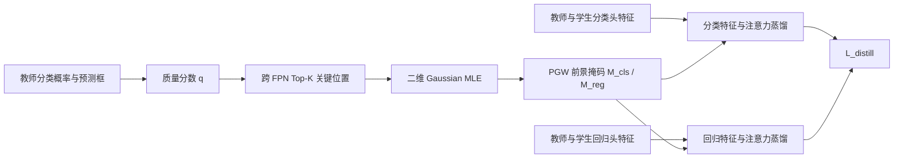

# Prediction-Guided Distillation for Dense Object Detection

**论文**：[ECCV 论文页面](https://www.ecva.net/papers/eccv_2022/papers_ECCV/html/1356_ECCV_2022_paper.php)  
**代码**：未提供  
**发表**：ECCV 2022

## 一句话总结

Prediction-Guided Distillation（PGD）先用教师的分类概率与定位 IoU 找到跨 FPN 的 top-K 关键预测位置，再以这些位置拟合二维高斯生成蒸馏权重，并把分类头与回归头分开蒸馏。

## 研究背景与问题

密集检测器没有 RoIAlign，每个 FPN 位置都产生预测，因此“蒸馏哪些特征”比分类任务更关键。DeFeat 对 GT 框内区域等权蒸馏，TADF 用以 GT 中心为均值的手工高斯，FGFI 根据 anchor 与 GT 的 IoU 选区域；这些规则都没有直接回答教师真正依赖哪些位置完成高质量检测。

PGD 的实证起点是：把教师在 GT 框内质量最高的预测从 NMS 前屏蔽，屏蔽 top-1% 就会造成约 50% AP 降幅。高质量响应只占前景特征的一小部分，并且区域大小不必与 GT 尺寸成比例。论文据此把教师预测本身作为蒸馏区域选择器，而不是使用固定中心或整框掩码。

完整方法包含 Key Predictive Regions、Prediction-Guided Weighting（PGW）和解耦的 Prediction-Guided Distillation。PGW 为每个 GT、每个任务生成前景权重；PGD 在分类和回归头的首个特征图上分别模仿教师，并结合源自 FGD 的空间与通道注意力监督。

## 方法总览

## 方法详解

### 1. 教师预测质量

位置 `X_i` 上第 `j` 个预测框相对 GT `b` 的质量为

$$
q(\hat b_{i,j},b)=\mathbf{1}[X_i\in b]\,\hat p_{i,j}(b)^{1-\eta}\,
\mathrm{IoU}(b,\hat b_{i,j})^{\eta}.
$$

`1[X_i∈b]` 限制位置必须位于 GT 内；`p̂_{i,j}(b)` 是 GT 类别的预测概率；IoU 衡量定位质量；`η` 平衡分类与定位。一个位置可能有多个 anchor，位置质量取该位置所有预测中的最大值。分类和回归 PGW 使用不同的 `η_cls`、`η_reg`，从源头上允许两项任务关注不同区域。

### 2. PGW：Top-K 后拟合高斯

对对象 `o`，从所有 FPN 层的 GT 内位置中选质量最高的 `K` 个绝对坐标 `T^o={(X_k^o,l_k^o)}`。假设这些坐标来自二维高斯 `N(μ,Σ|o)`，最大似然估计为

$$
\hat\mu=\frac1K\sum_k X_k^o,\qquad
\hat\Sigma=\frac1K\sum_k(X_k^o-\hat\mu)(X_k^o-\hat\mu)^T.
$$

只有入选 top-K 的像素获得非零重要性，其值由对应 Mahalanobis 距离的高斯指数项给出；若一个位置属于多个对象，取最大重要性。每个 FPN 层再除以该层非零像素数，得到前景蒸馏掩码 `M`。这种处理既排除低质量前景噪声，又用自适应椭圆高斯平滑 top-K 离散位置。

### 3. 分类与回归解耦蒸馏

PGD 在各 FPN 层分别蒸馏分类头和回归头的第一张特征图。分类特征损失对前景使用 `M_cls`，对背景使用归一化背景掩码，并乘教师的空间注意力 `P^{T,cls}` 与逐位置通道注意力 `A^{T,cls}`；回归特征损失仅在 `M_reg` 标记的前景位置计算。

空间注意力 `P` 由每个位置跨通道绝对响应经温度 softmax 得到；通道注意力 `A` 则在每个空间位置内对通道响应归一化。总蒸馏损失为 `L_distill=L_fea^cls+L_fea^reg+L_att^cls+L_att^reg`。论文明确不使用 FGD 的 Global Distillation Module，也去掉常见 adaptation layer，因为它们对结果影响很小。

分类分支保留背景蒸馏，是因为背景位置同样影响密集分类器的误报；回归分支则只在前景关键区域对齐，因为背景没有有效回归目标。这个不对称设计解释了消融中“仅回归蒸馏”虽然优于学生基线，却明显弱于分类蒸馏：它没有覆盖决定大量排序错误的背景分类信息。PGW 的高斯也不是把所有邻域重新纳入蒸馏，非 top-K 位置仍为零权重；高斯只在被选关键点之间分配相对强度。

分类分支保留背景蒸馏，是因为背景位置同样影响密集分类器的误报；回归分支则只在前景关键区域对齐，因为背景没有有效回归目标。这个不对称设计解释了消融中“仅回归蒸馏”虽然优于学生基线，却明显弱于分类蒸馏：它没有覆盖决定大量排序错误的背景分类信息。PGW 的高斯也不是把所有邻域重新纳入蒸馏，非 top-K 位置仍为零权重；高斯只在被选关键点之间分配相对强度。

## 实验与证据

实验覆盖 COCO 与 CrowdHuman，检测器包括 FCOS、ATSS、AutoAssign、GFL、DDOD；主要教师/学生骨干为 ResNet-101/ResNet-50，并与 DeFeat、FRS、FKD、FGD 等蒸馏方法比较。

- COCO 上，PGD 对不同单阶段检测器带来 3.1—4.6 AP 增益。FCOS 学生从 38.2 升至 42.5 AP，AutoAssign 从 40.6 升至 43.8 AP。
- ATSS 的关键消融中，学生基线 39.6 AP；整框等权 Box 为 43.3，GT 中心高斯 BoxGauss 为 43.7，直接质量加权为 43.8，TopkEq 为 43.9，PGD 为 44.2 AP。
- `K=30` 最佳，AP 为 44.2；`K=1` 为 43.2，`K=60` 为 43.9，说明位置太少会漏信息、太多会引入噪声。
- 仅分类蒸馏 FPN neck 为 43.6 AP，改蒸馏分类头特征为 43.8；仅回归分支为 41.7；分类与回归联合达到 44.2 AP。
- CrowdHuman 上使用 DDOD，论文报告 MR 改善 3.2、AP 改善 2.0；PGD 的 AP 优于其他比较蒸馏方案。

## 对 YOLO-Agent 的启发

接入点应位于 YOLO 教师和学生检测头内部，而不是只蒸馏 neck 输出：从教师解码后的类别概率与框 IoU 计算质量，在所有检测尺度上为每个 GT 选 top-K 网格，再分别生成分类、回归 PGW 掩码。若 YOLO 头是共享卷积，需在分类/回归分叉后的第一层特征处挂钩，避免把两种任务重新耦合。

对照组建议为：无蒸馏；整框等权蒸馏；直接质量加权；TopkEq；完整 PGD。主指标使用 COCO AP、APS、APM、APL，并单独记录 AP75，因为质量分数含定位项。验收阈值建议：完整 PGD 相对无蒸馏至少提升 1.0 AP，并至少领先整框等权 0.5 AP；若 APS 低于 TopkEq、AP75 不升，或蒸馏训练出现不稳定，则判定失败。调参优先扫描 `K` 与蒸馏系数：论文中 `K=30` 最优，且系数过大会导致训练不稳定，不能用扩大蒸馏区域补偿。

## 优点

- 蒸馏区域直接由教师的真实预测质量决定，避免固定几何先验。
- 自适应二维高斯保留 top-K 的集中趋势和方向性，同时抑制离散噪声。
- 分类、回归分别选区与蒸馏，适配密集检测头的任务差异。

## 局限

- 需要 GT 框计算质量分数，因此是有标注检测训练阶段的蒸馏方法。
- top-K 与高斯拟合会增加跨 FPN 选择和掩码生成开销。
- 论文主要验证单阶段 CNN 检测器，对两阶段和 Transformer 检测器仅作为未来方向。

## 评分

- **创新性：8.8/10**——把预测质量用于蒸馏区域发现，而非标签分配。
- **实验充分性：9/10**——覆盖多检测器、两数据集、区域策略与分支消融。
- **可迁移性：8.5/10**——适合具有明确分类/回归分支的多尺度检测头。
- **综合评分：8.8/10**
