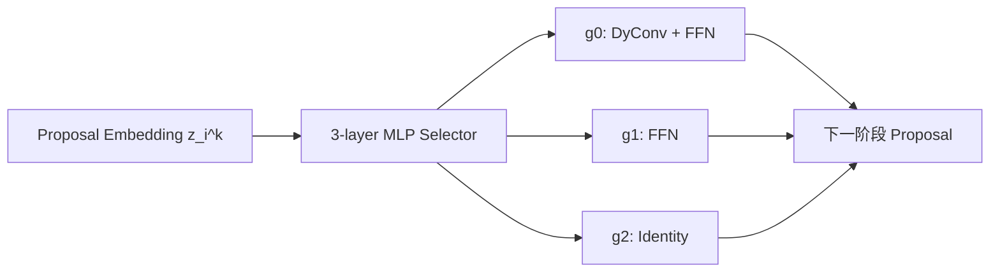

# Should All Proposals Be Treated Equally in Object Detection?

**论文**：[ECCV 官方论文页面](https://www.ecva.net/papers/eccv_2022/papers_ECCV/html/7151_ECCV_2022_paper.php)  
**代码**：题目分配未提供官方代码链接  
**发表**：ECCV 2022  
**类别**：动态检测头与效率优化

## 一句话总结

Dynamic Proposal Processing（DPP）不再让检测头用同一算子处理所有 proposals，而由轻量 MLP selector 按 proposal 和级联阶段动态选择高成本 `DyConv+FFN`、中成本 `FFN` 或零更新 `Identity`，并用 IoU loss 与 complexity loss 把有限计算优先分配给高质量候选。

## 研究背景与问题

Sparse R-CNN、DETR 一类方法把候选数量从数千降到数百，却让单个 proposal 的检测头越来越重；当 backbone 换成 MobileNetV2 时，头部开销甚至可能成为主要成本。论文给出的例子是：Sparse R-CNN 的 300-proposal 检测头需要 25 GFLOPS，而 MobileNetV2 整个 backbone 约为 5.5 GFLOPS。

现有检测器默认所有 proposals 等价，无论它们已经接近真实目标，还是几乎不可能成为有效框，都经过相同深度与算子。DPP 将问题形式化为“在总复杂度约束下，把不同算子匹配给不同 proposal，使精度最大”。训练阶段可用真实 IoU 教 selector 识别值得投入计算的候选；推理阶段 selector 只根据 proposal embedding 做路由，不需要真值。

## 方法总览

检测头包含多个顺序 stage。被选择的 stage 上，每个 proposal embedding 输入 selector，输出对三个算子的 one-hot 选择；未设置 selector 的 stage 复用前一阶段的选择。高 IoU proposal 倾向走 $g_0$，中等候选走 $g_1$，极差候选可直接走 $g_2$，从而形成图像相关、proposal 相关且 stage 相关的动态计算图。

## 方法详解

### 1. 复杂度建模

统一处理 $N$ 个 proposals 时，检测头复杂度为

$$C(\psi)=NC_h+\frac{N(N-1)}{2}C_p,$$

$C_h$ 是每 proposal 算子成本，$C_p$ 是 proposal 间 NMS 或 self-attention 等成对交互成本。DPP 使用算子集合 $G=\{h_j\}_{j=1}^{J}$，selector $s(x_i)$ 为第 $i$ 个 proposal 选择 $h_{s_i}$：

$$C(\psi)=\sum_{i=1}^{N}C_{h_{s_i}}+\frac{N(N-1)}{2}C_p.$$

优化目标是在 $C(\psi)<C$ 的预算下寻找最大精度 $P(\{h_{s_i}\})$ 的分配。论文实际采用三个算子：$g_0$ 为 proposal-dependent DyConv 加 FFN，$g_1$ 为静态 FFN，$g_2$ 为 Identity。

### 2. Selector

第 $k$ 个 stage 的 proposal embedding 为 $z_i^k$，三层 MLP 输出

$$\epsilon_i^k=\operatorname{MLP}(z_i^k)\in[0,1]^3.$$

训练时用 Gumbel-Softmax 产生 one-hot 路由，推理时选择最大分量对应的算子。selector 对 100 个 proposals 仅消耗 4e-3 GFLOPS。因为选择同时随 $i$ 与 $k$ 变化，若有 $|\mathcal K|$ 个动态 stage，可形成 $3^{|\mathcal K|}$ 种头部路径。

### 3. IoU 与复杂度联合监督

IoU loss 鼓励 $g_0,g_1$ 处理高质量候选：

$$L_{iou}=\frac{1}{N}\sum_i\sum_{k\in\mathcal K}\sum_{j\in\{0,1\}}\left[(1-u_i^k)\epsilon_{i,j}^k+u_i^k(1-\epsilon_{i,j}^k)\right],$$

$u_i^k$ 是 proposal 在该 stage 的 IoU；它让 IoU 高于 0.5 的候选倾向启用较重算子，低 IoU 候选反之。复杂度损失只约束高成本 $g_0$ 的使用次数：

$$L_c=\frac{1}{N}\sum_{k\in\mathcal K}\left|\sum_i\epsilon_{i,0}^k-T\right|,$$

其中 $T=\alpha M$，$M$ 是图像目标数，并裁剪到 $[T_{min},N]$。最终 $L_s=L_{iou}+\lambda L_c$，与原检测器的分类、GIoU 和框回归损失共同训练。

动态 stage 的安排也是 DPP 的组成部分。检测头写成 $\psi=\phi_1\circ\cdots\circ\phi_K$，selector 只放在子集 $\mathcal K$ 上，其余 stage 继承前一阶段算子选择。这样既允许同一 proposal 随 refinement 阶段改变路径，又避免每层都付出路由开销。论文可视化显示，后期 $g_0$ 更集中于接近真值的框，而被 Identity 跳过的末级 proposals 几乎没有检测精度。

## 实验与证据

- **数据与基线**：COCO，比较 Faster R-CNN-FPN、RetinaNet、DETR、Deformable DETR、Sparse R-CNN；backbone 使用 ResNet-50 与 MobileNetV2，复杂度主要报告检测头 GFLOPS。
- **ResNet-50**：Sparse R-CNN 为 45.0 AP、25 GFLOPS；DPP-XL 同为 45.0 AP，但头部仅 15 GFLOPS。DPP-M 为 42.2 AP、3.2 GFLOPS，DPP-S 为 40.4 AP、2.1 GFLOPS。
- **MobileNetV2**：Sparse R-CNN 为 36.6 AP、8.2 GFLOPS；DPP-XL 达到 36.9 AP、7.8 GFLOPS，DPP-S 仍有 35.7 AP、3.6 GFLOPS，并取得更好的延迟—精度曲线。
- **损失消融**：只用 $L_c$ 得到 41.1 AP，只用 $L_{iou}$ 为 41.8，两者结合为 42.2。$\lambda=1$ 与 10 接近，增至 100、300 时分别降到 41.7、41.0，表明过度追求复杂度会破坏 IoU 匹配。
- **预算控制**：默认 $T_{min}=1,\alpha=2$ 时，平均每图选择 $g_0$ 15 次；COCO 平均目标数为 7，说明约按实例数两倍配置重算子可落在复杂度—精度曲线的拐点。
- **路由解释**：不分配任何末级计算的 proposals 几乎为零 AP，证明模型确实学会放弃极差候选，而不是随机节省计算。

DPP-S、DPP-M、DPP-L 分别使用不同总 proposal 数，DPP-XL 则在大模型基础上提高 $T_{min}$，强制更多候选使用重算子。四个变体不是简单缩放同一静态头，而是同时改变候选池和目标计算预算。COCO test 上四个版本分别报告 44.7、43.8、42.5、40.7 AP，说明训练出的路由在验证集之外仍保持相同排序。论文还在单线程 CPU 上测量完整网络延迟，动态头的 FLOPS 节省确实转化为更优延迟—精度曲线，而非只停留在理论乘加量。

从算子职责看，$g_0$ 执行 proposal-dependent DyConv，最适合继续修正高质量框；$g_1$ 只做静态 FFN，承担中等成本的语义更新；$g_2$ 不再修改 embedding。三者不是宽度不同的同类卷积，而是逐步减少“实例自适应、特征变换、继续计算”的能力，因此 selector 的输出同时代表候选质量判断和后续处理深度。

论文先在没有 selector 的条件下预训练检测头，再加入选择损失进行动态路由学习。这样可以避免随机初始化的路由在训练初期把大量 proposal 直接送入 Identity，导致分类与回归头尚未学会基本检测就失去梯度来源。复现时应把静态预训练与动态训练阶段分开记录。

## 对 YOLO-Agent 的启发

标准 YOLO 没有显式 proposal decoder，不能直接把 DPP 塞进 dense head。合理接入点是 YOLO-Agent 的稀疏候选分支：先由原 head 或 top-score 筛选得到 proposal embeddings，再串联若干 refinement stage，并把每个 stage 的卷积块替换为 $g_0/g_1/g_2$ 路由。对照组应是相同 proposal 数、相同 stage 数的全 $g_0$ 头，以及 DPP-S/M/L 式不同预算模型；必须同时记录 AP、AP50、AP75、头部 GFLOPS 和端到端延迟。

失败判据应基于论文的复杂度—精度边界：若无法在接近 Sparse R-CNN 45.0 AP 时把头部从 25 降到 15 GFLOPS，或轻量设置不能接近 DPP-M 的 42.2 AP/3.2 GFLOPS，则动态路由没有形成有效优势；消融中若去掉任一损失反而不下降，需检查 IoU 标签、Gumbel-Softmax 与 $T$ 的实现。$\lambda$ 进入论文中 100–300 对应的 41.7–41.0 AP 区间，也应视为复杂度约束过强。

## 优点

- 从检测头而非只从 backbone 优化效率，适合轻量 backbone 场景。
- 路由模块极轻，计算预算可由 $T_{min}$、$\alpha$ 和 proposal 数控制。
- 在 ResNet-50、MobileNetV2 及多种检测器上给出一致的复杂度—精度收益。

## 局限

- 需要显式 proposal embedding 和多阶段 refinement，不适合未经结构改造的纯 dense YOLO head。
- 训练路由依赖 proposal IoU 与图像目标数，动态离散选择也增加实现和部署难度。
- 论文主要优化检测头 FLOPS；真实硬件上的分支、批处理和算子调度可能削弱理论节省。

## 评分

- **创新性：高**：把 proposal 质量与算子复杂度匹配成可学习问题。
- **效率证据：高**：同时给出 GFLOPS、CPU 延迟和两类 backbone。
- **YOLO 兼容性：中**：需要先引入稀疏 proposal refinement 结构。
- **综合评价：推荐研究型接入**：适合探索动态稀疏检测头，而非直接替换现有 head。
