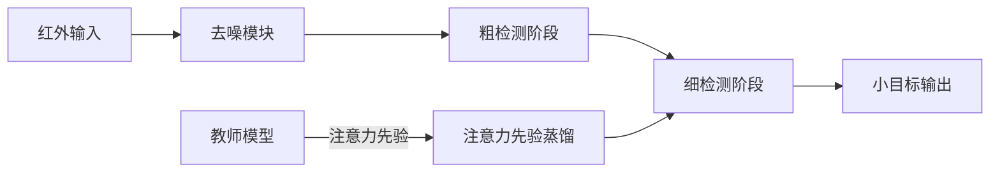

# Denoising-Enhanced Coarse-to-Fine Infrared Small Target Detection with Attention Prior-Guided Knowledge Distillation

**论文**: [arXiv](https://arxiv.org/abs/2606.21956) · [ECCV 2026 virtual](https://eccv.ecva.net/virtual/2026/poster/5434)  
**任务**: 红外弱小目标检测 / 高效检测

## 一句话总结

论文在红外弱小目标检测中串联三个组件：先去噪抑制低信噪比背景，再用粗到细两级定位收敛候选区域，最后用注意力先验引导的知识蒸馏把重型教师的空间注意力迁移到高效学生模型。

## 研究背景与问题

红外小目标检测的核心困难是信噪比极低：目标仅占几个像素、缺乏纹理，且常被云层、地物等杂波淹没。直接在原始特征上检测容易产生大量虚警；而高精度模型往往计算量大，难以部署在弹载、机载等资源受限平台。

## 方法总览

## 方法详解

- **去噪增强**：在检测头之前抑制背景杂波，提高目标区域信噪比，降低后续阶段的虚警压力。
- **粗到细检测**：粗阶段用低分辨率特征高召回地筛选候选，细阶段在高分辨率特征上精确分类和定位，两级设计兼顾召回与定位精度。
- **注意力先验蒸馏**：教师的注意力图作为空间先验监督学生的注意力，使学生学习"往哪里看"，而不仅学习最终特征表示。

## 实验与证据

- 在公开红外小目标数据集上与主流方法比较，报告召回率、虚警与 AP 指标。
- 论文强调蒸馏后的学生模型保持较小计算量，适合边缘部署。
- 注意力先验蒸馏相对仅特征蒸馏的消融是关键证据，正式论文中的消融表需进一步核对。

## 对 YOLO-Agent 的启发

- 当 AP_small 受噪声而非分辨率限制时，优先尝试"去噪 + 注意力先验蒸馏"组合，而不是盲目加分辨率分支。
- 注意力先验蒸馏与 YOLO 系的特征蒸馏兼容，可作为训练期附加损失，不增加推理成本。
- 若部署允许两阶段推理，粗到细设计可作为高召回初筛 + 精检测的模板；否则只用蒸馏部分。
- 评估时分别报告召回与虚警，避免单一 AP 掩盖虚警率变化。

## 优点

- 三个组件动机清晰，分别对应信噪比、定位精度与部署成本三个独立问题。
- 蒸馏只在训练期生效，推理侧零开销，工程友好。

## 局限

- 依赖红外域的教师质量；教师注意力先验有偏差会直接传给学生。
- 粗到细结构增加流水线复杂度，两阶段的阈值与级联策略需要逐数据集调参。

## 评分

- **创新性**: ★★★☆☆
- **证据强度**: ★★★☆☆
- **YOLO-Agent 参考价值**: ★★★★☆
