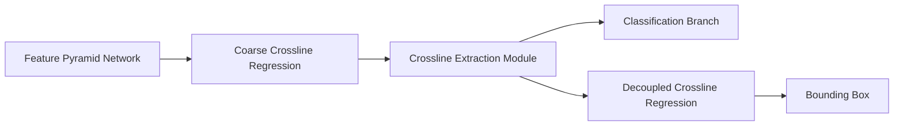

# CrossDet: Crossline Representation for Object Detection

**论文**：[官方论文原文](https://openaccess.thecvf.com/content/ICCV2021/html/Qiu_CrossDet_Crossline_Representation_for_Object_Detection_ICCV_2021_paper.html)  
**PDF**：[官方 PDF](https://openaccess.thecvf.com/content/ICCV2021/papers/Qiu_CrossDet_Crossline_Representation_for_Object_Detection_ICCV_2021_paper.pdf)  
**代码**：[论文页面中的作者资源（catalog 未提供独立官方仓库）](https://openaccess.thecvf.com/content/ICCV2021/html/Qiu_CrossDet_Crossline_Representation_for_Object_Detection_ICCV_2021_paper.html)  
**发表**：ICCV 2021  
**类别**：General Object Detection · Anchor-free Detection

## 一句话总结

CrossDet 以水平线 \(H_{line}\) 和垂直线 \(V_{line}\) 的组合代替 anchor box 或离散点集，通过 Crossline Extraction Module（CEM）沿线连续取特征，再用 Decoupled Crossline Regression 分别优化横向与纵向边界。

## 研究背景与问题

anchor box 会把框内背景和重叠物体一并编码，点表示又容易遗漏目标内部连续外观。Crossline Representation 从交点向四个边界生长：水平线提供左右边界及横向纹理，垂直线提供上下边界及纵向纹理。

网络采用两阶段 pipeline。第一阶段从 FPN 特征预测 coarse crossline location；第二阶段用 CEM 聚合当前 cross lines 上的上下文，再输出类别和精细位置。初始水平、垂直线均为 3 个像素长，因此一开始就包含交点相邻信息。

CEM 先做 Axis-aware Pooling 建模整行/整列依赖，再生成 Soft-weighted Sampling map，只在线段范围内累积特征。回归时水平线保持 \(y_o\) 不变，只预测 \(\Delta x,\Delta w\)；垂直线保持 \(x_o\) 不变，只预测 \(\Delta y,\Delta h\)。

## 方法总览

## 方法详解

Crossline 定义为 \(H_{line}=(x_1,x_2,y_o)\)、\(V_{line}=(x_o,y_1,y_2)\)，交点为 \((x_o,y_o)\)。端点天然对应真值框的 left/right/top/bottom，无需额外关键点标注。

对特征 \(I\in\mathbb R^{C\times H\times W}\)，轴向池化为 \(I^H_{pool}(0,y)=W^{-1}\sum_xI(x,y)\) 与 \(I^V_{pool}(x,0)=H^{-1}\sum_yI(x,y)\)。经过 1×3、3×1 卷积、展开与相加得到 \(I'\)，再以 sigmoid 权重 \(W(x,y)\) 计算
\[
F_H(x_o,y_o)=\sum_{x=x_1}^{x_2}W(x,y_o)\otimes I'(x,y_o),\quad
F_V(x_o,y_o)=\sum_{y=y_1}^{y_2}W(x_o,y)\otimes I'(x_o,y).
\]

Decoupled Regression 将二维搜索拆成两条一维搜索，并使用 GIoU 加 offset constraint：\(L_{reg}=L_{GIoU}+\alpha L_{oc}\)，\(\alpha=0.1\)。总损失跨两个 stage 聚合；第一阶段实验表明 localization supervision 比 classification supervision 更适合学习 coarse cross lines。

## 实验与证据

- PASCAL VOC 与 MS-COCO；消融使用 ResNet-50+FPN、12 epochs、batch 16。VOC 输入长短边 1000/600，COCO 为 1333/800。
- 表示对比 AP：Center Points 48.4、Key Points 48.9、Anchor boxes 49.3、Cross lines 50.9；对应 AP75 为 52.8/52.9/53.0/55.2。
- CEM：无 CEM 48.4；Axis-aware Pooling 50.9，Global Pooling 50.5；无 Sampling 48.8，Max/Average/Soft-weighted 为 50.7/49.7/50.9。
- 仅 Cls-CEM 为 49.4，仅 Reg-CEM 为 49.5，两支都有为 50.9。Traditional Regression 50.1，Decoupled 50.6，加 \(L_{oc}\) 为 50.9。
- 单 stage 为 48.1；两 stage 用分类监督 coarse line 为 50.0，用回归监督为 50.9。VOC2007 test 上 ResNet-50/101 为 50.9/52.8 AP；COCO test-dev 标准 12 epoch 为 41.8/42.8，多尺度训练测试 ResNet-101-DCN 达 48.4。

## 对 YOLO-Agent 的启发

可实现 `crossdet_head` 替换 YOLO 的 box parameterization：每个尺度先预测 coarse \((x_o,y_o,x_1,x_2,y_1,y_2)\)，按线段执行 CEM，再由分类头与水平/垂直回归头精炼。主对照保持 backbone、PAN、assigner、训练轮数一致，分别使用原 YOLO box、center point、去 CEM、单支 CEM、traditional regression 和无 \(L_{oc}\)。

Harness 报告 COCO AP/AP50/AP75/APS/M/L、VOC AP、每尺度线长分布、FPS 与显存。通过条件建议为相对原 box head AP 至少增加 1 点、AP75 至少增加 1.5、双支 CEM 必须高于任一单支至少 0.8、\(L_{oc}\) 至少贡献 0.2；若线段频繁越界、退化为固定 3 像素、推理时延增加超过 15%，则停止升级。

## 优点

- 线段兼具连续内部信息与明确边界含义，可直接由框标注监督。
- CEM 的轴向池化和软采样均有独立消融支持。
- 两轴解耦降低回归搜索空间，对 AP75 和大目标有明显帮助。

## 局限

- 两阶段 head 和动态线采样比普通 YOLO box head 更复杂。
- 横纵 cross lines 对旋转目标、弯曲细长物体的表达仍受坐标轴限制。
- 论文实现基于 FPN/MMDetection，移动端算子支持需重新评估。

## 评分

- **创新性：8.5/10**
- **实验充分性：9/10**
- **工程可迁移性：7.5/10**
- **综合评分：8.3/10**：适合探索 YOLO 检测头中的连续目标表示。
