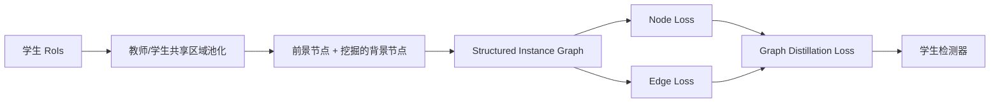

# Deep Structured Instance Graph for Distilling Object Detectors

**论文**：[CVF 论文页](https://openaccess.thecvf.com/content/ICCV2021/html/Chen_Deep_Structured_Instance_Graph_for_Distilling_Object_Detectors_ICCV_2021_paper.html)  
**代码**：官方代码链接未提供  
**会议**：ICCV 2021

## 一句话总结

DSIG 把教师和学生的 RoI proposal 表示组织成 Structured Instance Graph：节点保存前景/背景实例特征，边保存实例间余弦相似度，再以背景样本挖掘和自适应背景权重联合蒸馏局部语义与全局拓扑。

## 研究背景与问题

检测器特征图中背景像素远多于目标像素，直接逐像素拟合教师会让大量无效背景主导损失；只保留前景又会丢掉容易误分类的 hard negative。另一方面，检测头处理的是 proposal 或候选框级语义实例，像素之间的局部相似关系不能完整表达“哪些实例应聚在一起、哪些实例应分开”的检测知识。

论文因此把蒸馏单位从整张 feature map 改为 RoI pooled instance。相同的学生 RoI 被共享给教师，以保证两侧抽取的是同一区域；教师与学生各自构建一个无向完全图，既对齐节点表示，也对齐节点之间的关系矩阵。对于 RetinaNet 等单阶段检测器，则用预测框替换 RPN proposals 来建立图。

## 方法总览

Structured Instance Graph 记为 \(G=(V,E)\)。节点集合 \(V\) 由前景节点 \(v_i^{fg}\) 和背景节点 \(v_i^{bg}\) 组成，每个节点是一个 RoI pooled feature 的向量化表示；边矩阵 \(E=[e_{pq}]\) 则描述任意两个实例在嵌入空间中的相似性。训练损失由前景节点、背景节点、图边以及检测头 logits 四部分知识共同组成。

## 方法详解

### 节点、边与背景样本挖掘

proposal 与真值框的 IoU 决定其属于前景还是背景。边定义为两个节点的余弦相似度：

\[
e_{pq}=\frac{v_p\cdot v_q}{\|v_p\|\,\|v_q\|}.
\]

余弦相似度不受特征向量长度影响；由于 \(e_{pq}=e_{qp}\)，图是无向图，边矩阵对称。若把所有背景节点都加入完全图，背景相关边会平方级增长并淹没有效监督；若全部删除，则早期训练中的难负样本也被舍弃。

Background Samples Mining 借鉴 OHEM，只选择教师分类损失高于阈值 \(T\) 的背景 proposal。它们是教师也容易混淆的背景区域，更适合与全部前景节点一起形成扩展边集合；被教师高置信判为背景的简单样本不参与边蒸馏。

### 图蒸馏与总目标

教师图和学生图分别为 \(G^t=(V^t,E^t)\)、\(G^s=(V^s,E^s)\)。图损失为

\[
L_G=\lambda_1L_V^{fg}+\lambda_2L_V^{bg}+\lambda_3L_E,
\]

其中节点项计算对应 RoI 特征的欧氏距离，边项计算教师/学生相似度矩阵的欧氏距离。\(N_{fg}\)、\(N_{bg}\) 分别是前景和背景节点数；论文固定 \(\lambda_1=\lambda_3=0.5\)，并令

\[
\lambda_2=\alpha\frac{N_{fg}}{N_{bg}},
\]

用样本数比率动态压低背景节点损失，避免图中背景数量变化造成训练失衡。最终学生目标为

\[
L=L_{Det}+L_G+L_{Logits}
=L_{RPN}+L_{RoIcls}+L_{RoIreg}+L_G+L_{Logits},
\]

其中 \(L_{Logits}\) 用 KL divergence 对齐分类与框回归头输出。节点损失传递局部 proposal 语义，边损失约束整个实例嵌入空间的拓扑，两者并非替代关系。

图的语义还取决于区域对齐顺序。论文明确使用学生 RoIs 同时池化教师特征，而不是让两侧各自生成 proposal 后再匹配；这样第 \(i\) 个教师节点和第 \(i\) 个学生节点天然指向相同图像区域，节点欧氏距离与边相似度距离才有确定含义。若教师独立使用更好的 proposals，表面上节点质量更高，却会破坏逐节点监督的一一对应。

## 实验与证据

实验在 COCO2017 train/val 上覆盖 Faster R-CNN、RetinaNet，并扩展到 Mask R-CNN 实例分割；学生/教师包含 ResNet18→ResNet50、ResNet50→ResNet101、MobileNetV2→ResNet50 等组合。主要基线包括 FGFI、PixelPairWise、TaskAdap、AttentionGuided。

Faster R-CNN ResNet18 学生基线为 33.06 AP，DSIG 在 1x 日程达到 37.25，2x 达到 38.09；ResNet50 学生从 38.03 提升到 40.57（1x）和 41.55（2x）。MobileNetV2 学生达到 34.44 AP，相比 29.47 基线提升明显。RetinaNet ResNet18 从 31.60 提升到 34.72（1x）和 36.78（2x）。在实例分割中，Mask R-CNN ResNet18 的 box/mask AP 从 33.89/31.30 提升到 37.33/33.90。

消融使用 Faster R-CNN R18→R50。学生为 33.06 AP；只加 Edge 得到 33.95，即 +0.89；再加 ForeGround Node 达到 36.64，再增加 BackGround Node 达到 37.17。论文据此指出，前景节点提供最大的直接收益，边关系保留拓扑，经过平衡的背景节点还能额外贡献 0.53 AP。可视化中，教师节点类别聚类更清晰，DSIG 的边距离训练后接近教师，而只做像素模仿的 FGFI 仍保留较大关系差距。

## 对 YOLO-Agent 的启发

YOLO 没有 RoIAlign，可在正样本分配后把每个匹配目标对应的多尺度特征采样向量定义为前景节点，把分类损失高于阈值的未匹配候选定义为背景节点；教师与学生必须共享候选坐标，再构建批内实例余弦矩阵。接入位置在 neck 输出与检测头之间，推理时整套图分支删除。

对照组应为原始 YOLO、仅节点 KD、仅边 KD、节点+边、节点+边+背景挖掘，并同时比较普通全图 MSE。论文消融给出可用的失败阈值：若边损失不能带来正 AP 增益，或加入前景节点后增益远低于论文的 2.69 AP，说明节点抽取没有保留实例语义；若加入背景节点使 AP 下降，说明 hard-negative 筛选或 \(N_{fg}/N_{bg}\) 权重失效。最终方案至少应超过仅节点版本，并检查小目标 APS 与显存占用，避免完全图的 \(O(N^2)\) 边数抵消收益。

## 优点

- 蒸馏对象与检测头实际消费的 proposal 实例一致，前景监督更集中。
- 节点与边同时覆盖局部特征和全局实例关系。
- 不粗暴删除背景，而是挖掘难负样本并动态平衡其权重。
- 在一阶段、二阶段检测和实例分割上均验证了可迁移性。

## 局限

- 完全图边数随节点数平方增长，大量候选会增加训练显存与计算。
- 背景挖掘依赖教师分类损失阈值，教师错误可能把噪声当作难例传给学生。
- 教师和学生必须共享区域，对无 proposal 的密集检测头需要重新定义节点对齐协议。
- 方法包含图损失与 logits KL，多项收益并非全部来自 Structured Instance Graph 本身。

## 评分

**8.8/10**。论文准确抓住检测蒸馏中的实例语义和背景失衡，消融链条完整；主要成本是完全图复杂度以及迁移到现代无 RoI 检测器时需要额外设计。
