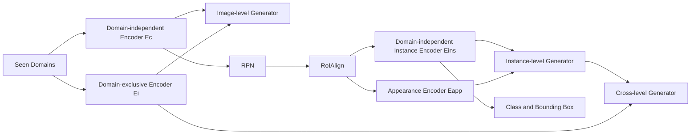

# Domain-Invariant Disentangled Network for Generalizable Object Detection

**论文**：[官方论文原文](https://openaccess.thecvf.com/content/ICCV2021/html/Lin_Domain-Invariant_Disentangled_Network_for_Generalizable_Object_Detection_ICCV_2021_paper.html)  
**PDF**：[官方 PDF](https://openaccess.thecvf.com/content/ICCV2021/papers/Lin_Domain-Invariant_Disentangled_Network_for_Generalizable_Object_Detection_ICCV_2021_paper.pdf)  
**代码**：[论文页面中的作者资源（catalog 未提供独立官方仓库）](https://openaccess.thecvf.com/content/ICCV2021/html/Lin_Domain-Invariant_Disentangled_Network_for_Generalizable_Object_Detection_ICCV_2021_paper.html)  
**发表**：ICCV 2021  
**类别**：General Object Detection · Domain Generalization

## 一句话总结

DIDN 不使用目标域数据，而是在 Faster R-CNN 内执行 Image-level Disentanglement、Instance-level Disentanglement 与 Cross-level Reconstruction，从多个已见源域提取可迁移的图像内容和实例表示。

## 研究背景与问题

目标域不可见时，UDA 的源—目标对齐无法成立；简单合并源域也会因天气、场景、相机与物体外观互相干扰。DIDN 学习共享映射 \(g\) 和域特有映射 \(f\)，并要求 \(d(g(S_i),f(S_i))\) 可重建原域。

图像级分支为每个源域设置 Domain-exclusive Encoder \(E_i\)，共享 Domain-independent Encoder \(E_c\) 同时充当 Faster R-CNN backbone；Image-level Generator 重建图像，分层 pair-wise Domain Classifier 迫使 \(E_c\) 去除域线索。

实例级分支在 RoIAlign 后使用 Appearance Encoder \(E_{app}\)、Domain-independent Instance Encoder \(E_{ins}\) 与 Instance-level Generator。Cross-level Generator 再结合重建 RoI 特征与图像域信息还原像素物体，补偿 RoIAlign 的信息损失。

## 方法总览

推理只保留 \(E_c\)、RPN、RoIAlign、\(E_{ins}\) 和检测头；域专属编码器、generator 与 domain classifier 均为训练期正则，论文称速度与 Faster R-CNN 相同。

## 方法详解

图像重建为 \(L^{img}_{rec}=\mathbb E\|G_{img}(E_i(x_i),E_c(x_i))-x_i\|^2\)，分层域分类器与 \(E_c\) 构成对抗，使共享内容难以暴露源域身份。

proposal 特征 \(p_{i,k}=RoI(E_c(r_{i,k}))\)，实例重建为 \(p'_{i,k}=G_{ins}(E_{app}(p_{i,k}),E_{ins}(p_{i,k}))\)，损失 \(L^{ins}_{rec}=\mathbb E\|p'_{i,k}-p_{i,k}\|^2\)。条件域分类器同时读取实例内容和类别 \(c_{i,k}\)。

跨层项为
\[
L^{rec}_{obj}=\sum_{k\in O}\|G_{obj}(p'_{i,k},RoI(E_i(r_{i,k})))-r_{i,k}\|^2.
\]
总目标 \(L_{DIDN}=L_{det}+\lambda_a(L^{img}_{adv}+L^{ins}_{adv})+\lambda_r(L^{img}_{rec}+L^{ins}_{rec})+\lambda_cL^{rec}_{obj}\)，优化为 \(\min_{E,G}\max_D\)，推荐 \(\lambda_a=0.5,\lambda_r=0.1\)。

## 实验与证据

- 数据使用 Cityscapes、Foggy Cityscapes、BDD100k、SIM10k、KITTI；检测器为 Faster R-CNN + RoIAlign、ResNet-50，短边 600。
- F&B→C 中 Source-combined/Directly Align 为 45.3/45.7 mAP，DIDN 为 47.9；C&B→F 从 31.3/27.4 提到 33.4；F&C→B 从 18.9/19.1 提到 22.7。
- 五域 car：C&B&S&F→K 为 76.8，比 Directly Align 高 1.2；C&F&K&S→B 为 52.3，比 Source-combined 高 4.1。
- 组件消融在 F&B→C 为 image-only 47.1、instance-only 46.1、二者 47.3、加跨层重建 47.9；C&B→F 为 32.1/31.9/33.2/33.4；F&C→B 为 21.1/20.3/22.2/22.7。

## 对 YOLO-Agent 的启发

YOLO 可把 `Ec` 放在 backbone/PAN，为每个源域增加训练期 `Ei` 与 Image-level Generator；把动态匹配后的正样本网格特征送入 `Eapp/Eins`，用对应物体裁剪执行 Cross-level Reconstruction。导出时只能保留 `Ec -> neck/head`。

Harness 对照为 `source-combined YOLO` 和只加 GRL 的 `Directly Align YOLO`，并逐项开关 image、instance、cross-level。按未见域记录 AP50/mAP、类别 AP、导出图与延迟。若平均提升不足 2 点、跨层重建不再增加至少 0.2、ONNX 中残留 generator/classifier，或推理延迟增加超过 1%，则拒绝接入。

## 优点

- 同时处理图像风格与实例外观偏移，并用重建保护信息。
- 无需目标域图像，符合 domain generalization 定义。
- 辅助模块可在部署前删除。

## 局限

- Cross-level Reconstruction 依赖真值框，不能直接用于无标签目标域。
- 源域增多会增加域专属编码器和成对分类器的训练成本。
- 未解决目标域出现新类别的问题。

## 评分

- **创新性：8/10**
- **实验充分性：8.5/10**
- **工程可迁移性：7/10**
- **综合评分：7.9/10**：适合跨天气、跨相机训练，但单阶段接入成本较高。
