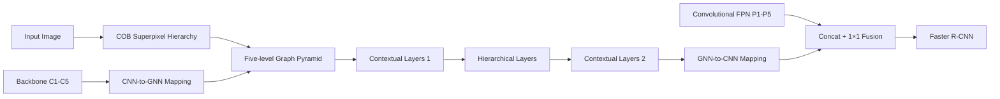

# GraphFPN: Graph Feature Pyramid Network for Object Detection

**论文**：[官方论文页面](https://openaccess.thecvf.com/content/ICCV2021/html/Zhao_GraphFPN_Graph_Feature_Pyramid_Network_for_Object_Detection_ICCV_2021_paper.html)  
**代码**：未提供  
**发表**：ICCV 2021

## 一句话总结

GraphFPN 先用 COB 为每张图像生成五级超像素 part-whole hierarchy，再把超像素变成图节点，通过同尺度 contextual layers 与跨任意尺度 hierarchical layers 传播信息，最后把图特征映射回卷积 FPN，与原 FPN 特征融合后送入 Faster R-CNN。

## 研究背景与问题

FPN、PANet、FPT 的多尺度交互都建立在固定二维网格和预设拓扑上，同一结构被用于所有图像；而物体部件、完整物体及场景布局随图像改变。普通 FPN 还主要让相邻尺度直接通信，非相邻层的信息必须级联传递，难以显式建模跨尺度的 part-whole 关系。

GraphFPN 的辨识点是“图拓扑由当前图像的超像素层级决定”。细粒度超像素构成部件，向上递归合并成更大区域；同层相邻关系形成 contextual edges，任意祖先—后代关系形成 hierarchical edges。因此它不是把 FPN 网格简单展平做 GNN，而是用图像特定的分割树重建多尺度计算图。

## 方法总览

COB 产生层级分割，从中选择超像素数量每级约缩小到四分之一的五个 partition，建立五层 graph pyramid。GraphFPN 顺序堆叠第一组 contextual layers、hierarchical layers、第二组 contextual layers；每层同时使用空间自注意力、local channel-wise attention 和 local channel self-attention。backbone 特征初始化图节点，图输出再复制回对应 FPN 网格，与卷积 FPN 特征拼接后经 $1\times1$ 卷积融合。

## 方法详解

### 1. 超像素层级与图边

层级分割为 $\{S^0,\ldots,S^L\}$，最细层近似像素，最高层覆盖整图。论文选取五级 $\{S^{l_1},\ldots,S^{l_5}\}$，使相邻级超像素数量约为四分之一。每个超像素对应图节点；同层空间相邻节点连接 contextual edge，跨层存在祖先—后代关系的节点连接 hierarchical edge。后者非常稠密，论文按节点特征余弦相似度剪掉每个节点关联边中排名后 50% 的边。

### 2. 图层与双局部通道注意力

contextual layer 只使用同层边，hierarchical layer 只使用剪枝后的跨层边，操作形式相同。空间更新采用单头 GAT：

$$
\mathbf h'_i=\mathcal M(\mathbf h_i,\{\mathbf h_j\}_{j\in\mathcal N_i}),
$$

$\mathcal N_i$ 是节点邻域，$\mathcal M$ 为图注意力聚合。local channel-wise attention 先平均节点及邻居特征得到 $\bar{\mathbf a}_i$，再计算 $\sigma(W_1\bar{\mathbf a}_i)\odot\mathbf h'_i$。local channel self-attention 将邻域特征组成矩阵 $A$，以 $X=A^TA$ 得到通道相似矩阵并逐行 softmax，输出 $\beta X\mathbf h''_i+\mathbf h''_i$；$\beta$ 可学习且初始化为 0。两种通道注意力都在局部邻域内计算，因此会随空间位置变化。

### 3. CNN 与 GNN 双向映射

backbone 网格单元分给重叠面积最大的超像素；属于同一超像素的网格特征分别做 max/min pooling，拼接后经全连接和 ReLU 得到节点初值：

$$
\mathbf h_k^i=\deltaleft(W_2[\Delta_{max}(C_k^i)\Vert\Delta_{min}(C_k^i)]
ight).
$$

$C_k^i$ 是第 $i$ 层分给超像素 $k$ 的网格集合，$\Vert$ 表示拼接。反向映射时把节点最终特征复制到所属 FPN 网格，得到图特征 $\bar P_i$，再与卷积特征 $P_i$ 拼接并用 $1\times1$ 卷积恢复通道数。

max 与 min pooling 的并用是 GraphFPN 的特有映射设计：前者保存超像素内最强语义响应，后者保留另一端的局部统计，二者拼接比单一平均更能描述不规则区域。映射回 CNN 时采用复制而非插值，同一超像素内的网格获得相同图上下文；随后与原 FPN 特征融合，原卷积分支仍提供精细位置差异，图分支则补充区域级和跨尺度关系。

## 实验与证据

实验使用 COCO 2017（118k train、5k val、20k test），Faster R-CNN 为检测框架，主干在 ImageNet-1k 预训练。主要比较 FPN、PAN、ZigZagNet、FPT，以及 RetinaNet、DETR、Deformable DETR、Sparse R-CNN 等。

论文在 8 张 2080 Ti 上训练，并遵循 FPT 的检测设置。基础 Faster R-CNN 只有 33.1 AP，加入普通 FPN 为 36.2；GraphFPN 的提升说明收益不仅来自“存在多尺度特征”，还来自超像素图上的同尺度与跨尺度交互。作者同时指出层级超像素更有利于小结构而不完全适合大目标，这与其相对 FPT 的 APS 优势和 APL 劣势相互印证。

- ResNet-50 骨干下，GraphFPN 基础训练为 42.1 AP；加入 AutoAugment/增强训练（表中 AH、MT 组合）达到 43.7 AP、64.0 AP50、48.2 AP75。论文指出相对 FPT 的小目标 AP 提升 2.3，但大目标 AP 略逊，符合超像素层级偏向局部结构的特性。
- 完整 CGL-1→HGL→CGL-2 为 39.1 AP。移除第一组 contextual layers 降至 38.2，移除第二组降至 38.7；只留 hierarchical layers 为 36.2，只留 contextual layers 为 37.2，说明同尺度预传播、跨尺度传播和后处理互补。
- 去掉 spatial attention、local channel-wise attention、local channel self-attention 后 AP 分别从 39.1 降至 37.8、37.9、37.6；两个通道注意力都去掉为 37.1。
- 每组三层、总九层时最好，为 39.1 AP；每组一、二、四、五层分别为 36.1、37.2、38.1、37.1，过深会因梯度消失退化。
- 完整流水线相对 Faster R-CNN+FPN 具有 1.89 倍参数、1.21 倍 FLOPs、12.9% 更长检测时间；若计入 CPU 上 COB，额外约 0.12 秒，成为实际部署瓶颈。

层级边剪枝同样是不可省略的工程环节：每个节点原本连接所有祖先和后代，边数会随层级迅速增长。按余弦相似度删除后 50% 边，使 hierarchical layers 保留更相关的跨尺度关系，同时限制显存与计算。它也是 GraphFPN 区别于固定全连接跨尺度注意力的重要设计。

## 对 YOLO-Agent 的启发

接入点应位于 YOLO backbone 与 PAN/FPN neck 之间：保留原卷积 neck，新增 image-specific graph branch，最后在每个尺度用 concat+$1\times1$ 融合，而不是替换检测头。对照组设为原 PAN/FPN、仅 contextual graph、仅 hierarchical graph、完整 GraphFPN；记录 AP、APS、APL、端到端延迟，并把超像素生成时间单列。

失败阈值应体现论文的真实代价：若 APS 增益低于 1.0 AP 或 APL 下降超过 0.5，图分支不值得保留；若包含分割预处理后的端到端延迟增加超过 20%，应停止完整 COB 方案，改测 GPU 超像素或从 backbone 特征学习层级；若去掉 CGL-1 后 AP 不降，说明当前图节点初始化已包含充分局部上下文，可缩短为 HGL→CGL，减少层数。默认先复现每组三层，超过九层若不再增益即判定过平滑或梯度问题。

## 优点

- 图拓扑随图像结构变化，可直接连接非相邻尺度的部件与整体。
- contextual/hierarchical layer 和双局部通道注意力都有明确消融支持。
- 与卷积 FPN 融合而非互斥，保留了规则网格的位置表达。

## 局限

- COB 超像素层级是额外预处理，CPU 实现显著拖慢推理。
- 参数和 FLOPs 增幅较大，难以直接迁移到实时检测器。
- 大目标表现不占优，层级分割质量会把边界错误传给图拓扑。

## 评分

- **方法创新：9/10**——以图像特定超像素层级重构特征金字塔拓扑。
- **实验充分：8.5/10**——模块、注意力、深度与计算成本均有分析。
- **工程可用：6.5/10**——精度强，但预处理和图分支偏重。
- **综合评分：8.0/10**。
