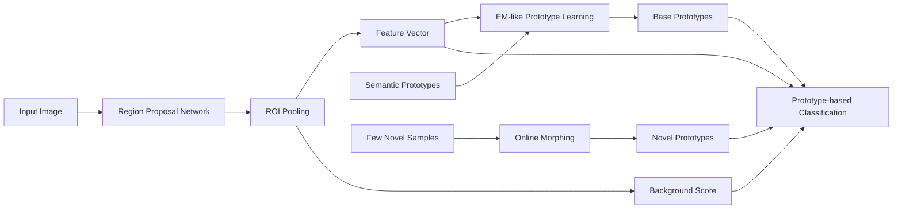

# Morphable Detector for Object Detection on Demand

**论文**：[官方论文原文](https://openaccess.thecvf.com/content/ICCV2021/html/Zhao_Morphable_Detector_for_Object_Detection_on_Demand_ICCV_2021_paper.html)  
**PDF**：[官方 PDF](https://openaccess.thecvf.com/content/ICCV2021/papers/Zhao_Morphable_Detector_for_Object_Detection_on_Demand_ICCV_2021_paper.pdf)  
**代码**：[论文页面中的作者资源（catalog 未提供独立官方仓库）](https://openaccess.thecvf.com/content/ICCV2021/html/Zhao_Morphable_Detector_for_Object_Detection_on_Demand_ICCV_2021_paper.html)  
**发表**：ICCV 2021  
**类别**：General Object Detection · Object Detection on Demand

## 一句话总结

Morphable Detector（MD）把类别分类器写成可替换的 prototype 集合：离线用语义向量初始化并通过 EM-like 交替学习融合视觉信息，在线面对新类别时只前向少量标注框求均值原型，不再训练网络。

## 研究背景与问题

ODOD 要求已有检测器由 base classes 离线训练，上线后拿不到 base 数据，只得到 novel class 的少量框标注，而且设备不能反向传播。普通 few-shot detector 需要微调或重新混合 base/novel 数据，因而不满足此约束。

MD 以 Faster R-CNN 为实例，保留 RPN、ROI pooling 和 class-agnostic box regression，把类别相关参数集中到 \(P_{base}\) 与 \(P_{novel}\)。RoI 特征经两条全连接分支得到背景分数 \(b_i\) 和嵌入 \(f_i\)，前景类别由 \(f_i\) 与 prototype 的内积决定。

prototype 先由语义嵌入初始化；E-step 固定网络，用 base 类视觉特征更新 prototype；M-step 固定 prototype，训练网络参数。在线 morphing 只把 novel 标注框的平均嵌入追加到 prototype 表。

## 方法总览

训练完成后的参数由网络 \(\Theta\) 与 \(P_{base}\) 组成；新增 \(P_{novel}\) 后结构和 \(\Theta\) 均不变化。论文报告单类写入在 RTX 3090 上用 ResNet-50 约 0.04 秒、ResNet-101 约 0.09 秒。

## 方法详解

前景损失为
\[
L_{FG}=-\sum_{y_i>0}\log\frac{e^{f_i\cdot p_{y_i}}}{e^{b_i}+\sum_{p_m\in P_{base}}e^{f_i\cdot p_m}},
\]
背景项把分子换为 \(e^{b_i}\)，总目标 \(L=L_{BG}+L_{FG}+L_{bbox}\)。单独预测背景标量，避免为高度多样的背景定义 prototype。

第 \(j\) 类视觉均值为 \(v_j=|g_j|^{-1}\sum_{x_i\in g_j}N^t(x_i)\)，原型更新为 \(p_j^{t+1}=(1-\lambda)v_j+\lambda p_j^t\)，二者先归一化。实验选择 \(\lambda=0.5\)，2–3 次迭代后基本收敛。

在线阶段直接计算 \(p_j=|g_j|^{-1}\sum N(x_i)\)。测试后验是 \(e^{f_i\cdot p_j}/(e^{b_i}+\sum_{p_m\in P_{base}\cup P_{novel}}e^{f_i\cdot p_m})\)，新增类别等价于扩展 prototype 列表。

## 实验与证据

- FSOD 含 1000 类，800/200 划分；训练 52,350 图、147,489 框，测试 14,152 图、35,102 框，每个 novel 类给 5 个样本。
- ImageNet/FRCNN 视觉 prototype 分别为 10.1/16.3 与 15.5/22.6 AP/AP50；MD(iter1) 为 18.2/31.2，最终 22.2/37.1。concat 只有 17.3/29.9，\(\lambda=0.5\) 最优。
- COCO novel split 3 的 1-shot 结果为 9.7 AP、15.0 AP50、9.9 AP75；FSView 1-shot 为 4.5/12.4/2.2，多数其他方法使用 10-shot 且要额外训练。
- Pascal VOC 三个 novel split 的 AP50 为 53.2、41.6、38.6；VOC base 平均 AP50 最终为 80.7，未出现明显遗忘。

## 对 YOLO-Agent 的启发

接入点是 YOLO 类别 logits：保留 objectness/background 与 class-agnostic box branch，把固定分类卷积替换为归一化 embedding 和动态 prototype 矩阵乘法。离线 Harness 执行三轮 `prototype_update -> network_update`；在线 API 只接受带框样本，经 RoIAlign 或框内池化更新 `novel_prototypes`，不得创建 optimizer。

对照包括原 YOLO 头、仅视觉 prototype、concat、\(\lambda\) 扫描和需微调的 few-shot 版本。记录 novel AP/AP50/AP75、base AP50、单类写入延迟与梯度调用。若 1-shot AP 低于 9.0、相对视觉 prototype 的 AP50 增益不足 10 点、base AP50 下降超过 1 点、写入超过 0.1 秒，或在线日志出现反向传播，则判定不符合 ODOD。

## 优点

- 新类别参数可解释，在线更新无需保存 base 图像。
- 背景独立建模，避免把复杂背景压成不稳定中心。
- 同一模型可覆盖 base、few-shot novel，并支持 zero-shot 变体。

## 局限

- 结果依赖 base 与 novel 的语义关系，不同类别划分波动明显。
- 单均值 prototype 难覆盖类内多模态外观、遮挡和视角变化。
- 官方页面没有独立实现，框级特征抽取和语义向量细节需复核。

## 评分

- **创新性：8.5/10**
- **实验充分性：8/10**
- **工程可迁移性：8/10**
- **综合评分：8.2/10**：适合构建禁止在线训练的动态类别检测服务。
