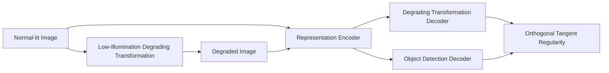

# Multitask AET With Orthogonal Tangent Regularity for Dark Object Detection

**论文**：[官方论文原文](https://openaccess.thecvf.com/content/ICCV2021/html/Cui_Multitask_AET_With_Orthogonal_Tangent_Regularity_for_Dark_Object_Detection_ICCV_2021_paper.html)  
**PDF**：[官方 PDF](https://openaccess.thecvf.com/content/ICCV2021/papers/Cui_Multitask_AET_With_Orthogonal_Tangent_Regularity_for_Dark_Object_Detection_ICCV_2021_paper.pdf)  
**代码**：[论文页面中的作者资源（catalog 未提供独立官方仓库）](https://openaccess.thecvf.com/content/ICCV2021/html/Cui_Multitask_AET_With_Orthogonal_Tangent_Regularity_for_Dark_Object_Detection_ICCV_2021_paper.html)  
**发表**：ICCV 2021  
**类别**：General Object Detection · Dark Object Detection

## 一句话总结

MAET 以真实相机 ISP 和噪声模型把正常图像合成为暗光图像，共享 DarkNet-53 同时解码低照度退化参数与 YOLOv3 检测结果，再用 Orthogonal Tangent Regularity 降低两个任务在表示流形上的干扰。

## 研究背景与问题

先增强再检测并不可靠：面向人眼的恢复算法可能生成伪影，正常光检测器也难覆盖真实暗光分布。MAET 不把增强图像作为最终目标，而是让网络解释“正常图像如何经过曝光衰减、shot/read noise、量化、白平衡、色彩与 gamma 变成暗图”。

Representation Encoder \(E\) 是共享权重 Siamese DarkNet-53；正常图 \(x\) 与退化图 \(t_{deg}(x)\) 的特征拼接后送入 Degrading Transformation Decoder \(D_{deg}\)，只把暗路径 \(E(t_{deg}(x))\) 送入 Object Detection Decoder \(D_{obj}\)。测试时仅保留暗路径与检测头。

两个任务相关却不应互相支配：\(D_{deg}\) 关心照明与成像参数，\(D_{obj}\) 关心类别和位置。论文把二者对 encoder representation 的切向量拉到正交，令一个输出坐标变化尽量不影响另一任务。

## 方法总览

## 方法详解

AET 先预测变换 \(\hat t=D_\phi[E(x),E(t(x))]\)，并用 \(L_{deg}=\sum_k\ell_k(\hat t_k,t_k)\) 监督各退化参数。正交项为
\[
L_{ort}=\sum_{k,l}\left|\frac{(\partial E/\partial D^k_{deg})^T(\partial E/\partial D^l_{obj})}{\|\partial E/\partial D^k_{deg}\|\,\|\partial E/\partial D^l_{obj}\|}\right|.
\]
分子是两个任务切向量内积；最小化绝对余弦相似度使其接近 90°。总目标 \(L_{total}=L_{ort}+\omega_1L_{obj}+\omega_2L_{deg}\)，实验取 \(\omega_1=1,\omega_2=10\)。

退化模型先执行 inverse tone mapping、inverse gamma、sRGB→cRGB、inverse white balance 得到近似 RAW，再按 \(k\) 衰减并加入 shot/read noise 和 quantization，最后走白平衡、颜色校正、tone mapping、gamma：
\[
t_{deg}(x)=t_{ISP}(k\,t_{unprocess}(x)+x_{noise}+x_{quan}).
\]
其中 \(k\in[0.01,1]\)，均值 0.1；噪声近似 \(x_{noise}\sim\mathcal N(kx,\delta_r^2+\delta_s kx)\)，还预测 \(k,1/B,1/g_r,1/g_b,1/\gamma\)。

## 实验与证据

- YOLOv3/DarkNet-53，输入 608×608；VOC 2007+2012 训练、VOC2007 test，COCO2017 train/val；另测 ExDark 与 UG2+ DARK FACE。
- synthetic low-light：普通 YOLO 为 VOC AP50 0.764、COCO AP 0.318；MAET 无正交项为 0.770/0.321，完整 MAET 为 0.788/0.330，COCO AP50/AP75 为 0.569/0.341。
- ExDark 含 7,363 张、12 类；完整 MAET mAP 0.740，无正交项 0.722，YOLO(L) 0.716，Zero-DCE+YOLO(N) 0.720。
- UG2+ DARK FACE 使用 5,400 张微调、600 张评估；MAET 为 0.558，MAET(w/o ort) 与 Zero-DCE+YOLO 都为 0.542，YOLO(L) 为 0.540。

## 对 YOLO-Agent 的启发

这是可直接进入 YOLO Harness 的训练插件：`maet_degrader` 在数据层生成带已知 \(k,B,g_r,g_b,\gamma\) 的暗图；共享 backbone 后增加 `Ddeg`，原检测头充当 `Dobj`，训练器计算 Jacobian 切向余弦。对照必须含 normal-only、synthetic-low-only、增强算法+normal detector、MAET without orthogonal loss，并固定所有检测增强、输入尺寸和 epoch。

核心指标为 synthetic VOC AP50、COCO AP/AP50/AP75/APS/M/L、ExDark mAP、DARK FACE mAP 与正常光 AP。失败阈值：正交项相对 `w/o ort` 在 COCO AP 提升小于 0.005、ExDark 低于 0.73、DARK FACE 低于 0.55、正常光 AP 下降超过 2 点，或生成暗图参数超出论文范围；出现 NaN Jacobian 时立即停止训练。

## 优点

- 暗光合成显式考虑 RAW、shot/read noise 与 ISP，较单纯 gamma 更接近成像过程。
- 与 YOLOv3 端到端联合训练，不依赖测试前图像增强。
- 正交消融在 synthetic、ExDark、DARK FACE 上方向一致。

## 局限

- 噪声与 ISP 参数仍是近似模型，不同手机和相机可能偏离训练分布。
- Jacobian 正交项计算昂贵，现代大 YOLO 需控制采样维度。
- 真实数据评估包含微调，不能等同于完全零样本暗光泛化。

## 评分

- **创新性：8.5/10**
- **实验充分性：8/10**
- **工程可迁移性：8.5/10**
- **综合评分：8.4/10**：与 YOLO 架构天然匹配，适合建立暗光鲁棒性训练分支。
