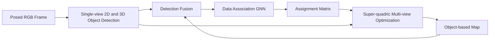

# ODAM: Object Detection, Association, and Mapping Using Posed RGB Video

**论文**：[官方论文原文](https://openaccess.thecvf.com/content/ICCV2021/html/Li_ODAM_Object_Detection_Association_and_Mapping_Using_Posed_RGB_Video_ICCV_2021_paper.html)  
**PDF**：[官方 PDF](https://openaccess.thecvf.com/content/ICCV2021/papers/Li_ODAM_Object_Detection_Association_and_Mapping_Using_Posed_RGB_Video_ICCV_2021_paper.pdf)  
**代码**：[论文页面中的作者资源（catalog 未提供独立官方仓库）](https://openaccess.thecvf.com/content/ICCV2021/html/Li_ODAM_Object_Detection_Association_and_Mapping_Using_Posed_RGB_Video_ICCV_2021_paper.html)  
**发表**：ICCV 2021  
**类别**：General Object Detection · Object-based Mapping

## 一句话总结

ODAM 将 posed RGB 视频逐帧送入单目 2D/3D Detector，用 attention-based GNN 完成 detection-to-map association，再以 Super-quadric 和 category-conditioned scale prior 优化每个对象的三维位置、朝向、尺度与形状。

## 研究背景与问题

RGB-only 三维对象地图有三个相互耦合的难点：单帧透视存在深度—尺度歧义；多视图框约束缺少适合一般物体的体积表示；在室内重复椅子、遮挡和局部观察下，一次错误关联会持续污染地图。

ODAM 前端基于 DETR，除了 2D 框和类别，还预测相机坐标系中的平移 \(t_{co}\)、旋转 \(R_{co}\) 与三轴尺寸 \(s\)。每个 detection 被编码为 16 维描述符，包含 frame ID、2D 框、类别、分数、6DoF pose 和 3DoF scale。

历史观测先经四层 self-attention 融成 object descriptor，再与当前帧 detections 进入六层交替 self/cross-attention 的 GNN，输出 frame-to-model assignment matrix。后端不直接平均单目 3D 框，而是利用所有关联视图的 2D 重投影和类别尺度先验做 MAP 优化。

## 方法总览

GNN 的 object fusion 写为 \(o_n=f_d(\{d_n^{t_0},...,d_n^{t_l}\})\)，frame-to-model 匹配为 \(M=f_m(\{o_n\},\{d_m^t\})\)。前者聚合一个地图对象的多视图证据，后者在两个节点集合间预测分配。

## 方法详解

Super-quadric 的隐式表面为
\[
f(x)=\left[\left(\frac{x}{\alpha_1}\right)^{2/\epsilon_2}+\left(\frac{y}{\alpha_2}\right)^{2/\epsilon_2}\right]^{\epsilon_2/\epsilon_1}+\left(\frac{z}{\alpha_3}\right)^{2/\epsilon_1}.
\]
\(\alpha_1,\alpha_2,\alpha_3\) 控制三轴尺寸，\(\epsilon_1,\epsilon_2\) 控制从椭球到立方体的曲率；再加世界位姿 \(T_{wo}\in SE(3)\)，每个对象共 11 个参数。

给定关联 2D 框集合 \(B=\{b_i\}\)，MAP 目标为
\[
\arg\max_\theta P(\theta|B)=\arg\max_\theta P(\theta)\prod_iP(b_i|\theta).
\]
重投影似然 \(P(b_i|\theta)=\mathcal N(b_i|\hat b_i,\sigma^2)\)，\(\hat b_i=Box(\pi(T_{cw}T_{wo}X_o))\)；尺度先验是 \(P(\theta)=\mathcal N(\alpha|\mu_0,\Sigma_0)\)。实现采样 1000 个表面点，取 \(\sigma^2=20\)，每 50 个观测优化 20 步，序列结束再优化 200 步。

## 实验与证据

- ScanNet 上与 RGB-only 的 MOLTR、Vid2CAD 对比；IoU>0.25 的平均 P/R/F1 为 64.7/58.6/61.5，MOLTR 为 54.2/55.8/55.0，Vid2CAD 为 56.1/54.5/55.2。
- IoU>0.5 时 ODAM 为 31.2/28.3/29.7，MOLTR 仅 15.2/17.1/16.0，Vid2CAD 为 16.8/16.3/16.5。
- GNN、monocular 3D、frame-to-model 三者齐全的 association accuracy 为 0.88；去掉其中任一项分别为 0.86、0.84、0.85。
- shape 消融：ellipsoid F1 20.7，3D cuboid 27.2，Super-quadric 完整系统 29.7；no optimization 为 23.9，去掉 scale prior 为 22.1。
- 单目 detector 约 10 fps，GNN 平均 15 fps，完整前端约 6 fps；Adam 后端 20 次迭代约 0.2 秒。

## 对 YOLO-Agent 的启发

YOLO-Agent 可将 `odam_3d_heads` 接在每个 2D detection embedding 后，输出 depth、Euler rotation、3D dimensions，并组装 16 维描述符；`odam_map_gnn` 维护历史 object descriptors；`odam_superquadric_backend` 消费关联框、相机位姿和类别尺度先验。主对照固定同一 YOLO detector，分别替换为 3D GIoU 手工匹配、frame-to-frame GNN、关联后直接平均单目框、cuboid 表示。

Harness 必须报告 association accuracy、ScanNet 3D P/R/F1@0.25/0.5、重复地图对象数、前端 FPS 与后端耗时。若关联准确率低于 0.87、完整后端相对 no-optimization 的 F1@0.5 增益不足 3 点、产生的重复对象不比手工匹配少，或前端低于 5 fps，则判为失败；薄门窗类需单列，因为论文指出轻微定位误差就会造成 3D IoU 崩落。

## 优点

- 把检测、跨帧关联和几何优化组成闭环，而非逐帧独立预测。
- Super-quadric 同时覆盖圆形与箱形物体，尺度先验能抵抗噪声 2D 框。
- RGB-only 在部分大物体类别接近甚至超过 VoteNet。

## 局限

- 依赖已知相机位姿和类别尺度分布，位姿漂移会直接进入重投影项。
- thin objects 的 3D IoU 极其敏感，门、窗、画和窗帘表现较差。
- 后端按对象持续优化，不适合大量动态物体或严格低延迟场景。

## 评分

- **创新性：9/10**
- **实验充分性：8.5/10**
- **工程可迁移性：7/10**
- **综合评分：8.2/10**：是将 YOLO 检测结果升级为对象级三维地图的清晰蓝图。
