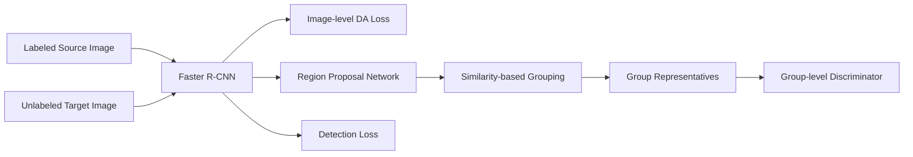

# Seeking Similarities Over Differences: Similarity-Based Domain Alignment for Adaptive Object Detection

**论文**：[官方论文原文](https://openaccess.thecvf.com/content/ICCV2021/html/Rezaeianaran_Seeking_Similarities_Over_Differences_Similarity-Based_Domain_Alignment_for_Adaptive_Object_ICCV_2021_paper.html)  
**PDF**：[官方 PDF](https://openaccess.thecvf.com/content/ICCV2021/papers/Rezaeianaran_Seeking_Similarities_Over_Differences_Similarity-Based_Domain_Alignment_for_Adaptive_Object_ICCV_2021_paper.pdf)  
**代码**：[论文页面中的作者资源（catalog 未提供独立官方仓库）](https://openaccess.thecvf.com/content/ICCV2021/html/Rezaeianaran_Seeking_Similarities_Over_Differences_Similarity-Based_Domain_Alignment_for_Adaptive_Object_ICCV_2021_paper.html)  
**发表**：ICCV 2021  
**类别**：General Object Detection · Unsupervised Domain Adaptation

## 一句话总结

ViSGA 不强迫所有 source/target proposals 一一对齐，而是以 cosine distance 做层次聚类，形成数量自适应、类别无关的 visually similar groups，再通过 image-level 与 group-level adversarial training 学习域不变检测特征。

## 研究背景与问题

检测 UDA 的争议集中在“对齐什么”和“如何对齐”：逐 proposal 对齐容易被仿真背景等离群点拖累；把全部实例压成单 prototype 又丢失域内变化；依赖 target pseudo-label 的类别聚合在训练早期噪声很大。

论文统一为 Faster R-CNN、Image-level DA Loss 与 Instance-level DA Loss，目标 \(L=L_{det}+\lambda_1L_{img}+\lambda_2L_{inst}\)。检测损失只用于有标签 source，两个域适配项同时读取 source 与无标签 target。

ViSGA 的关键关系是：RPN proposals 先按视觉 embedding 聚成多个 class-agnostic groups，组内平均得到 representative，再经 GRL 与 Group-level Discriminator 做对抗；backbone 特征另有 Image-level Discriminator，二者分别负责全局和局部对齐。

## 方法总览

## 方法详解

域分类器对域标记 \(d\in\{0,1\}\) 的损失为 \(L_{disc}=-d\log D(F_d)-(1-d)\log(1-D(F_d))\)，GRL 让特征提取器反向最大化该损失。实验系统比较了它与 max-margin contrastive learning，最终选择 adversarial training。

对 proposals 特征 \(z_i,z_j\)，聚类距离为
\[
dist(z_i,z_j)=1-\frac{z_i\cdot z_j}{\|z_i\|\|z_j\|}.
\]
层次凝聚从每个 proposal 单独成簇开始，按 complete linkage 合并：\(MaxLink(A,B)=\max_{a\in A,b\in B}dist(a,b)\)。当簇内最远距离超过半径 \(\tau\) 时停止，因此组数随训练和域差动态变化。

第 \(c_i\) 个簇的代表为 \(Z_{c_i}=N_{c_i}^{-1}\sum z_i\)，然后进入 group discriminator。视觉距离可以合并图像中相隔很远但外观相似的实例，也避开 noisy pseudo-label；与 IoU grouping 相比不会重复产生大量近似组。

## 实验与证据

- 场景包括 Cityscapes→Foggy Cityscapes、SIM10k→Cityscapes、KITTI→Cityscapes；Faster R-CNN/ResNet-50，短边 600，评价 AP50。
- Sim2Real 上 source-only 为 31.9 car AP；contrastive 的 SG/MG/MG+CA 为 33.2/36.9/42.6，对抗训练为 40.8/43.1/45.6，三个聚合层级均是 AT 更强。
- 加 image-level alignment 后，MG 从 43.1 到 44.9，MG+CA 从 45.6 到 49.3；SG 反而由 40.8 降到 39.5，说明单组已经过度全局化。
- Foggy/Sim2Real 上 no grouping 为 38.5/39.0，adaptive MG+CA cosine 为 43.3/49.3；fixed groups 为 42.5/49.0，IoU grouping 为 41.9/44.8。
- 最终 ViSGA 在 Cross Camera 为 47.6、Sim2Real 为 49.3、Foggy mAP 为 43.3；多源 SIM10k+KITTI→Cityscapes 从 42.5 提到 51.3。训练单 batch 时间 0.79，对照为 0.62，推理无额外开销。

## 对 YOLO-Agent 的启发

YOLO 接入点应取 decoupled head 中 NMS 前的候选 embedding：按每图 top-k 候选执行 `visga_hac(cosine, complete_linkage, tau)`，组均值经过 GRL discriminator；PAN/FPN 最高层另接 image discriminator。对照包括 source-only、proposal-level AT、SG、fixed MG、IoU grouping 与 contrastive loss，所有检测损失和 target 无标签协议保持一致。

Harness 记录目标域 AP50、前景/背景组数量、半径敏感性、batch 时间和导出延迟。Sim2Real 式验收要求相对 no grouping 至少增加 6 点，cosine grouping 至少高于 IoU grouping 2 点，多源结果不得低于单源最佳；若训练开销超过 35%、推理图残留聚类器/判别器、组数塌缩为 1 或长期接近 proposal 数，也视为失败。

## 优点

- 对 UDA 的对齐机制、聚合层级和类别信息做了系统对照。
- 动态视觉分组保留多模态结构，又减轻 proposal 级完全对齐压力。
- 训练插件不进入推理路径，并可直接扩展到多源设置。

## 局限

- 层次聚类随 proposal 数增长，训练时间和显存高于 source-only。
- 半径 \(\tau\) 对大域差 Sim2Real 较敏感，需按场景校准。
- 仍假设 source/target 共享类别空间，未知类可能被错误拉入已有组。

## 评分

- **创新性：8.5/10**
- **实验充分性：9/10**
- **工程可迁移性：7.5/10**
- **综合评分：8.4/10**：适合成为 YOLO 域适配 Harness 的组级对齐基准。
