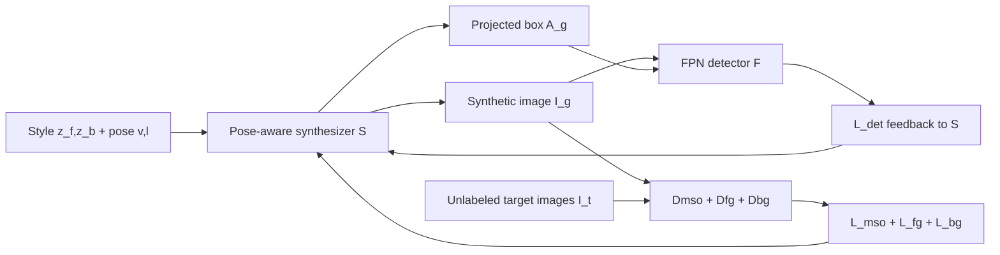

# Self-Supervised Object Detection via Generative Image Synthesis

**论文**：[官方论文页面](https://openaccess.thecvf.com/content/ICCV2021/html/Mustikovela_Self-Supervised_Object_Detection_via_Generative_Image_Synthesis_ICCV_2021_paper.html)  
**代码**：论文未提供官方代码  
**发表**：ICCV 2021

## 一句话总结

SSOD 从无框标注的单物体图像集合学习可控 BlockGAN 式生成器，利用已知三维姿态投影自动生成二维框，再把 FPN 检测损失、目标域前景/背景外观和尺度分布共同反馈给生成器，从而只靠图像集合训练汽车检测器。

## 研究背景与问题

弱监督检测仍依赖图像级类别标签和外部 proposal，自驾驶仿真方法则依赖 CAD 模型、渲染器与人工场景资产。本文设定更特殊也更严格：目标域 `{I_t}` 是每图含未知数量物体的无标注街景；另有来源可不同的 `{I_s}`，每张图只含已知数量（实验中为一个）的同类物体，但同样没有框。核心难题是如何从 `{I_s}` 学到能控制位置、视角和物体数的生成器，并把可控参数转成可靠框标注，同时缩小合成图与 `{I_t}` 的外观和尺度差异。

## 方法总览

SSOD 有 Pose-Aware Synthesis、Object Detection Adaptation 和 Target Data Adaptation 三部分。生成器 `S` 合成图像 `I_g` 并根据输入姿态产生框 `A_g`；检测器 `F` 用 `(I_g,A_g)` 训练，检测损失反向更新 `S`；前景判别器、背景判别器和 Object Scale Adaptation（OSA）让合成数据接近目标域。训练先分别预训练 `S` 与 `F`，再交替更新生成器和其余网络。

三部分分别回答“标注从哪里来”“合成数据是否真的利于检测”“如何迁移到目标街景”。姿态模块提供几何可控性，检测适配把下游误差变成生成器监督，目标域适配则拆开前景、背景和尺度三种域差异。论文没有把目标图直接伪标后自训练作为主线，而是先改造数据生成分布，再用生成的成对图像与框训练检测器。

## 方法详解

### 1. 姿态可控合成与自动框

`S` 基于 BlockGAN：前景和背景各有可学习 canonical 3D code，风格向量 `z_f、z_b` 通过 AdaIN 控制外观；前景姿态由方位角 `v_f` 与水平/深度位移 `l_f` 指定。多个前景对象分别经 3D 卷积和变换后做逐元素最大融合，再透视投影到 2D 并卷积生成 `I_g`。论文用 progressive growing 把分辨率从 64×64 提到 256×256。场景对抗损失为 `L_scn=-E[D_scn(I_g)]`。

生成时已知物体姿态和固定相机矩阵，因此可把类别平均 3D 包围盒投影到图像平面，取投影点坐标极值得到 `A_g`。人工检查表明自动框与手工框在 IoU 0.5 下的 mAP 为 0.95。该过程不需要目标域真实框，但需要来源集合中每图物体数已知；作者尝试直接用物体数未知的 KITTI 场景训练生成器并未成功。

### 2. 检测任务反向约束生成器

检测器 `F` 是标准 FPN，使用常规检测损失 `L_det`。关键不只是用合成数据训练 `F`，还把 `L_det(F(I_g),A_g)` 回传到 `S`，迫使合成内容服务于检测。为保证远近尺度都清晰，论文从 `A_g` 扩张并裁出单位纵横比区域 `I_c`、缩放到 256×256，再用多尺度物体判别器得到 `L_mso=-E[D_mso(I_c)]`；真实样本来自 `{I_s}`。

### 3. 目标域外观与尺度适配

前景判别器 `D_fg` 只在生成框掩码 `M_g` 内计算 patch realism，形成 `L_fg`。目标域真实前景由预训练 `F` 在 `{I_t}` 上筛选置信度大于 0.9 的检测获得。背景判别器 `D_bg` 在 `1-M_g` 区域计算 `L_bg`，真实背景则由分类网络的 Grad-CAM 找出不含目标物体的目标域 patch。OSA 对多个深度区间分别合成数据、训练检测器并在目标域产生高于 0.85 的框，选择 VGG conv5 特征分布 Sinkhorn 距离最小的深度区间 `d_o`。

生成器总损失为 `L_syn=λ_scnL_scn+λ_msoL_mso+λ_detL_det+λ_fgL_fg+λ_bgL_bg`。耦合阶段交替训练 `S`，以及 `D_scn、F、D_mso、D_fg、D_bg`。

非耦合阶段先只用 `{I_s}` 训练 `S` 与两个合成判别器，再合成包含一个或两个目标的图像；这些前景会与 Grad-CAM 找到的真实目标域背景组合，用来预训练 `F`。耦合阶段每次更新 `S` 后再更新其余网络，避免生成器和多个判别器同时改变导致不稳定。外观损失只更新风格 MLP 和二维卷积层，不改动决定三维姿态的全部参数，从而尽量保持自动框与生成物体的几何一致。

## 实验与证据

来源数据为 CompCars 单车图像，目标域为 KITTI 与 Cityscapes，指标是 IoU 0.5 mAP。KITTI 消融中，未与检测器耦合的 BlockGAN 从 64、128 到 256 分辨率，All mAP 依次为 51.3、54.5、56.5；完整 SSOD 达 68.4。移除前景/背景适配、`L_mso` 或 OSA 后分别为 62.2、65.8、62.7，说明目标域外观适配影响最大。完整模型的 Sinkhorn/KID/FID 为 0.465/0.037/6.37，也优于所有消融。

KITTI 上 SSOD 的 Easy/Medium/Hard/All 为 80.8/68.1/56.6/68.4，显著高于 PCL 的 33.2 和 Wetectron 的 38.1；无 CAD 资产时，All 也高于 Meta-Sim 66.0 与 Meta-Sim2 66.7，但 Hard 低于两者。Cityscapes 上完整模型为 31.3 mAP，高于 Wetectron 18.2 和未耦合 BlockGAN 22.7。将 IoU 阈值从 0.5 放宽到 0.45 后，KITTI Easy/Medium/Hard 从 80.8/68.1/56.6 升到 83.5/73.2/63.6，揭示框投影精度和重遮挡是主要瓶颈。

## 对 YOLO-Agent 的启发

可把该思路用作“可控合成数据代理”：先用已有生成器或三维资产接口输出图像、姿态和自动框，再让 YOLO 的 box/class/obj 损失反向筛选生成参数；若不能对生成器求梯度，可用损失作为采样奖励。对照组应为固定合成器、仅检测损失反馈、加入多尺度裁剪判别、再加入目标域前景/背景适配。指标除目标域 AP50 外，必须记录自动框与人工抽检框的 AP50、Hard/遮挡子集召回及合成—真实物体特征 Sinkhorn 距离。若自动框 AP50 低于 0.90、Hard 召回相对真实数据训练基线低 20 点以上，或外观适配后 Sinkhorn 未下降至少 5%，则禁止扩大伪数据比例。

## 优点

- 姿态控制直接产生二维框，绕开 proposal 和 CAD 标注依赖。
- 检测损失真正参与生成器优化，合成质量以目标任务而非纯视觉逼真度定义。
- 对外观、背景、尺度和多物体分辨率分别设计了可验证组件。

## 局限

- 需要一个物体数已知的单物体/固定物体数来源集合，适用类别与数据条件有限。
- 重遮挡和投影框误差明显限制 Hard 场景；平均 3D 框不能覆盖实例形状差异。
- 多阶段、多判别器、多个深度区间检测器使训练成本和复现难度较高。

## 评分

**8.8/10**：以可控生成、自动标注和检测反馈构成完整 analysis-by-synthesis 闭环，实验非常有辨识度；但数据假设与训练复杂度限制了通用部署。
