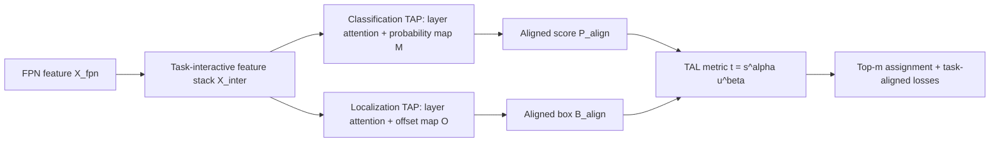

# TOOD: Task-aligned One-stage Object Detection

**论文**：[官方论文页面](https://arxiv.org/abs/2108.07755)  
**代码**：[官方代码](https://github.com/fcjian/TOOD)  
**发表**：ICCV 2021

## 一句话总结

TOOD 用共享的任务交互特征、分别面向分类与回归的 Task-Aligned Predictor（TAP），以及以分类分数和 IoU 联合定义正样本的 Task Alignment Learning（TAL），让 NMS 所依据的分类排序更接近真实定位质量。

## 研究背景与问题

单阶段检测器通常在 FPN 后接平行分类塔和回归塔。两条分支优化目标不同：分类希望找到最易辨认的位置，回归则偏好边界预测最准确的位置；若二者选中的 anchor 不一致，便会出现高分类分数却低 IoU 的框，并在 NMS 中压掉更准确的候选。ATSS、PAA、GFL 等工作改善了样本分配或质量建模，但 TOOD 进一步把问题定义为“任务对齐”：头部结构要允许两任务交换信息，训练目标也要明确奖励同时分类正确且定位精确的 anchor。

## 方法总览

TOOD 保留 backbone–FPN–head 主干，并在每个位置只使用一个 anchor。完整方法由两部分组成：T-Head 负责生成可交互、又可按任务分解的特征与对齐预测；TAL 根据当前分类和回归输出构造对齐度，完成动态样本分配和损失加权。两者形成闭环：T-Head 先预测，TAL 产生对齐监督，梯度再推动 TAP 的分类概率图和回归偏移图靠近共同最优位置。

## 方法详解

### 1. Task-aligned Head

给定 `X_fpn ∈ R^{H×W×C}`，连续 `N` 个卷积层生成 `X_k^inter`。这些层的感受野不同，但不再为分类、回归各复制一套塔。每个 TAP 通过层注意力 `w∈R^N` 组合它们：`X_k^task = w_k X_k^inter`，其中 `w = sigmoid(fc2(ReLU(fc1(x_inter))))`，`x_inter` 是跨层拼接特征经全局平均池化后的向量。分类 TAP 与回归 TAP 拥有各自的 `w`，因此共享信息而不强迫两任务使用相同层级。

分类预测 `P` 再乘空间概率图 `M∈R^{H×W×1}`，得到 `P_align=P×M`；`M` 同时观察两任务的交互特征，用于降低错位位置的置信度。回归预测 `B∈R^{H×W×4}` 则由偏移图 `O∈R^{H×W×8}` 重采样：四个边界通道各自学习二维偏移，并用双线性插值从邻域取更精确的边界值。`M` 和 `O` 都由 `X_inter` 的轻量卷积分支产生。

层注意力解决的是“共享后如何重新分工”，预测对齐解决的是“两个输出最终落在哪个空间位置”。前者让分类可偏向语义更强的层、回归可偏向边界更敏感的层；后者不增加独立 centerness 或 IoU head，而是直接利用联合特征调整已有输出。偏移图为四条边各预测一组二维位移，因此左、上、右、下边界可以分别从附近最可靠的位置取值，而不是整框共享同一个中心偏移。

### 2. Task Alignment Learning

对某个实例及候选 anchor，论文定义 `t = s^α × u^β`，其中 `s` 是该类别的预测分数，`u` 是预测框与真值框的 IoU，`α`、`β` 控制分类与定位在对齐度中的贡献。每个实例选取 `t` 最大的 `m` 个 anchor 为正样本，其余为负样本。实验采用 `α=1、β=6、m=13`，即更强调定位质量。

正样本分类目标不是 1，而是实例内归一化后的 `t̃`：其最大值被缩放为该实例正样本中的最大 IoU，既保留排序又避免困难实例的目标整体过小。分类损失为正样本 `|t̃_i-s_i|^γ BCE(s_i,t̃_i)` 与负样本 `s_j^γ BCE(s_j,0)` 之和；`γ` 是 focal focusing 参数。回归使用 `L_reg=Σ t̃_i L_GIoU(b_i,b̂_i)`，`b_i` 为预测框，`b̂_i` 为对应真值。于是高分类、准定位的样本同时获得更强分类目标和回归权重。

## 实验与证据

实验在 MS COCO 上完成，消融使用 ResNet-50、12 epoch 和 COCO minival，最终结果报告于 test-dev。T-Head 插入 FCOS、RetinaNet、ATSS 等检测器时，相比平行头提升 0.7–1.9 AP，并减少头部参数与 FLOPs。以 ATSS 为起点，平行头为 39.2 AP，换 T-Head 得 41.1；仅把训练换为 TAL 得 40.3；T-Head+TAL 达 42.5 AP、46.4 AP75，组合收益 3.3 AP，超过两个组件单独增益之和。

在 ATSS anchor-free 配置中，平行头的头部/整网参数为 4.92M/32.07M、FLOPs 为 104.87G/205.21G，T-Head 为 4.82M/31.98M、100.79G/201.13G，AP 却从 39.2 升到 41.1。这说明改进并非来自扩大 head 容量。anchor-free 与 anchor-based 完整 TOOD 分别为 42.5 和 42.4 AP，也说明 TAL 的核心是 anchor 级质量排序，而非依赖某一种框参数化。

对齐统计也支持机制解释：平行头+ATSS 的分类/定位排序 PCC 为 0.408、top-10 平均 IoU 为 0.637；完整 TOOD 提升到 0.452 和 0.661，同时冗余框从 25,428 降到 15,242，错误框从 92,677 降到 69,013。COCO test-dev 上，ResNet-101 的 TOOD 为 46.7 AP，ResNeXt-101-64×4d-DCN 版本达到 51.1 AP；同一强骨干下高于 ATSS 47.7、GFL 48.2、PAA 49.0。

## 对 YOLO-Agent 的启发

可在 YOLO 的解耦头中增加一个共享交互塔，并把分类、DFL/框回归分支前的特征改为独立层注意力组合；训练侧把现有 assigner 的质量项替换为 `s^α IoU^β`，先固定论文值 `α=1、β=6、top-m=13`。对照组应为：原始 YOLO、仅交互头、仅 TAL、二者联合，保持增强、训练轮数和 NMS 不变。主要观察 COCO AP、AP75、分类分数与 IoU 的 Pearson 相关系数，以及 NMS 前 top-10 IoU；若联合方案 AP75 未提升至少 1.5 点，或 PCC 提升不足 0.02 且推理延迟增加超过 8%，应判定接入失败并优先移除预测对齐偏移分支。

## 优点

- 结构对齐与监督对齐协同设计，不只修改标签分配。
- 对 anchor-based 与 anchor-free 形式均有效，且能插入多种单阶段检测器。
- 论文用 PCC、top-k IoU 和冗余/错误框数量验证了 NMS 前后的真实对齐变化。

## 局限

- `α、β、m` 仍是经验超参数，对极端长尾或小目标分布可能需要重搜。
- 回归偏移图涉及双线性重采样，部署到受限推理后端时需验证算子支持与实际延迟。
- 论文主要验证 COCO，任务对齐收益在开放词汇、旋转框等输出形式上没有直接证据。

## 评分

**9.3/10**：问题定义、结构设计和训练目标高度一致，实验不仅给 AP，还直接测量分类与定位的排序一致性，是单阶段检测标签分配与检测头设计的重要基线。
