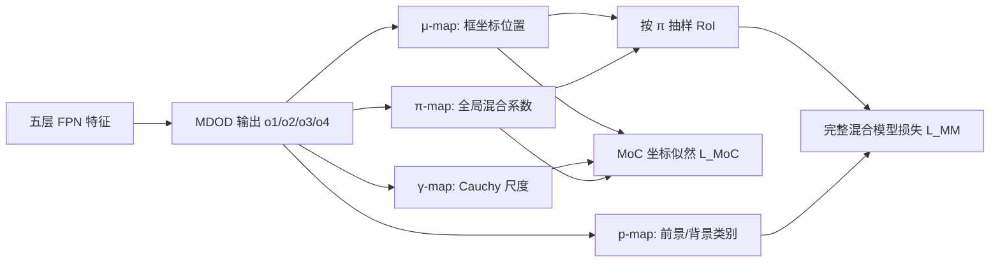

# Training Multi-Object Detector by Estimating Bounding Box Distribution for Input Image

**论文**：[CVF 论文页面](https://openaccess.thecvf.com/content/ICCV2021/html/Yoo_Training_Multi-Object_Detector_by_Estimating_Bounding_Box_Distribution_for_Input_ICCV_2021_paper.html)  
**代码**：未提供  
**发表**：ICCV 2021

## 一句话总结

Mixture Density Object Detector（MDOD）把一张图像中的可变数量目标表示成边界框的多峰条件分布，用 Cauchy 坐标分布、类别分布和混合系数联合建模，从而绕开 anchor/中心与 GT 的显式匹配。

## 研究背景与问题

传统检测器先离散化边界框空间，再把每个 GT 分配给某些 anchor 或网格位置，随后生成坐标偏移和类别目标。这个流程需要匹配阈值、正负样本定义、困难负样本挖掘等规则，其根源是网络固定形状的输出难以直接表达图像中数量可变的框集合。

MDOD 改变问题定义：对于给定图像，边界框 `b` 的条件分布天然是多峰的，每个峰对应一个潜在目标或背景候选。网络不再学习“某位置应回归哪个 GT”，而是估计一个混合模型，使所有 GT 在该分布下具有高似然；类别学习则通过从当前混合分布抽样的 RoI 完成。

模型在五层 FPN 的每个空间位置放置一个 mixture component，但所有层共同构成一张图像的单个混合模型。每个 component 输出坐标位置 `μ`、坐标尺度 `γ`、类别概率 `p` 与全局归一化混合系数 `π`，推理时以各 component 的 `μ` 作为候选框。

## 方法总览

## 方法详解

### 1. 图像条件混合模型

框由四维位置 `b_p=(b_l,b_t,b_r,b_b)` 和 one-hot 类别 `b_c` 组成。MDOD 定义

$$
p(b\mid image)=\sum_{k=1}^{K}\pi_k
F(b_p;\mu_k,\gamma_k)P(b_c;p_k).
$$

`K` 是五层参数图所有空间位置的总数；`π_k` 是第 `k` 个 component 的混合系数；`F` 是四维 Cauchy 密度；`μ_k、γ_k` 分别是位置和尺度；`P` 是由 `p_k` 参数化的 categorical 分布。论文假设四个坐标条件独立，因此 `F` 可分解为左、上、右、下四个一维 Cauchy 密度之积。选择 Cauchy 而非 Gaussian，是因为其重尾随距离二次衰减，预测离 GT 较远时更不易出现似然下溢和梯度中断。

### 2. 参数图与坐标约束

`o1` 生成 `μ-map`：先按 FPN 层使用 `s=2^{l-1}` 缩放，再通过 decoder 得到中心、宽高；center-limit 用 `x=x̄+s_lim·tanh(dx')`（`y` 同理）限制 component 中心偏离默认网格中心，最后由 `xywh` 转为 `ltrb`。`o2` 经 softplus 和 level-scale 得到正尺度 `γ`；`o3` 在通道维 softmax 得到 `C+1` 类概率，最后一类是背景；`o4` 在全部五层空间位置上统一 softmax，使所有 `π_k` 之和为 1。

### 3. 两项训练目标

坐标分布首先由 GT 的负对数似然学习：

$$
L_{MoC}=-\frac1{N_{gt}}\sum_i\log\sum_k\pi_kF(b^i_{gt,p};\mu_k,\gamma_k).
$$

它只更新 `π、μ、γ`，不含类别。为学习背景概率，论文按 `π` 从 `μ` 中随机抽样框：与任一 GT 的 IoU 大于 0.5 时标为最高 IoU GT 的类别，否则标为背景，形成 `{b_roi}`。完整混合模型损失为 `L_MM=-(1/N_roi)Σ_j log p(b_roi^j|image)`，且其梯度只传给类别概率 `p_k`，避免坐标分布用自己的抽样结果反向重学。总损失 `L=L_MoC+αL_MM`，实验取 `α=2`。

### 4. 推理

每个 component 的 `μ_k` 作为该局部混合峰的代表框，类别置信度来自 `p_k`。NMS 前可以按类别概率和归一化混合系数 `π'_k=π_k/max(π)` 过滤低价值 component。MDOD 每个网格只产生一个 component，因此候选数和输出通道数都少于九 anchor 基线。

这里的“一个混合模型”很关键：不同 FPN 层并不是分别拟合小、中、大目标分布，而是共同竞争全局归一化的 `π` 概率质量。某层某位置只有在能解释图像中的 GT 时才会获得较高混合权重。RoI 抽样也随当前 `π` 改变，坐标分布逐渐贴近真实目标后，抽到的背景会自然集中为靠近目标却未匹配的困难负样本，因此论文认为前景—背景失衡随训练推进被分布估计过程自行缓解。

模型使用 3×3 卷积和三层 1×1 卷积组成预测网络，除输出层外采用 Swish。`μ、γ、p、π` 参数图与对应 FPN 特征保持相同空间尺寸，这使 mixture component 数量完全由特征图分辨率决定，也直接造成动态输入下 `K` 改变这一局限。

这里的“一个混合模型”很关键：不同 FPN 层并不是分别拟合小、中、大目标分布，而是共同竞争全局归一化的 `π` 概率质量。某层某位置只有在能解释图像中的 GT 时才会获得较高混合权重。RoI 抽样也随当前 `π` 改变，坐标分布逐渐贴近真实目标后，抽到的背景会自然集中为靠近目标却未匹配的困难负样本，因此论文认为前景—背景失衡随训练推进被分布估计过程自行缓解。

模型使用 3×3 卷积和三层 1×1 卷积组成预测网络，除输出层外采用 Swish。`μ、γ、p、π` 参数图与对应 FPN 特征保持相同空间尺寸，这使 mixture component 数量完全由特征图分辨率决定，也直接造成动态输入下 `K` 改变这一局限。

## 实验与证据

论文在 MS COCO train2017 训练、test-dev2017 评估，并比较常规基线、EfficientDet、SSD、RefineDet、M2Det、PASSD、FCOS、ATSS 等。

- ResNet-50-FPN、320×320 下，常规基线为 30.1 AP，MDOD 为 33.9 AP；ResNet-101-FPN 下从 31.1 升至 35.0 AP。
- 512×512、ResNet-101-FPN 下，MDOD 达到 40.0 AP，而对应基线为 36.6；Efficient-D1 结构下 MDOD 为 40.5 AP，原 EfficientDet-D1 为 39.6。
- `ltrb`、center-limit、level-scale 全部启用时为 33.8 AP；去掉 `ltrb` 后为 32.9，论文总结 `ltrb` 比直接学习 `xywh` 约高 1 AP。
- RoI 数取 `N_gt×1、×3、×5` 时 AP 分别为 33.8、33.8、33.9，说明类别抽样量不是主要敏感项。
- 320×320 的 ResNet-50 基线预测 19206 个框、总耗时 21 ms；MDOD 预测 2134 个框、总耗时 18 ms。512×512 下对应为 28 ms 与 23 ms。
- 可变 short-800 输入下 MDOD 为 42.2 AP，低于 ATSS 的 43.6；作者认为随输入尺寸变化且数量较大的 `K` 会干扰优化。

## 对 YOLO-Agent 的启发

接入点不是替换 YOLO 的单个损失，而是新增一个“混合密度检测头”实验分支：每个多尺度网格只输出一组 `μ、γ、p、π`，训练阶段移除 TaskAligned/SimOTA 一类显式 GT 匹配，用 `L_MoC` 学框分布、用抽样 RoI 的 `L_MM` 学前景与背景。为控制变量，backbone、neck、数据增强和 NMS 必须与原 YOLO 保持一致。

对照组至少包含：原 YOLO；MDOD-Cauchy；MDOD-Gaussian；MDOD 去除 center-limit；MDOD 使用 `xywh`。指标使用 AP、AP50、AP75、APS 和端到端延迟，并记录下溢 component 比例、候选框数量。验收阈值建议：静态输入下 MDOD 相对同结构 YOLO 至少提升 1.0 AP或降低 15% 后处理耗时；若 Gaussian 下溢率不高于 Cauchy、`ltrb` 不优于 `xywh`，则核心机制未复现；若 short-800 AP 落后原 YOLO 超过 1.0，停止向动态输入主线合并。

## 优点

- 从概率密度角度统一表达可变数量框，显著减少手工匹配规则。
- Cauchy 重尾改善远距离预测的数值稳定性。
- 每格一个 component，候选数少，能够降低输出层和 NMS 开销。

## 局限

- 四个框坐标独立的假设忽略坐标相关性。
- RoI 抽样和类别梯度截断仍属于专门设计，并未完全消除训练机制复杂度。
- `K` 随动态输入变化时优化困难，short-800 未超过当时最佳密集检测器。

## 评分

- **创新性：9.2/10**——从标签分配转向图像条件框分布估计。
- **实验充分性：8.5/10**——包含结构、坐标、分布和速度对比。
- **可迁移性：7.5/10**——需要替换检测头与训练目标，改造成本较高。
- **综合评分：8.4/10**
