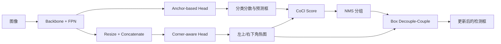

# Anchor-Intermediate Detector: Decoupling and Coupling Bounding Boxes for Accurate Object Detection

**论文**：[arXiv 论文页面](https://arxiv.org/abs/2310.05666)  
**代码**：[官方代码 AID](https://github.com/YilongLv/AID)  
**发表**：ICCV 2023  
**类别**：检测头、定位质量估计与后处理

## 一句话总结

Anchor-Intermediate Detector（AID）在 RetinaNet、GFL 等锚框检测头旁增加无锚的 Corner-aware Head，用角点热图产生 CoCl 排序分数，并在推理时通过 Box Decouple-Couple（BDC）从当前框及其重叠框中重新选择左上角和右下角，避免 NMS 直接丢掉可能定位更准的边界信息。

## 研究背景与问题

锚框检测器把每个预测框视作不可拆分的个体：分类分数最高的框通常被 NMS 保留，其余高重叠框被压制。然而分类置信度并不等价于边界质量，尤其在模糊边缘处，最高分框的某一条边可能偏移，而被抑制框的对应角点反而更准确。论文因此不再把“重叠框”仅看作冗余输出，而把它们视为同一目标的多个边界观测。

AID 的关键转换是把锚框推理临时改写成角点组合问题：锚框头负责稳定地产生类别与候选框，Corner-aware Head 独立判断每个位置成为某类别左上角或右下角的可信度，BDC 再只在当前预测框的局部重叠集合内重组角点。它保留了 anchor-based 检测的候选约束，又借用了 CornerNet 式角点建模，避免全图任意角点配对带来的组合爆炸。

## 方法总览

训练阶段，Backbone 与 FPN 同时服务于锚框头和 Corner-aware Head；推理阶段，分类分数与角点分数合成为 CoCl，随后以 CoCl 执行 NMS 分组，再对保留框与其重叠框实施 BDC，输出更新后的边界框。

## 方法详解

### 1. Corner-aware Head

多层 FPN 特征先调整到同一高分辨率并沿通道拼接：

$$F=\operatorname{Cat}(\operatorname{Resize}(F_n)),\quad n=1,\ldots,N,$$

其中 $F_n$ 是第 $n$ 个金字塔层，$F$ 是单尺度融合特征。方向池化分别得到上、下、左、右特征 $F_t,F_b,F_l,F_r$，再形成类别相关的左上角和右下角热图：

$$M_{tl}=\sigma(\operatorname{Conv}(F_t\oplus F_l)+\operatorname{Conv}(F)),$$
$$M_{br}=\sigma(\operatorname{Conv}(F_b\oplus F_r)+\operatorname{Conv}(F)).$$

$\oplus$ 表示逐元素相加，$\sigma$ 把每个位置压到 $[0,1]$。角点监督 $Y_{cor}$ 是在真实角点周围扩展的非归一化高斯热图，$M_{cor}\in\{M_{tl},M_{br}\}$ 采用 CornerNet 风格焦点损失。总目标为

$$L_{total}=L_{reg}+L_{cls}+\lambda L_{corner},$$

其中前两项属于原锚框检测器，$\lambda$ 控制角点任务对共享特征的影响。

### 2. CoCl 分数

论文将检测排序从单独的分类分数 $S_{cls}$ 改成

$$\operatorname{CoCl}=S_{cls}\times F(M_{tl},M_{br}).$$

$M_{tl},M_{br}$ 是预测框两个角点在对应类别热图上的值，$F$ 可取均值、最大值或最小值。实验中两角均值与分类分数相乘得到 39.8 AP；进一步用幂形式调节两类信息时，分类与角点不能被任一方完全取代，说明 CoCl 的作用正是把语义可信度和边界可信度联合起来。

### 3. Box Decouple-Couple

对主框 $P$，先收集 $O=\{b\mid \operatorname{IoU}(b,P)>\tau\}$。每个框 $B=(x_1,y_1,x_2,y_2)$ 被拆成左上角集合 $S_{tl}$ 与右下角集合 $S_{br}$；角点映射到 $M_{tl},M_{br}$ 后得到各自分数。BDC 从两组中选高分角点，再分别求均值组成 $B_{update}$。因此更新框的两个角可以来自不同预测框，但搜索范围始终受同一 NMS 重叠组约束。

这种设计还解释了 AID 与纯 CornerNet 的差别：AID 不在整张热图上枚举所有左上—右下组合，而由锚框头先给出类别和重叠邻域，再在邻域内执行角点选择。锚框提供实例归属约束，角点头只负责边界质量判断；两条路径在训练时共享特征，在推理时通过 CoCl 和 BDC 汇合。

## 实验与证据

- **数据集与设置**：MS COCO 2017，训练集 118K、验证集 5K、测试集 41K；消融以 RetinaNet、ResNet-101、12 个 epoch 为主，比较 RetinaNet 与 GFL，并测试 ResNet-50、ResNet-101、ResNeXt-101 等骨干。
- **主结果**：论文摘要报告 AID 在 COCO test-dev 上相对 RetinaNet 提升约 2.4 AP、相对 GFL 提升约 1.2 AP。使用更强骨干时，RetinaNet 系列达到 40.1–41.7 AP，GFL 系列达到 45.7–49.4 AP。
- **头部位置**：基线为 38.5 AP；Corner-aware Head 接在 FPN 后并与分类/回归分支并行达到 39.8 AP，优于接在分类分支后的 39.4 和回归分支后的 39.1。
- **损失权重**：$\lambda=0.3$ 达到 40.1 AP；继续增大到 1 时降至 38.2 AP，说明角点辅助任务过强会干扰原检测目标。
- **BDC 消融**：重叠角点全部平均只有 36.0 AP；取最高分为 39.7，Top-10 为 39.8，按角点分数阈值筛选后为 40.0 AP。低质量角点不能无差别参与耦合。
- **组件叠加**：AID、CoCl、BDC、PAFPN 与 ATSSAssigner 逐步组合，最终从 38.5 提升到 40.8 AP。

## 对 YOLO-Agent 的启发

最直接的接入点不是改 YOLO 的标签分配，而是在 neck 输出旁建立独立 Corner-aware Head：将多尺度特征 resize 后拼接，预测每类左上/右下热图；原 YOLO head 保持分类与回归输出，推理端新增 CoCl 排序和局部 BDC。对照组应依次为原 YOLO、仅角点辅助训练、角点训练加 CoCl、完整 CoCl 加 BDC，以隔离“共享特征正则化”和“框重组”两种收益。

验收指标应重点看 COCO AP、AP75 与大目标 APL，因为论文的机制针对边界精度。若并行角点头未达到论文中相对基线的 1.3 AP 增益，或 BDC 不能把 38.5 AP 级基线推到论文报告的 40.0 AP 量级，则应判定该接入未复现；若采用“全部角点平均”并出现接近论文 36.0 AP 的退化，应立即回退到阈值筛选。训练时还要监控 $\lambda$，论文中从 0.3 增至 1 会由 40.1 降至 38.2 AP，这是明确的失败区间。

## 优点

- 充分利用 NMS 原本会丢弃的重叠框，不需要全图角点自由配对。
- Corner-aware Head 与常见锚框头并行，能接入 RetinaNet、GFL 等不同基线。
- CoCl、BDC 和角点损失均有独立消融，定位收益来源较清晰。

## 局限

- 推理流程不再是标准 NMS，增加热图查询、重叠组处理与角点重组逻辑。
- 角点热图分辨率与高斯监督会造成位置量化，同分角点仍需启发式筛选和平均。
- 方法主要在 COCO 上验证，拥挤场景中不同实例的重叠框可能被错误放入同一耦合集合。

## 评分

- **创新性：高**：把锚框候选转成受约束的角点重组问题，思路鲜明。
- **实验完整性：高**：包含头部位置、损失权重、分数形式和耦合策略消融。
- **工程可用性：中上**：训练侧易并行接入，但部署端需要自定义后处理。
- **综合评价：推荐**：适合定位误差明显、且允许修改后处理的 YOLO 系统。
