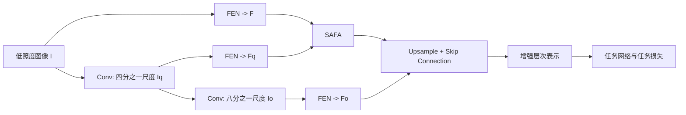

# FeatEnHancer: Enhancing Hierarchical Features for Object Detection and Beyond Under Low-Light Vision

**论文**：[CVF 官方论文页面](https://openaccess.thecvf.com/content/ICCV2023/html/Hashmi_FeatEnHancer_Enhancing_Hierarchical_Features_for_Object_Detection_and_Beyond_Under_ICCV_2023_paper.html)  
**代码**：未提供官方代码链接  
**发表**：ICCV 2023  
**类别**：低照度特征增强与下游视觉

## 一句话总结

FeatEnHancer 不用亮度、颜色或重建损失训练一个独立 LLIE 网络，而是在原图、四分之一尺度和八分之一尺度上用 Feature Enhancement Network（FEN）提取任务相关特征，再以 Scale-Aware Attentional Feature Aggregation（SAFA）融合高分辨率语义并用 skip connection 注入低层细节，整个模块由检测、分割或视频检测损失端到端驱动。

## 研究背景与问题

低照度图像增强通常以人眼观感为目标：提高亮度、保持颜色、减少噪声。但更“好看”的图像不一定更利于检测，增强网络还常依赖成对数据、合成退化或专门的增强损失，换任务和数据域后容易失效。FeatEnHancer 的出发点是把优化目标从 RGB 图像质量改为下游网络真正使用的层次语义。

低照度目标既需要高分辨率特征辨认小物体与边缘，也需要低分辨率特征聚合全局结构。简单平均多尺度表示会混淆两类信息；直接在原分辨率做注意力又代价过高。论文因此把“尺度内增强”和“尺度间融合”分开：FEN 负责每个尺度内部的空间增强，SAFA 只在压缩后的高层表示上做分块注意力，最后再以跳连补回最低尺度细节。

## 方法总览

输入低照度图像 $I$ 先通过卷积下采样得到 $I_q$ 与 $I_o$；三个尺度分别经过共享结构的 FEN，产生 $F,F_q,F_o$。SAFA 将 $F$ 和 $F_q$ 投影到八分之一尺度，分成多个通道块计算尺度感知注意力，得到增强表示 $\bar F_h$；上采样后与 $F_o$ 通过 skip connection 合并，既可输出增强图像，也可直接送入任务网络，并仅由任务损失联合训练。

## 方法详解

### 1. 多尺度构建与 FEN

卷积下采样定义为

$$I_q=\operatorname{Conv}(I),\ K=7,S=4,$$
$$I_o=\operatorname{Conv}(I_q),\ K=3,S=2.$$

$K,S$ 分别是卷积核和步长，$I_q\in\mathbb R^{H/4\times W/4\times3}$，$I_o\in\mathbb R^{H/8\times W/8\times3}$。每个尺度都经过全卷积 FEN：首层把通道从 3 变为 32，随后使用六个 $3\times3$、步长为 1 的卷积与 ReLU，并采用对称 skip concatenation。网络不使用额外下采样和 Batch Normalization，以保留邻近像素的语义关系。

### 2. SAFA

SAFA 把 $F$ 用两层卷积投影为查询 $Q$，把 $F_q$ 用一层卷积投影为键 $K$，两者都位于八分之一尺度。拼接特征 $F_{q+k}$ 沿通道分成 $N$ 个块：

$$F_{q+k}^{n}=F_{q+k}[:,:, (n-1)C/N:nC/N].$$

第 $n$ 个块的尺度相关权重为 $W_{q+k}^{n}=F_q^n\cdot F_k^n$，再经 softmax 得到 $\bar W_{q+k}^{n}$；增强块为

$$\bar F_h^n=\sum_{l=1}^{L}\bar W_{q+k}^{n}\cdot F_{q+k}^{n}.$$

拼接所有 $\bar F_h^n$ 得到 $\bar F_h$。这里 $N$ 是 attention block 数，$L$ 是归一化维度上的元素数。论文默认 $N=8$，兼顾子空间数量和每块通道容量。

### 3. 低层细节回注

$\bar F_h$ 与 $F_o$ 均通过双线性插值恢复到原尺度，再以 skip connection 合并。SAFA 负责融合 $F$ 与 $F_q$ 的高分辨率语义，SC 负责把 $F_o$ 的边缘和局部细节送入最终表示。论文的组合消融表明，两处都用 SAFA 或都用 SC 都不如“SAFA 后接 SC”。

FeatEnHancer 与普通预处理器的训练边界也很明确：它不先在增强数据上预训练，再冻结后交给检测器；FEN、SAFA 和任务网络从同一任务损失获得梯度。输出图像只是层次表示经过全局残差路径形成的可视化结果，论文判断模块好坏时以检测 mAP、分割 mIoU 等下游指标为准，而不是以视觉亮度为准。

因此复现时不能额外加入曝光、颜色恒常或平滑损失，否则优化目标已从论文的任务驱动特征增强变成传统 LLIE 多任务训练，实验结论也无法与原消融对应。

## 实验与证据

- **数据集**：ExDark（12 类，4800 训练、2563 验证）、DARK FACE（1 类，5400/600）、ACDC Nighttime（19 类，400/106）、DarkVision（4 类，26/6）。任务覆盖暗光目标检测、人脸检测、语义分割和视频目标检测。
- **检测基线**：RetinaNet 与 Featurized Query R-CNN（FQ R-CNN）；对比 RAUS、KIND、EnGAN、MBLLEN、Zero-DCE、Zero-DCE++ 和任务方法 MAET。
- **ExDark**：RetinaNet 基线为 46.3 mAP，FeatEnHancer 为 46.4；FQ R-CNN 从 47.0 提升到 56.5 mAP，AP50 从 74.5 提升到 86.3，超过 MAET 的 52.4 mAP。
- **DARK FACE**：RetinaNet 上为 19.9 AP，与基线持平；FQ R-CNN 从 28.6 提升到 29.4 AP，AP50 达 69.0。论文明确指出弱检测器对极暗小脸的收益有限。
- **跨任务结果**：ACDC 的 DeepLabV3+ 基线 45.7 mIoU，FeatEnHancer 达 54.9；DarkVision 在照度 3.2 与 0.2 下分别由 32.8/10.4 mAP 提升到 34.6/11.2，而外部 LLIE 方法普遍显著降低视频检测性能。
- **关键消融**：SAFA 相比简单平均在 ExDark、ACDC、DarkVision 分别提升到 72.6 mAP、54.9 mIoU、34.6 mAP；卷积下采样优于 maxpool、adaptive average pooling 和 interpolation；尺度组合 $(4,8)$ 最佳；attention block 从 2 增至 8 持续提升，12 时开始饱和或回落。

## 对 YOLO-Agent 的启发

接入点应位于数据增强之后、YOLO backbone 之前：FeatEnHancer 输出增强层次表示或增强图像，检测损失直接反向传播到 FEN 与 SAFA。对照组应包含原始暗光 YOLO、先用 Zero-DCE 类 LLIE 再检测、仅多尺度 FEN、FEN 加简单平均、完整 SAFA+SC；测试必须使用真实低照度集，不能只在合成暗化 COCO 上验证。

论文显示模块对检测器能力高度敏感：RetinaNet 在 ExDark 仅由 46.3 到 46.4 mAP，而 FQ R-CNN 从 47.0 到 56.5。若 YOLO-Agent 的完整模块只出现类似 0.1 mAP 的变化，应判为接入未证明有效，并检查小目标特征分辨率与任务损失是否真正更新 FeatEnHancer；若 SAFA 不优于简单平均的 69.5 mAP 或 SC 的 70.3 mAP 参照趋势，也需回查注意力投影。默认选择应复现 $(4,8)$ 尺度和 $N=8$ 的最优点，避免落入 $(8,16)$ 对应的明显退化。

## 优点

- 直接优化下游任务，不依赖合成配对数据或手工图像增强损失。
- 模块可用于检测、分割和视频检测，跨任务证据较完整。
- SAFA 在低分辨率上计算注意力，兼顾多尺度融合与计算可行性。

## 局限

- 在 RetinaNet 和极暗小脸场景中收益很小，效果依赖下游检测器能力。
- FEN、三尺度分支和 SAFA 会增加训练与推理开销，论文正文未给出完整速度比较。
- 生成图像的视觉质量可能较差；方法目标是机器表征，不适合直接替代面向人的增强系统。

## 评分

- **方法辨识度：高**：FEN、SAFA、SC 的层次关系明确。
- **跨任务证据：高**：四个低照度数据集覆盖多类视觉任务。
- **检测稳定性：中上**：强检测器收益显著，弱检测器上并不稳定。
- **综合评价：推荐专项验证**：适合真实低照度分支，但必须保留强基线与外部 LLIE 对照。
