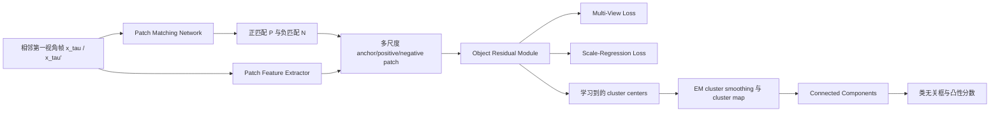

# Self-Supervised Object Detection from Egocentric Videos

**论文**：[CVF 论文页面](https://openaccess.thecvf.com/content/ICCV2023/html/Akiva_Self-Supervised_Object_Detection_from_Egocentric_Videos_ICCV_2023_paper.html)  
**代码**：未提供  
**发表**：ICCV 2023

## 一句话总结

DEVI 利用第一视角视频中人靠近或绕行物体产生的时间与尺度变化，通过多时刻 patch 匹配、Object Residual Module（ORM）、multi-view loss 和 scale-regression loss学习细粒度聚类特征，再从 cluster map 的连通区域生成类无关框。

## 研究背景与问题

Ego4D 一类第一视角视频包含剧烈视角变化、光照变化、遮挡和高密度物体。依赖整图表征的通用自监督模型容易把复杂场景压成粗粒度特征；LOST、FreeSOLO 等无监督检测流程又常需要全局预训练、对象发现和后续训练等多个阶段，难以同时获得局部定位能力与场景鲁棒性。

DEVI 不使用框标注，把视频中同一物体在相邻时刻的不同观察当成天然正样本。模型以 patch 为基本单元，在时间轴上约束跨视角一致性，在尺度轴上约束局部与其覆盖的大尺度 patch 一致性。这样学习到的不是单一“前景性”，而是可把不同对象类别映射到不同 cluster 的类别相关局部表示。

方法由 Patch Matching Network、Patch Feature Extractor、Object Residual Module 与无监督框生成组成。两个 transformer 网络结构相同但权重不同；前者先学会跨帧对应并冻结，后者与 ORM 使用匹配结果训练。视频只在训练时需要，推理可对单帧完成。

## 方法总览

## 方法详解

### 1. 多时刻 patch 匹配

给定视频 `V={x_0,…,x_{T-1}}`，采样时间间隔不超过 `δ` 的两帧 `x_τ、x_τ'`。匹配网络先用同一图像及其随机仿射变换训练：将变换同步作用到 patch 特征以获得空间对齐正样本，其余位置为负样本，并用对比损失学习匹配。冻结后，它在两真实帧间为每个尺度和位置选最相似 patch 组成正集合 `P_{i,s}^{τ→τ'}`，并选最不相似的 `N` 个 patch 组成负集合。

### 2. Object Residual Module

特征提取器在尺度 `s` 输出 `z_s^t∈R^{L_s×D}`，ORM 学习 `K` 个 `D` 维 cluster center `C∈R^{K×D}`。对 patch 特征 `z`，基础残差是 `z-C`，论文进一步定义

$$
r=\sigma(\theta\lVert z-C\rVert_2)\odot(z-C).
$$

`r` 是 patch 相对所有 cluster 的软残差表征；`θ∈R^{1×K}` 是每个 cluster 的可学习尺度；`σ` 是对归一化距离施加的 softmax；`⊙` 表示逐元素加权。大 patch 可能同时覆盖碗和盒子，软残差允许它以多个 cluster 的混合表示，而不是被硬分到单一类别。

### 3. 时间与尺度目标

Multi-view loss 的正样本来自跨帧匹配，目标是让同一物体在不同视角和光照下的残差表示接近；Scale-regression loss 的正样本是同位置重叠的更高尺度 patch，目标是让局部物体与包含它的尺度视图保持一致。两项损失都采用对比形式：提高 anchor 残差 `r_i^+` 与正残差 `r_i^p` 的点积，同时以负集合 `r_{i,j}^-` 的指数点积作为分母竞争项。两者共享 anchor 与负样本，仅正样本定义不同。

### 4. 从 cluster 到框

推理时以已学习 center 初始化 EM，在当前 batch 特征上运行若干次迭代得到平滑 center，再把各尺度位置分配到 cluster，形成 cluster map。Connected Components 把 map 分成 blob 并取外接框。框分数是 blob 凸性 `Area(blob)/ConvexHull(blob)` 与平均 objectness prior `O(blob)` 的加权调和平均：

$$
S(b_i)=\frac{(1+\beta^2)c_iO_i}{\beta^2c_i+O_i}.
$$

其中 `c_i` 是凸性，`O_i` 是来自现成自监督模型的平均 objectness，`β` 控制两者权衡。方法还删除映射像素少于 `γ` 的 cluster，并用 objectness 与凸性阈值过滤框。

DEVI 的 cluster center 不是预先给定类别原型，而是在两个对比目标驱动下共同学习。Multi-view 迫使不同时间、不同照明中的同类局部靠近同一组 center，scale-regression 则防止同一对象因 patch 尺度变化切换到无关 cluster。EM smoothing 只在当前 batch 上细化 center，用于降低单帧分配噪声，并不回写训练参数。最后的 blob 框因此反映“空间上连续且残差类别一致”的区域，而非显著图阈值的单次分割。

DEVI 的 cluster center 不是预先给定类别原型，而是在两个对比目标驱动下共同学习。Multi-view 迫使不同时间、不同照明中的同类局部靠近同一组 center，scale-regression 则防止同一对象因 patch 尺度变化切换到无关 cluster。EM smoothing 只在当前 batch 上细化 center，用于降低单帧分配噪声，并不回写训练参数。最后的 blob 框因此反映“空间上连续且残差类别一致”的区域，而非显著图阈值的单次分割。

## 实验与证据

DEVI 在 EgoObjects 与 Ego4D 上训练和评估，并把 Ego4D 训练模型直接测试到 COCO val。指标为 AP50、AR1、AR10、AR100；由于第一视角数据标注稀疏，论文更重视 recall。主要比较 Selective Search、LOST、FreeSOLO、TimeCycle、VideoMAE 与 MoCo V3。

- EgoObjects 上 DEVI 为 14.96 AP50、6.47 AR1、29.61 AR10、39.43 AR100；FreeSOLO 为 15.70、8.30、20.70、32.90，DEVI 在多 proposal recall 上明显更高。
- Ego4D 上 DEVI 达到 6.51 AP50、2.91 AR1、14.12 AR10、22.03 AR100；MoCo V3 为 4.57、2.59、8.33、8.48。
- 完整 ORM+multi-view+scale-regression 为 6.51 AP50、14.12 AR10、22.03 AR100。只用 ORM 与 multi-view 为 4.02、7.92、21.34，加入 scale-regression 后 AP50 和 AR10 继续上升。
- 不使用 ORM 时改用 K-Means，整体结果更差；作者据此认为软残差对高歧义场景比经典聚类更有效。
- Ego4D 训练后零样本测试 COCO val，DEVI 为 8.03 AP50、3.31 AR1、15.64 AR10、25.93 AR100；其 AR10、AR100 高于列出的 LOST、DETReg 与 FreeSOLO 结果。

## 对 YOLO-Agent 的启发

最合理的接入点是无标注视频预训练模块，而不是直接替换 YOLO 检测损失：在 YOLO backbone/neck 的多尺度特征上建立 patch matching 与 ORM，先用 `L_MV+L_SR` 预训练，再把权重迁移到有标注 YOLO。另一个实验分支可把 cluster blob 当作类无关 pseudo box，供 YOLO 的 objectness 头预训练，但必须与“只做特征预训练”分开验证。

对照组建议为：随机初始化 YOLO；VideoMAE/MoCo 类全局预训练；仅 multi-view；multi-view+scale-regression；完整 ORM。预训练阶段报告类无关 AP50、AR10、AR100，微调后报告 COCO AP 与 APS。验收阈值建议：完整方案在无标注类无关评估上相对全局预训练至少提升 2.0 AR100，且下游 YOLO AP 至少提升 0.5；若 AR100 上升但 AP50 下降超过 1.0，说明 blob 过度碎片化；若加入 scale-regression 后 AR10 不升，则停止增加尺度分支。第一视角训练数据还应与 YouTubeBB 等外部视角视频作对照，因为论文明确观察到第一视角变化更适合该目标。

## 优点

- 把第一视角运动转化为跨视角、跨尺度的免费监督。
- ORM 用多 cluster 软残差表示复杂 patch，适合对象密集和类别混合区域。
- 训练用视频、推理用单帧，并在未见 COCO 数据时展示跨域召回能力。

## 局限

- 推理仍依赖 EM、连通域、凸性和外部 objectness prior，流程并非纯神经端到端输出框。
- 第一视角数据标注不完整会显著扭曲 precision，AP 的解释受限。
- patch matching 需要额外预训练与冻结步骤，且对视频时间采样质量敏感。

## 评分

- **创新性：9/10**——把第一视角行为模式与残差聚类用于无监督检测。
- **实验充分性：8.3/10**——有组件、跨域和训练域对照，但精度评估受稀疏标注限制。
- **可迁移性：7.8/10**——适合视频预训练，直接并入常规检测推理链较复杂。
- **综合评分：8.4/10**
