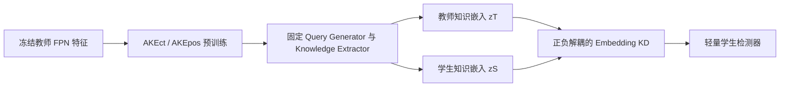

# UniKD: Universal Knowledge Distillation for Mimicking Homogeneous or Heterogeneous Object Detectors

**论文**：[CVF 论文页](https://openaccess.thecvf.com/content/ICCV2023/html/Lao_UniKD_Universal_Knowledge_Distillation_for_Mimicking_Homogeneous_or_Heterogeneous_Object_ICCV_2023_paper.html)  
**代码**：官方代码链接未提供  
**会议**：ICCV 2023

## 一句话总结

UniKD 用两类 Adaptive Knowledge Extractor（AKE）把教师和学生的 FPN 特征动态聚合为固定数量的 content/position knowledge embeddings，从而绕过异构检测头造成的像素语义错位，并支持更省存储的离线蒸馏。

## 研究背景与问题

传统检测蒸馏常写成 \(D(F^T,\phi(F^S))\)：教师特征 \(F^T\) 与经适配器 \(\phi\) 处理的学生特征 \(F^S\) 逐像素匹配。这对相同检测头和标签分配策略的同构组合有效，但 RetinaNet、FCOS、RepPoints、Deformable DETR 等异构检测器在空间位置上的语义并不一致，强行对齐会把“不同含义的像素”拉近。

另一个实际问题是大型教师无法在线参与每一步训练。若离线保存整套多尺度 feature map，磁盘消耗巨大。UniKD 不保存稠密特征，而是先把检测相关知识吸收到固定数量的 query embeddings 中，再让任意学生在同一 AKE 坐标系下模仿这些嵌入。

## 方法总览

UniKD 是两阶段训练。阶段一冻结教师 backbone/FPN，仅预训练 AKE，使其从教师特征中抽取能完成分类和定位的知识。阶段二冻结 AKE，让教师和学生共享由教师特征产生的 queries，分别读取 \(F^T\) 与 \(\phi(F^S)\)，再以 embedding MSE 训练学生。AKE 只用于训练，推理时删除。

## 方法详解

### AKE 的两类查询

AKE 由 Query Generator（\(f_{ct}\) 或 \(f_{pos}\)）和 Detection-relevant Knowledge Extractor \(f_e\) 组成，核心运算是 deformable cross-attention。AKEct 从可学习输入 \(E\in\mathbb R^{N\times C}\) 生成 content query \(q_{ct}\)；AKEpos 从框集合 \(\tilde B\in\mathbb R^{N\times4}\) 经全连接层得到输入嵌入，再生成 position query \(q_{pos}\)。\(N\) 是 query 数，\(C\) 是通道维。

\(\tilde B\) 包含真值框附近的 jitter box 与随机背景框：正框要求和对应真值 IoU 大于 \(\alpha=0.6\)，背景框与所有真值的最大 IoU 小于 \(\beta=0.4\)。两类 query 均依赖教师特征 \(F^T\)，随后分别与教师或学生多尺度特征做可变形交叉注意力，得到 \(z_{ct}\) 和 \(z_{pos}\)。两套 AKE 结构相同但参数不共享，总参数量为 1.56M。

### 吸收教师知识与注入学生

阶段一中，content embeddings 通过 DETR 式二分图匹配对应真值，position embeddings 因框生成关系已知而直接获得正负索引。分类损失监督全部 query，框损失监督正 query，促使固定长度 embedding 真正编码检测相关的内容与位置知识。

阶段二冻结 AKE。教师和学生共用由 \(F^T\) 产生的 \(q_{ct},q_{pos}\)，但知识读取的第二输入分别是 \(F^T\) 与 \(\phi(F^S)\)。蒸馏损失为

\[
L_{kd}=\lambda_1D(z_{ct}^S,z_{ct}^T)+\lambda_2D(z_{pos}^S,z_{pos}^T).
\]

\(D\) 将正、负 query 分开平均 MSE，避免数量较多的背景 query 掩盖前景。适配器 \(\phi\) 由全连接层和 deformable self-attention 组成，用于缩小异构特征差距。默认 \(N=200\)、\(\lambda_1=\lambda_2=10\)，AKE 的 \(f_{ct},f_{pos},f_e\) 各用一层 transformer decoder；学生仍保留原分类与定位损失。

共享 query 是 UniKD 能比较异构特征的关键：query generator 始终读取教师 \(F^T\)，所以教师和学生知识提取器被同一组内容探针与位置探针询问，差异只来自第二输入的特征来源。若分别从教师和学生生成 queries，embedding 索引将不再代表同一个问题，MSE 会重新退化成语义未对齐的集合比较。离线蒸馏也应保存这种固定索引关系，而不只是无序 embedding。

## 实验与证据

实验在 MS-COCO 2017 上进行，指标为 COCO mAP、mAP50、mAP75 及尺度 AP。教师/学生横跨 RetinaNet、Faster R-CNN、FCOS、ATSS、RepPoints、Deformable DETR，并覆盖 ResNet、ResNeXt、ConvNeXt、Swin、Uniformer。比较对象包括 FitNet、FGD、MGD、SGFI、HEAD、FKD。

在异构组合中，RetinaNet-R18 学生基线 31.7 mAP，UniKD 从 RepPoints-R50 教师学习后达到 34.8，优于 HEAD 的 34.2；FCOS-R18 从 32.5 提升到 35.5，优于 HEAD 的 35.0。传统 FGD/MGD 在异构组合上仅带来 -0.4 到 +1.3 mAP 变化，而 UniKD 稳定提升 3.0 到 3.1 mAP。

同构比较中，RetinaNet-R50 从 37.4 提升到 40.7，超过 FGD 的 40.4；Faster R-CNN-R50 从 38.4 提升到 42.3，超过 FGD 的 42.0。跨 backbone 表中，RetinaNet-R18 从不同大模型教师学习均达到 34.4—35.3，且 ConvNeXt-T、Swin-T、Uniformer-S 学生也保持正增益，说明固定 embedding 协议比逐像素同构假设更通用。

消融显示 content query 与 position query 单独都有效，联合最佳；query 数增加到 200 最优，继续增加略降；\(f_e\) 用一层 cross-attention 达到 35.3 mAP，多层反而下降。AKE 预训练 15 epoch 已达到最佳学生 35.3 mAP，耗时约为完整教师训练的 21%；异构 Deformable DETR 场景中，适配器加入两层 self-attention 可额外提升 1.9 mAP。FitNet 与 UniKD 同时使用不如 UniKD 单独使用，说明后者已经覆盖主要特征模仿能力。

## 对 YOLO-Agent 的启发

可把 YOLO 的 P3/P4/P5 作为学生输入，在教师侧允许使用任意 one-stage、two-stage 或 query-based detector。先实现 AKE 预训练工具，缓存每张图的 \(z_{ct}^T,z_{pos}^T\) 和 query 元数据，而不是缓存完整 FPN；再在 YOLO trainer 中加入学生 AKE 前向和正负解耦 MSE。部署时确认 AKE 不进入导出模型。

对照组应包含原始 YOLO、前景区域 FitNet、UniKD-content、UniKD-position、完整 UniKD，并至少选择一个同构教师与一个异构教师。失败阈值可对齐论文异构证据：若完整 UniKD 相对学生提升不足 3.0 mAP，或不超过 HEAD/改进 FitNet，则通用接口没有发挥作用；若 query 超过 200 或 AKE 超过一层后性能下降，应采用论文默认而非继续堆叠。离线模式还需记录单图缓存体积；若知识 embedding 存储不显著小于 FPN 特征，就失去论文的重要工程优势。

## 优点

- 用 query embedding 建立统一知识接口，兼容同构和异构检测器。
- content/position 两种查询分别承载语义与定位信息，且消融证明互补。
- 支持离线教师并避免保存稠密多尺度特征。
- AKE 训练后可移除，不增加学生推理开销。

## 局限

- 训练流程分为 AKE 预训练和学生蒸馏两阶段，工程复杂度高于普通 feature MSE。
- queries 仍由教师特征生成，离线缓存协议需要保存足够的查询相关信息。
- 更强、架构差异更大的教师不一定产生更大收益，论文也将此留作未来问题。
- deformable attention 与适配器会增加训练显存和实现依赖。
- AKE 预训练质量受教师检测损失监督限制；若教师输出本身存在系统性偏差，固定知识嵌入也会把这种偏差稳定传给不同学生。
- 不同数据域下还需重新确认查询数量与正负比例是否合适。

## 评分

**9.1/10**。UniKD 给出了可落地的异构检测蒸馏协议，并兼顾离线存储；不足在于两阶段训练较重，教师选择与收益之间仍缺乏稳定规律。
