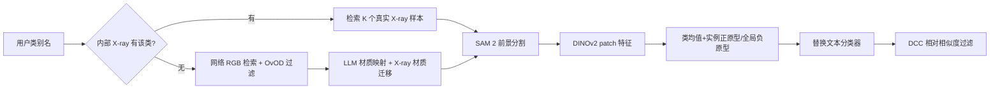

# Superpowering Open-Vocabulary Object Detectors for X-ray Vision

**论文**：[官方论文页面](https://openaccess.thecvf.com/content/ICCV2025/html/Garcia-Fernandez_Superpowering_Open-Vocabulary_Object_Detectors_for_X-ray_Vision_ICCV_2025_paper.html)  
**代码**：论文给出官方项目页 `pagf188.github.io/RAXO/`  
**发表**：ICCV 2025  
**类别**：开放词汇与跨模态检测

## 一句话总结

RAXO 不微调 RGB 开放词汇检测器，而是为用户类别收集或合成 X-ray 样本，用 DINOv2 区域特征构造前景、实例与背景视觉原型，直接替换原 CLIP 文本分类器，并用 Descriptor Consistency Criterion（DCC）剔除与预测类别缺乏相对间隔的候选框。

## 研究背景与问题

安检 X-ray 检测数据昂贵且依赖专家标注，已有数据集通常不足 20 类；传统监督检测器只能识别训练类别。RGB 开放词汇检测器虽能接受任意文本类别，但其 RoI 特征是在 RGB 图像—文本空间中对齐的，同一物体变成材料透射图后，文本向量与 X-ray 区域特征严重错位。论文因此把问题定义为 Cross-Modality Transfer Evaluation（CMTE）：模型只在源 RGB 数据训练，直接在目标 X-ray 数据和新词表上测试，不允许再训练。

RAXO 的数据流具有明确的三阶段。首先，若类别存在于独立的内部 X-ray 库，就取前 $K$ 个样本；否则以类别名从 Google Images 检索 RGB 图，经原 RGB OvOD 以阈值 $\tau$ 过滤，再按物体材质转换为合成 X-ray 样本。其次，SAM 2 分割物体，DINOv2 ViT-B/14 提取 patch 特征，分别形成前景正原型、背景负原型及保留类内形态差异的多原型集合。最后，用这些视觉描述符替换 Detic、VLDet、CoDet 或 GroundingDINO 的文本分类器，RoI 与类内最近原型做余弦匹配。

## 方法总览

材质迁移不是通用风格化。作者先让 GPT-4 将内部类别聚成 metal、wood、plastic、leather 等材质组，再用组内 X-ray 物体掩码区域的平均三通道值建立材质库；对网络 RGB 物体，SAM 2 掩码内填入对应材质的 X-ray 外观。类描述符同时包含该类所有实例正原型及其均值，背景描述符包含全库负原型及均值。DCC 对候选的最近类原型相似度 $s_1$ 与其他类别平均原型的平均相似度 $s_2$ 求差，只有 $s_1-s_2\ge\sigma$ 才保留。

## 方法详解

### 1. DET-COMPASS 与开放词表评测

论文将 COMPASS-XP 分类数据重新人工框标，形成 370 类的 DET-COMPASS，并保留像素对齐 RGB/X-ray 图和物体可见性属性。它与 PIXray、PIDray、CLCXray、DvXray、HiXray 共同构成六数据集评测，总计 343 个可见独有类别、超过 14 万图像，弥补以少数违禁品类别评估开放词汇方法的缺陷。

### 2. 双源画廊与视觉描述符

默认 $K=30$、检索过滤阈值 $\tau=0.5$。对每个样本，掩码内 patch 平均为正原型，掩码外平均为负原型；类描述符保留“类均值+所有实例原型”，避免厨刀、工具刀等形态差异被一次平均抹平。这个离线画廊可增量加入新类别，不改变检测器参数。

### 3. 视觉分类与 DCC

每个 RoI 对所有视觉原型取最大余弦相似度决定类别；若最匹配的是背景原型则直接删除。DCC 再要求预测类最近原型相似度显著高于其他类平均原型，默认 $\sigma=0.15$。因此 RAXO 修复的是分类端的模态错位，RPN 与框回归仍完全继承 RGB 检测器。

## 实验与证据

四个 RGB OvOD 基线在 X-ray 上直接测试均较弱。仅使用网络合成样本的 0/100 设置，RAXO 平均提升 2.1 AP；20/80 提升 4.8，50/50 在 DET-COMPASS 平均提升 14.9；全部使用独立内部样本时，跨方法与数据集平均提升 14.7。GroundingDINO 在六数据集的平均 AP 从 10.2 提升到 27.2，即 +17.0。默认报告 COCO AP、AP50、AP75，并对内部/网络类别随机划分重复三次。

PIXray 消融显示，直接网络检索 X-ray 图反而由 12.9 降至 7.9 AP；检索 RGB 为 13.9，OvOD 过滤后 14.3，StyleShot 风格迁移 14.6，材质迁移达到 16.1。内部样本的描述符消融中，简单类平均为 25.2 AP；加入分割为 27.1，负原型 27.8，多原型描述符 28.5，最终加入 DCC 达 36.9 AP、45.0 AP50、39.0 AP75。$K=30$ 附近饱和，$\sigma=0.15$ 在误报与漏报间最优。

## 对 YOLO-Agent 的启发

- **对照组**：冻结同一 GroundingDINO/Detic 的 RPN 与框回归，依次比较原 CLIP 文本分类器、真实 X-ray 单原型、网页 RGB 原型、StyleShot、按材质迁移的合成 X-ray、多原型库及 `RAXO+DCC`，由此拆开“视觉描述符替换”和 Descriptor Consistency Criterion 的贡献。
- **指标**：围绕 RAXO 的原型检索与 DCC，记录 AP/AP50/AP75、预测类与次优类的 $s_1-s_2$、背景原型命中率、每类原型覆盖度、网页样本过滤通过率、真实/合成原型到目标 RoI 的距离，以及 DCC 前后的 FP/FN 迁移。
- **切片评估**：按 X-ray 材料属性、目标尺度、重叠遮挡、朝向和行李内密集度分桶，并分开报告内部 X-ray 样本已覆盖类、纯网页新类与材质映射歧义类，检验 RAXO 是否真的把 RGB 外观转成可迁移的 X-ray 类描述符。
- **成本指标**：分别统计网页检索、SAM 分割、DINOv2 编码、前景/实例/背景原型库存储和在线最近邻分类延迟；类别扩展到 300 类时报告显存、检索复杂度及相对原文本分类器的时延增幅。
- **失败判断**：若纯网页新类相对原 CLIP 文本对照组平均 AP 提升不足 1.0，或 DCC 仅压低 Recall 而 AP75 不升；若同材质类别混淆增加、背景原型误删真实小目标超过 5%，或 300 类在线分类延迟增幅超过 20%，则判定 RAXO 的材质迁移、视觉原型或 DCC 未形成可用收益。

## 优点

- 不训练检测器即可接入多个 OvOD，类别描述符可离线增量扩展。
- 将跨模态问题转成视觉—视觉匹配，避免继续依赖失效的文本对齐。
- DET-COMPASS 的 370 类和像素对齐双模态数据显著扩大了评测词表。
- 消融明确区分检索质量、材质迁移、前景分割、负原型、多原型和 DCC 的贡献。

## 局限

- 仍需内部 X-ray 样本建立可靠材质库；完全无内部数据时增益明显较小。
- 材质平均颜色忽略厚度、重叠、射线能量和设备差异，合成图不等同真实成像。
- 只替换分类器，RGB RPN 若漏掉 X-ray 形态异常目标，视觉原型无法补救。
- SAM、网络检索和 LLM 材质映射会引入外部服务、错误传播与离线维护成本。

## 评分

- **问题重要性**：★★★★★
- **方法清晰度**：★★★★★
- **实验可验证性**：★★★★★
- **工程可迁移性**：★★★★☆
- **YOLO-Agent 参考价值**：★★★★☆
