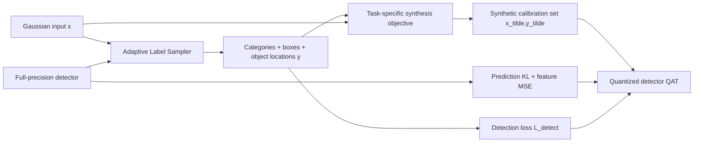

# Task-Specific Zero-shot Quantization-Aware Training for Object Detection

**论文**：[官方论文页面](https://openaccess.thecvf.com/content/ICCV2025/html/Li_Task-Specific_Zero-shot_Quantization-Aware_Training_for_Object_Detection_ICCV_2025_paper.html)  
**代码**：论文未提供官方代码  
**发表**：ICCV 2025

## 一句话总结

该方法把检测标签的类别、框尺寸与网格位置同时注入零样本图像反演，并通过 Adaptive Label Sampling 从全精度检测器自身挖掘框分布，再用输出 KL、跨层特征 MSE 和检测损失联合执行量化感知训练。

## 研究背景与问题

传统 Quantization-Aware Training（QAT）需要原始训练集来估计量化步长并微调低比特网络；数据受隐私、授权或存储限制时，Zero-shot Quantization（ZSQ）只能合成校准图像。以往检测 ZSQ 多匹配 backbone 的 BN 统计或 Transformer patch 相似性，生成的是任务无关纹理，忽略了目标类别、位置、尺寸和每图目标数。分类任务可随机抽一个类别 ID 做反演，检测标签却是变长框集合，且 COCO 类别分布高度不均衡，直接均匀随机框会产生不可信的空间与类别组合。

## 方法总览

框架分两阶段。Stage I 先从高斯噪声出发，以统计先验、图像正则和检测训练损失优化输入；Adaptive Label Sampler 在优化过程中交替更新图像与框标签，最后固定生成标签并合成小规模任务特定校准集。Stage II 对全精度教师和量化学生进行 prediction-matching distillation、feature-level distillation，并继续使用这些合成框的检测损失完成 QAT。

“零样本”指不访问真实训练图像；论文同时讨论了可使用少量真实标签集合与完全不知道标签分布的 data-free 设置。前者可直接用 2K 或 50 个标签描述生成图像，后者则由 Adaptive Label Sampler 自己恢复类别频率和框数量。两种设置共享后续合成与 QAT 流程，区别只在标签来源。

## 方法详解

### 1. 量化与任务无关反演基线

LSQ 对浮点张量 `w_fp` 使用步长 `s`：先将 `w_fp/s` 四舍五入并裁剪到 `b` bit 的整数范围得到 `w_int`，再以 `ŵ_fp=w_int·s` 反量化；`s` 在校准和 QAT 中学习。对 CNN，任务无关反演匹配每层 BN 的存储均值/方差与合成输入统计，得到 `L_prior`；对无 BN 的 ViT/Swin，使用 Patch Similarity Entropy。图像正则为 `L_reg=α_TV L_TV+α_l2||x||₂`，抑制高频噪声并平滑相邻像素。

### 2. Stage I：任务特定校准集

检测损失写为 `L_detect(Φ(x),y)=L_category+L_box+L_conf`，分别恢复类别、框尺寸/坐标和网格目标置信度。最终图像反演目标为

`min_x α_prior L_prior(x)+α_detect L_detect(Φ(x),y)+L_reg(x)`。

Adaptive Label Sampling 先均匀随机生成一个合法类别与框；用上述目标优化输入若干步后，再让固定的全精度检测器重新检测当前图像，把高置信区域加入标签、删除低置信区域，同时保证每图至少一个框。图像和标签交替更新，使类别频率、目标数、相对位置与尺寸逐渐接近教师所记忆的真实训练分布。得到标签后将其固定，再从新的高斯输入生成最终校准图像，避免只复用标签搜索阶段的单一样本。

这一过程利用的不是外部元数据，而是教师在检测头隐藏状态与决策边界中保留的训练分布。单次随机框只是启动点；随着图像被检测损失塑造成可识别目标，教师会提出新的高置信区域，标签集合再反过来约束下一轮图像。至少保留一个标签防止图像退化为纯背景，删除低置信框则避免随机初始化产生的错误框永久留在目标集合中。

### 3. Stage II：任务特定蒸馏 QAT

直接让量化网络拟合合成硬标签容易过拟合，因此输出使用教师软目标：`L_KD=(τ²/N)Σ KL(z^F(x̃_i;θ),z^Q(x̃_i;θ'))`，`τ` 为温度，`θ、θ'` 分别是全精度与量化参数。跨 `L` 个选定层的特征损失为 `L_feat=(1/(NL))Σ_iΣ_l||f_l^F(x̃_i)-f_l^Q(x̃_i)||²`，用于抑制低比特误差逐层累积。总 QAT 目标为 `L_Q=β_KL L_KD+β_feat L_feat+β_detect L_detect`，最后一项直接利用合成框学习检测任务。

## 实验与证据

实验使用 MS-COCO 2017 和 Pascal VOC，覆盖 YOLOv5-s/m/l、YOLO11-s/m/l、CNN Mask R-CNN 与 Swin-T/S Mask R-CNN，基线是使用真实数据的 LSQ、LSQ+。COCO 上只生成 2K 校准图，规模为 120K 训练集的 1/60。YOLOv5-l 在 W6A6 下，预训练为 49.0 mAP，满数据 LSQ/LSQ+ 为 43.3/43.4，本文用零真实图像达到 45.1；YOLO11-l 在 W8A8 达 51.8，超过满数据 LSQ+ 的 50.9。CNN Mask R-CNN 在 COCO W8A8 达 35.2，略高于满数据 LSQ 的 35.0；VOC 仅 50 张合成图时为 72.9，高于满数据 LSQ 的 72.4。

关键消融直接验证任务特定损失。2K 合成图下，YOLO11-s W8A8 从去掉 `L_detect` 的 43.6 升到 45.6 mAP，W4A8 从 39.7 升到 42.6；Swin-S W6A6 从 42.8 升到 45.1。完全无标签先验的 YOLOv5-s W6A6 实验中，高斯噪声不收敛，Tile 和 MultiSample 最好为 24.0 与 29.7，而 Adaptive Label Sampling 达 32.0 mAP，距使用真实标签生成图像的 32.7 仅 0.7。

Transformer Mask R-CNN 进一步显示方法并不依赖 BN：Swin-T/S 使用 PSE 先验，在 W8A8 下本文为 45.1/47.1 mAP，同规模真实数据 LSQ 为 44.4/47.0；W6A6 为 42.0/45.1，对应小数据 LSQ 41.2/44.4。相对满数据 LSQ 仍有小幅差距，但只需 2K 合成图，说明任务特定反演与蒸馏在无 BN 架构上仍成立。

## 对 YOLO-Agent 的启发

最直接的接入点是部署前量化代理：冻结已训练 YOLO 教师，用其检测头输出周期性改写合成标签，再以 2K 左右图像执行 LSQ 风格 QAT。对照组应为真实小样本 LSQ、BN/PSE 任务无关合成、随机 MultiSample 框和 Adaptive Label Sampling；分别测试 W8A8、W6A6 与 W4A8。指标必须包含 COCO mAP/mAP50、相对 FP32 掉点、合成标签类别 KL 距离、每图框数分布和不收敛比例。若 W6A6 相比同规模真实数据 LSQ 未提升 1.5 mAP，或类别分布 KL 连续三轮不下降、QAT 在前 10% iteration 出现 NaN，则停止标签交替更新并回退到固定教师高置信伪标签。

## 优点

- 同时解决“检测标签如何零样本生成”和“量化网络如何利用这些标签”两个问题。
- 仅用原训练集 1/60 规模的合成数据即可逼近或超过部分满数据 QAT 结果。
- 在 YOLO、CNN 两阶段检测器和 Transformer 骨干上均验证，量化位宽覆盖较广。

## 局限

- 图像合成需要对输入反复反向传播，节省真实数据不等于低计算成本。
- 教师的类别偏差和漏检会被 Adaptive Label Sampling 继承，长尾类别未必得到充分恢复。
- 论文主要使用对称 LSQ；结论不能直接外推到整数部署内核、混合精度或后训练量化。

## 评分

**9.0/10**：将任务标签结构真正纳入检测 ZSQ，而非只生成“像图像的纹理”，并在多类检测器上给出强结果；代价是反演与交替采样流程较重。
