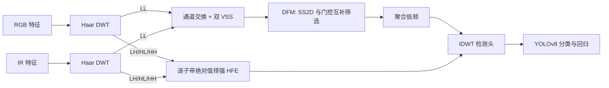

# WaveMamba: Wavelet-Driven Mamba Fusion for RGB-Infrared Object Detection

**论文**：[官方论文页面](https://openaccess.thecvf.com/content/ICCV2025/html/Zhu_WaveMamba_Wavelet-Driven_Mamba_Fusion_for_RGB-Infrared_Object_Detection_ICCV_2025_paper.html)  
**代码**：论文正文未给出可确认的官方代码地址  
**发表**：ICCV 2025  
**类别**：多模态目标检测

## 一句话总结

WaveMamba 不在空间域直接拼接 RGB 与红外特征，而是用 Haar DWT 将每层特征拆成低频结构与三个高频子带：低频交给由通道交换、VSS/SS2D 和门控注意力组成的 LMFB 深度融合，高频按绝对值逐元素择强，最后以 IDWT 检测头无损重建多尺度特征。

## 研究背景与问题

RGB 在正常照明下保留纹理、边缘和颜色，夜间或恶劣天气却容易失去对比度；红外不依赖可见光，能稳定突出热目标，但细节和纹理较弱。论文在 M3FD 验证集统计 DWT 子带的信息熵，观察到 RGB 的高频信息更丰富、红外的低频信息更突出，因此质疑常见的卷积、交叉注意力或简单加和：它们把不同频率、不同可靠性的成分按同一种规则处理，既可能把道路阴影等低频冗余带入融合，也可能抹掉小目标边缘。

WaveMamba 的独特数据流是双流 YOLO 骨干先分别提取 RGB/IR 特征，在第 2 层后执行一级 Haar DWT，并在后续第 3、5 层继续做多级 DWT；每次得到一个 `LL` 低频子带和 `LH/HL/HH` 三个高频子带。三个 WaveMamba Fusion Block（WMFB）分别处理这些频带，输出最终送入改造 YOLOv8 head 的低、高频特征；检测头不用普通插值上采样，而以 IDWT 将对应高频子带与聚合后的低频特征重建，再沿用原 YOLOv8 的其余预测结构。

## 方法总览

WMFB 分成 Low-frequency Mamba Fusion Block（LMFB）和 High-Frequency Enhancement（HFE）。LMFB 先用 Shallow Fusion Mamba（SFM）交换两模态的部分通道，再让两个新特征各自通过 Visual State Space（VSS）块；随后 Deep Fusion Mamba（DFM）令两模态轮流充当主、辅分支，主分支的一路经过深度卷积、SiLU、SS2D 与 LayerNorm，另一路形成门控，辅助模态也走 SS2D 路径，门控同时筛选主、辅输出后相加。HFE 不引入可学习参数，而是在每个高频子带的同一位置比较 RGB 与 IR 系数绝对值，保留绝对值更大的原始带符号系数。

## 方法详解

### 1. Haar DWT 与多层频率路由

二维 Haar DWT 用低通 $[1,1]/\sqrt{2}$ 与高通 $[1,-1]/\sqrt{2}$ 的组合做深度卷积和二倍下采样，得到 `LL、LH、HL、HH`。`LL` 保存主体结构，另外三带保存方向性细节及噪声。论文不是只在输入做一次图像融合，而是在骨干中逐层分解与融合，因此频率路由参与了特征层级的形成；这也使 IDWT 能在检测头利用此前保留下来的高频系数，而非从低分辨率语义特征中猜测细节。

### 2. SFM 与 DFM 的低频融合

SFM 通过切分、拼接交换 RGB/IR 通道，先建立廉价的跨模态相关，再以四方向展开的 SS2D 建模二维长程依赖。DFM 解决“融合越深、冗余越多”的问题：主模态的轻量 SiLU 分支生成门控，调制主模态 SS2D 表征和辅助模态 SS2D 表征；两模态交换主辅身份得到两路输出。因而它不是把 Mamba 当普通块堆叠，而是用一条模态自身的响应决定哪些跨模态低频结构应该通过。

### 3. HFE 与 IDWT 检测头

HFE 对 `LH、HL、HH` 独立执行 $|F_{RGB}|$ 与 $|F_{IR}|$ 比较，逐元素选取幅值更大的系数，保留其符号；这里的先验是高频系数幅值代表局部突变的重要程度。完成多层 WMFB 后，两模态低频结果先聚合，再与 HFE 高频结果一起进入 IDWT。该头在 M3FD 上由原头的 91.0/63.3 mAP50/mAP 提升到 92.1/64.4，同时参数从 76.7M 降至 69.1M，说明收益并非单靠扩大模型。

## 实验与证据

论文主文评估 M3FD、DroneVehicle、LLVIP、FLIR-Aligned，并在补充材料加入 VEIDA、KAIST；统一报告 mAP50 与 mAP，FLIR-Aligned 还报告 Precision、Recall、F1、参数量和推理时间。方法基于 Ultralytics YOLO 双流框架，并分别接入 ResNet50、YOLOv5、YOLOv8 骨干。YOLOv8 版本在 M3FD 达到 92.1 mAP50、64.4 mAP，相比表中次优结果分别高 5.5 和 5.1；在密集小目标 DroneVehicle 上为 79.8/60.5，在低照行人 LLVIP 上为 98.3/66.0。FLIR-Aligned 上达到 84.2 Precision、80.9 Recall、82.5 F1、88.4 mAP50、48.1 mAP，69.1M 参数、40.0 ms。

关键消融与设计一致：去掉 SFM 后为 90.6/62.3，去掉 DFM 后为 90.2/62.2；完整模型是 92.1/64.4。仅做无 DWT 平均融合的基线为 83.2/55.1；采用 DWT 后 `(Avg, Avg)` 为 86.6/58.2，低频换 LMFB 得 90.6/62.6，高频换 HFE 得 90.4/62.3，二者组合达到 91.0/63.3。Grad-CAM 与检测可视化还显示模型减少对背景的扩散关注，并在恶劣天气、低照、遮挡和密集场景中降低漏检与误检。

## 对 YOLO-Agent 的启发

- **基线**：固定双流 YOLOv8、训练预算与配准数据，比较空间域逐元素平均、DWT 后 `(Avg, Avg)`、仅 HFE、仅 LMFB、完整 `HFE+LMFB+IDWT`；另保留 RGB-only、IR-only 判断收益是否确由互补信息产生。
- **机制指标**：除 mAP50/mAP、AP75、AP_small 外，记录各层 `LL/LH/HL/HH` 的模态选择比例、HFE 选中 RGB 的位置占比、SFM 前后跨模态相关性、DFM 门控均值与熵，以及 IDWT 前后小目标边缘能量保持率。
- **切片评估**：按白天/夜间/恶劣天气、目标尺度、朝向、遮挡和每图目标数分桶；DroneVehicle 类密集小车场景重点看 AP_small、Recall 与重复框，低照行人重点看 IR 主导区域，避免总体 mAP 掩盖模态退化。
- **成本对照**：同时测参数、FLOPs、峰值显存、端到端延迟和 DWT/IDWT 导出支持；HFE 理论上无参数，但其逐子带比较和多层缓存仍可能成为部署瓶颈。
- **失败判断**：若完整方法相对 `(Avg, Avg)` 的三种子平均 mAP 提升不足 1.0，或 AP_small/夜间 Recall 没有同步改善；若 HFE 的模态选择长期塌缩到单一模态、DFM 门控接近常数，说明机制未工作。若精度增益小于 1.0 且延迟或显存增加超过 20%，也不应进入默认配置。

## 优点

- 用频率统计明确规定两模态的职责，模块名、数据流和消融结果能够相互对应。
- HFE 无可学习参数，LMFB 借助 SS2D 以线性复杂度覆盖长程依赖。
- 同一融合设计跨 ResNet50、YOLOv5、YOLOv8 均有提升，并覆盖地面、无人机、低照与热成像数据。
- IDWT 同时改善精度并减少参数，适合与小目标检测的细节保真目标结合。

## 局限

- “RGB 高频、IR 低频更可靠”是数据分布先验，热噪声、运动模糊或严重失配时，绝对值最大未必代表有效细节。
- HFE 是硬二值选择，无法表达两个模态同时有用或都不可靠的情况，也可能放大孤立噪声。
- 主文缺少配准误差、旋转目标和不同小波基的系统消融，多层 DWT 的最佳位置与数量主要留在补充材料。
- 与部分方法的比较跨不同骨干和实现，实际迁移仍需在同一训练配方下重跑。

## 评分

- **问题重要性**：★★★★★
- **方法清晰度**：★★★★★
- **实验可验证性**：★★★★☆
- **工程可迁移性**：★★★★☆
- **YOLO-Agent 参考价值**：★★★★★
