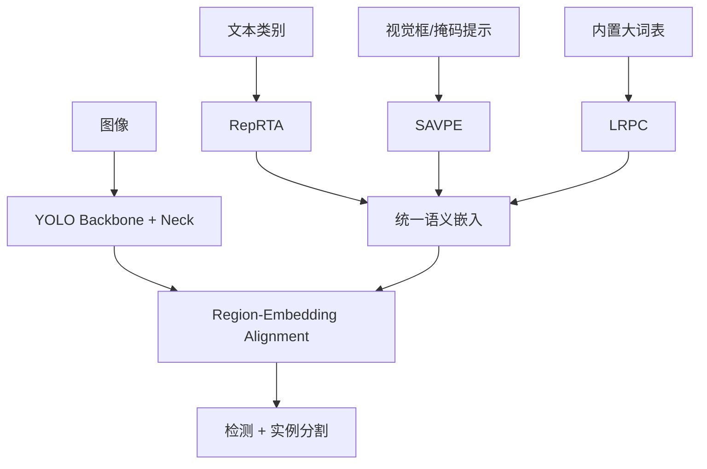

# YOLOE: Real-Time Seeing Anything

**会议**: ICCV 2025  
**论文**: [arXiv](https://arxiv.org/abs/2503.07465)  
**代码**: [THU-MIG/yoloe](https://github.com/THU-MIG/yoloe)  
**任务**: 开放词汇目标检测与实例分割

## 一句话总结

YOLOE 将文本提示、视觉提示和无提示开放世界识别统一到一个实时 YOLO 中：RepRTA 在训练时修正文本嵌入、部署时折叠进类别权重；SAVPE 用语义与激活双分支编码视觉提示；LRPC 则把大词表与区域特征做延迟对比，避免每次推理调用大型语言编码器。

## 背景与问题

闭集 YOLO 只能预测训练时定义的类别。开放词汇检测通过语言或视觉提示扩展类别，但通常面临三类取舍：文本模型计算重、视觉提示编码复杂、无提示模式需要庞大词表且容易拖慢推理。不同提示范式往往由不同模型负责，训练和部署链路不统一。

## 整体框架

## 方法详解

### 1. RepRTA：文本提示

预训练文本嵌入与检测区域特征之间存在域差异。RepRTA 使用轻量辅助网络对文本嵌入进行残差修正，并在训练后把变换折叠到最终类别嵌入中。因此推理阶段无需保留辅助网络，也不增加文本到视觉的额外传输成本。

核心思想与卷积重参数化类似：训练时使用更灵活的函数学习，部署时将结果固化为静态类别权重。

### 2. SAVPE：视觉提示

视觉提示可能是框、点或掩码。SAVPE 将编码拆成：

- **语义分支**：提取提示区域“是什么”；
- **激活分支**：确定提示在空间上“在哪里”；

两者解耦后再融合，可以避免只做 ROI pooling 导致语义弱，也避免对全图执行昂贵交互注意力。

### 3. LRPC：无提示模式

无提示模式希望模型直接发现并命名尽可能多的物体。LRPC 使用内置大词表与专门区域嵌入执行对比，但把昂贵操作延后到候选区域筛选之后，减少对全部空间位置进行大词表匹配的成本，也避免部署时依赖外部语言模型。

### 4. 统一检测与分割

YOLOE 在相同视觉骨干和对齐空间上支持框与掩码输出。三种提示模式共享大部分参数，便于在“固定类别部署”“交互式视觉提示”和“开放发现”之间切换。

## 实验与证据

- 在 LVIS 上评估零样本检测、实例分割和 prompt-free 模式，并在 COCO 上评估下游迁移。
- 论文报告 YOLOE-v8-S 训练成本约为 YOLO-Worldv2-S 的三分之一、推理快 1.4 倍，同时 LVIS 指标提高 3.5 AP。
- YOLOE-v8-L 迁移到 COCO 后，相比闭集 YOLOv8-L 提高 0.6 box AP 和 0.4 mask AP，训练时间接近减少四倍。
- 消融分别验证 RepRTA、SAVPE、LRPC 以及训练数据与对齐策略。

## 对 YOLO-Agent 的启发

- 先根据部署词表是否稳定选择模式：固定类别使用重参数化文本权重；交互式目标使用视觉提示；未知类别发现使用 prompt-free。
- Harness 应分别统计图像编码、提示编码、区域—词表匹配和后处理延迟，不能只报告整体 FPS。
- 开放词汇评估需区分 base/novel/rare 类别，并检查类别同义词与提示模板敏感性。
- 视觉提示实验要固定框/掩码质量，否则提示质量变化会掩盖编码器本身效果。

## 优点

- 一个模型覆盖三种开放提示方式和检测/分割任务。
- 重参数化与延迟对比设计明确面向真实部署成本。
- 零样本、prompt-free 和下游迁移证据较完整。

## 局限

- 性能仍受文本词表、类别描述和训练数据覆盖影响。
- Prompt-free 依赖内置词表，严格意义上仍不是无限类别发现。
- 多阶段训练与多提示模式让复现和数据准备复杂度较高。

## 评分

- **创新性**: ★★★★★
- **实验充分度**: ★★★★☆
- **部署价值**: ★★★★★
- **YOLO-Agent 参考价值**: ★★★★★
