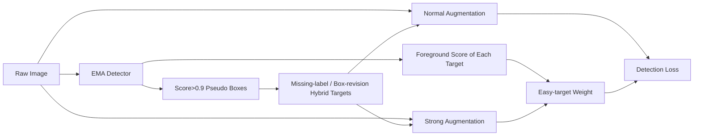

# Bootstrap Your Object Detector via Mixed Training

**论文**：[官方论文页面](https://proceedings.neurips.cc/paper_files/paper/2021/hash/5e15fb59326e7a9c3d6558ca74621683-Abstract.html)  
**代码**：未提供  
**发表**：NeurIPS 2021

## 一句话总结

MixTraining 用同一在线检测器的 EMA 副本完成两种 bootstrap：一方面产生高置信伪框来补全漏标或替换定位噪声，另一方面预测每个训练目标是否“容易”，只让 easy targets 承受强增强损失，从而把 normal/strong augmentation 与人工/伪训练目标混合进同一训练流程。

## 研究背景与问题

常规 SiTraining 对所有图像使用单一增强策略，并把人工框直接视为绝对真值。论文指出两个独立问题：强增强对某些图像增加有效多样性，却会破坏另一些目标的类别外观；COCO 人工标注还存在漏标和框定位不一致，前者会把真实物体当背景，后者会给回归头错误坐标。

MixTraining 不用离线教师或额外标注，而是维护当前检测器的 EMA 模型。EMA 在弱处理图像上更稳定：它既能生成高置信 pseudo boxes 修正训练目标，也能给已有目标预测 foreground score，判断强增强下哪些目标已足够容易。两个分支共享 EMA 前向，因此“混合目标”和“混合增强”不是孤立技巧。

## 方法总览

每张图随机采用 normal 或 strong augmentation。EMA 分支只做 scale jitter，预测经 NMS 后保留 foreground score 大于 0.9 的伪框；伪框与人工 GT 的 IoU 小于 0.5 时视为 missing label 并加入目标，大于 0.5 时可替换人工框以处理 localization noise，二者合用称 hybrid。对 strong augmentation，只有 EMA score 大于 0.9 的 easy target 获得检测损失权重 1，其他目标权重 0；normal augmentation 的所有目标权重均为 1。

三个视图的职责并不相同：EMA 看接近原图的稳定视图，用于判断与生成目标；normal/strong 两个训练视图更新在线 detector。伪框先与人工 GT 合并，再随训练视图做一致的几何变换。这样，easy score 评估不会被强增强本身扰动，strong 分支也不会使用未同步变换的框。论文把人工框和伪框合称 mixed training targets，而不是完全用模型预测替换监督。

## 方法详解

### 1. Mixed Training Targets

EMA 模型动量为 0.999，预测框先做 NMS，仅保留分数 $>0.9$。若伪框与所有 GT 的 IoU $<0.5$，它被当作漏标目标追加；若与 GT 的 IoU $>0.5$，定位噪声策略用伪框替换该人工框。Hybrid 同时执行两者。网络对标注噪声具有一定鲁棒性，因此训练中后期 EMA 可给出比局部人工误差更一致的框。

### 2. Mixed Data Augmentation

normal 与 strong 都含 scale jitter、solarize、brightness、contrast、sharpness；strong 额外加入 translation、rotate、shift、cutout。论文没有删除 non-easy target，因为删除后，与该物体重叠的 proposal 会被错误分为背景。它只把该目标关联 proposal 的损失置零：

$$
w(g)=\begin{cases}
1,&g\text{ 为 easy target 或图像采用 normal aug},\\
0,&\text{其他情况},
\end{cases}
$$
$$
\mathcal L_{det}=\sum_i w(g_i)\mathcal L_{det}(p_i,g_i).
$$

$g_i$ 是分给 proposal $p_i$ 的训练目标。easy 的判定是 EMA 对目标的 foreground score $>0.9$。因此强增强仍保留完整标签分配，只屏蔽难目标产生的梯度。

具体强增强中，translation、rotate、shift 的采用概率均为 0.3，cutout 数量在 1 到 5 之间、遮挡比例在 0.05 到 0.2；normal 不含这些几何扰动。论文观察到训练末期 easy targets 中大目标占 48%、小目标占 17%，non-easy 中小目标占 49%、大目标占 15%，说明固定高置信阈值天然更愿意把大目标交给强增强。

## 实验与证据

实验使用 COCO 2017（118k train、5k minival、20k test-dev），主要在验证集比较 Faster R-CNN、Cascade R-CNN 与 ResNet-50、Swin-Small；ResNet 使用 SGD，Swin 使用 AdamW，均采用 ImageNet-1K 预训练。

所有模型运行在 32 张 V100 上。论文为每种方法尝试多个训练日程并报告其最佳结果，因为 MixTraining 能从 720k 长训练获益，而普通 SiTraining 会过拟合。伪框总数和被保留为 missing labels 的数量都随训练增加，作者据此判断 EMA 伪框在后期更可靠；这也意味着早期若伪框数量过快膨胀，应被视为异常而非成功。

- Faster R-CNN ResNet-50 从 41.7 提到 44.0 mAP，AP50/AP75 从 62.8/45.6 到 64.9/47.9；Faster R-CNN Swin-S 从 48.7 到 50.3；Cascade R-CNN Swin-S 从 50.9 到 52.8。
- 组件消融：SiTraining normal 为 41.7，加入 mixed data augmentation 为 42.5，再加入 mixed training targets 为 44.0，即两部分贡献 0.8 和 1.5 AP。
- 伪框策略中，仅定位噪声 42.9，补漏标 43.7，hybrid 44.0，基线为 42.5；漏标修复是主要来源，但两者可互补。
- mixed augmentation 内部，随机混合增强本身从 41.7 到 42.1，再加入 easy-target weighted loss 到 42.5。只用 strong augmentation 为 40.7，低于 normal 的 41.7，mixed 为 42.5。
- 长训练下 normal SiTraining 在 180k/360k/540k/720k 为 41.7/41.7/40.2/36.1，出现过拟合；MixTraining 在 360k 为 42.4、720k 为 44.0。训练结束时超过 50% 目标被判为 easy，且 easy 目标中大目标占比更高。

伪框随训练变化的曲线也揭示了 bootstrap 的时间性：模型初期只能生成较少可靠框，训练推进后总伪框和被识别为 missing labels 的框都增加。定性示例中，3k iteration 的伪框质量明显弱于训练结束时。因此实现不宜在第一个 iteration 就使用大量低阈值伪标签；保持 0.9 高阈值和 EMA 平滑，是避免错误闭环的组成部分。

Hybrid 的 AP75 为 47.9，略低于 missing-label-only 的 48.0，但总 mAP 和 AP50 更高，分别为 44.0 和 64.9。这说明用伪框替换人工框并非对所有高 IoU 定位都更优，整体收益主要仍由补漏标贡献；在标注本身较干净的数据集上，box localization noise 分支应当单独验证，而不能默认开启。

## 对 YOLO-Agent 的启发

接入需要两个明确位置：EMA teacher 在无强几何增强视图上生成伪框和 GT foreground score；训练 dataloader 同时输出 normal/strong 视图，loss 层按 target 权重屏蔽 strong-view 的 non-easy 正样本，但不得把这些区域改成负样本。对照组应为 normal、strong、随机 mixed、mixed+easy weighting、完整 mixed+hybrid targets；指标包括 AP、AP75、伪框数量、missing-label 数量和 easy-target 比例。

失败阈值应防止自训练漂移：完整方法若相对 mixed augmentation 增益低于 0.5 AP，应先关闭 box replacement，只保留 missing-label；伪框加入后 AP50 上升但 AP75 下降超过 0.3，说明定位伪框不可靠；easy targets 在训练末期若仍低于 30%，阈值 0.9 对该 YOLO 过严，若早期即超过 70%，EMA 可能过度自信。strong-only 若没有明显低于 mixed 组，说明增强强度不足，无法验证论文机制。

## 优点

- 同一 EMA 前向同时服务伪框修正和强增强难度估计。
- 不删除难目标，避免其 proposal 被错误监督为背景。
- 对 CNN、Transformer backbone 和更强 Cascade detector 均有增益。

## 局限

- 训练需 normal/strong 分支和 EMA 推理，计算成本并非真正“免费”。
- 0.9 分数与 0.5 IoU 是固定阈值，校准不佳时会自我强化错误。
- 论文只在 COCO 验证，极端长尾或高噪声数据上的伪框可靠性未知。

## 评分

- **方法创新：8.5/10**——把增强选择与标注修正统一为 detector bootstrap。
- **实验充分：8.5/10**——含模型、日程、伪框策略和增强组成消融。
- **工程可用：8/10**——机制可迁移，但双视图与 EMA 增加训练成本。
- **综合评分：8.3/10**。
