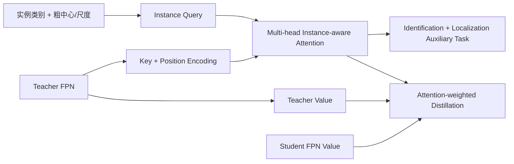

# Instance-Conditional Knowledge Distillation for Object Detection

**论文**：[NeurIPS 官方论文页面](https://proceedings.neurips.cc/paper_files/paper/2021/hash/892c91e0a653ba19df81a90f89d99bcd-Abstract.html)  
**代码**：未提供官方代码链接  
**发表**：NeurIPS 2021  
**类别**：实例条件知识蒸馏

## 一句话总结

Instance-Conditional Distillation（ICD）将每个真值实例的类别、粗中心和尺度编码成 query，以教师多尺度 FPN 特征作为 key/value，通过多头 instance-aware attention 检索与该实例相关的表示，再用识别—定位辅助任务训练解码器，并以该注意力对教师—学生特征 MSE 加权，实现同时面向分类与定位的实例级蒸馏。

## 研究背景与问题

检测蒸馏不能简单复制分类蒸馏：一张图中有多个目标，前景、背景、边界与中心位置对不同实例的价值不同。现有 proposal-based、规则掩码或网络激活注意力通常只回答“哪些区域总体重要”，却没有明确说明某块特征对哪一个实例、哪一种检测目标有用。

ICD 将知识定义为条件检索结果。对于实例 $i$，教师知识不是整张特征图，而是 $\kappa_i^T=G(T,y_i)$：$T$ 是教师多尺度表示，$y_i$ 是该实例的类别与框，$G$ 是可学习的条件解码模块。辅助任务要求检索结果能够辨别真实/伪实例并恢复准确位置，因此注意力必须找到同时支持识别和定位的教师特征，而非只跟随高激活区域。

## 方法总览

教师和学生各自产生 FPN 特征。真值实例经过有意降精度的编码形成 query；教师特征加位置编码后作为 key，原特征投影为 value，多头点积注意力产生每个实例的空间权重。教师解码结果用于辅助识别与框回归；蒸馏时复用教师注意力，以像素级 MSE 约束学生 value 特征。推理只保留学生检测器，条件解码器和教师均被移除。

## 方法详解

### 1. 实例条件知识

教师多尺度特征 $X_p\in\mathbb R^{D\times H_p\times W_p}$ 沿空间拼接为 $A^T\in\mathbb R^{L\times D}$，其中 $L=\sum_pH_pW_p$。实例标注 $y_i=(c_i,b_i)$，$b_i=(x_i,y_i,w_i,h_i)$，经编码 $E$ 与 MLP 得到 query：

$$q_i=F_q(E(y_i))\in\mathbb R^D.$$

第 $j$ 个注意力头将教师特征投影为 key/value，将 query 投影到 $d=D/M$ 维：

$$K_j^T=F_j^k(A^T+F_{pe}(P)),\quad V_j^T=F_j^v(A^T),\quad q_{ij}=F_j^q(q_i),$$

$$m_{ij}=\operatorname{softmax}\left(\frac{K_j^Tq_{ij}}{\sqrt d}\right).$$

$m_{ij}\in\mathbb R^L$ 是实例 $i$ 在第 $j$ 个头上的空间注意力，$\kappa_i^T=\{(m_{ij},V_j^T)\}_{j=1}^{M}$ 即实例条件知识。

### 2. 防止 query 走捷径的辅助任务

若 query 直接含精确框，解码器可能忽略教师特征、仅从 query 恢复目标。论文因此将中心随机扰动：

$$x_i'=x_i+\phi_xw_i,\quad y_i'=y_i+\phi_yh_i,$$

$\phi_x,\phi_y\sim U[-a,a]$，实验取 $a=0.3$；宽高只保留 $\lfloor\log_2w_i\rfloor,\lfloor\log_2h_i\rfloor$ 的粗尺度，并按数据分布生成 fake instances。注意力聚合表示 $g_i^T=F_{agg}(\kappa_i^T,q_i)$ 需完成二元真实/伪识别与 $L_1$ 框回归：

$$L_{aux}=L_{BCE}(F_{obj}(g_i^T),\delta_{obj}(y_i))+L_1(F_{reg}(g_i^T),\delta_{reg}(y_i)).$$

### 3. 注意力加权蒸馏

学生特征投影为 $V_j^S$，教师注意力 $m_{ij}$ 对逐位置特征 MSE 加权：

$$L_{distill}=\frac{1}{M N_r}\sum_{j=1}^{M}\sum_{i=1}^{N}\delta_{obj}(y_i)\left\langle m_{ij},L_{MSE}(V_j^S,V_j^T)\right\rangle.$$

$N_r$ 是真实实例数，$\langle\cdot,\cdot\rangle$ 为内积。蒸馏时 $m_{ij}$ 与 $V_j^T$ 停止梯度；总损失为

$$L_{total}=L_{det}+L_{aux}+\lambda L_{distill}.$$

$L_{det}$ 与 $L_{distill}$ 更新学生，$L_{aux}$ 只更新条件解码器及其辅助头，避免辅助任务直接改变学生预测。

这种梯度划分是 ICD 能稳定工作的关键：辅助任务负责把 decoder 训练成“会从教师特征中找实例证据”的检索器，蒸馏损失再把检索到的空间权重用于学生。若让辅助分类和回归直接更新学生，系统会混入多任务学习效应；若不停止教师 value 与注意力的梯度，蒸馏目标本身会随学生共同移动。

多头注意力还允许不同子空间分别关注显著部件、边界和上下文。论文可视化中部分头集中于目标轮廓，部分头覆盖更平滑的周边区域，这与识别和回归知识并非分布在同一位置的动机一致。

## 实验与证据

- **设置**：主要在 MS COCO 2017 trainval115k/minival 上评估，教师为 ResNet-101、3× schedule，学生多为 ResNet-50、1× schedule；对比 FitNet、Li 等、Wang 等和 Zhang 等检测蒸馏方法。
- **核心结果**：RetinaNet 学生从 37.4 AP 提升到 39.9，使用 inheriting strategy 后到 40.7，超过 40.4 AP 的教师；Faster R-CNN 从 37.9 到 40.4，继承初始化后为 40.9。
- **跨检测器**：FCOS 学生 39.4，ICD 后 41.7，继承后 42.9；CondInst 框 AP 从 39.7 到 43.7，提升 4.0；SOLOv2 mask AP 从 34.6 到 38.5，提升 3.9。学生相对教师约提升 25% FPS、减少 40% 参数，且无额外推理模块。
- **移动骨干**：RetinaNet-MobileNetV2 使用继承策略从 26.4 提升到 31.6，增益 5.2；Faster R-CNN-MobileNetV2 从 27.2 到 31.4，增益 4.2。
- **辅助任务消融**：37.4 AP 基线中，识别单项为 39.6，定位单项为 39.2，定位加尺度为 39.4，识别、定位和尺度联合为 39.9。两类知识联合优于任一单项。
- **注意力消融**：无注意力 39.0、前景 mask 39.4、fine-grained mask 39.5、activation attention 39.3，instance-conditional attention 为 39.9，说明实例 query 学到的权重优于固定或全局注意力。
- **解码器设计**：8 个头达到 39.9 AP；1、4、16 个头分别为 39.4、39.7、39.7。级联层数 1、2、4 的 AP 为 39.9、39.9、39.8，继续堆叠解码器没有明显收益。

## 对 YOLO-Agent 的启发

接入点应放在 YOLO neck 的多尺度输出，而不是最终 logits：把 P3–P5 展平拼接为教师/学生 value，真值类别和框编码成 query，训练一个只在蒸馏阶段存在的 ICD decoder。若 YOLO assigner 已产生正样本，也不要直接用正样本 mask 替代实例 query，因为论文的增益来自“每个真值实例分别检索”而非统一前景区域。对照组应包括全图 MSE、前景 mask、fine-grained mask、activation attention 和完整 instance-conditional attention，并单独消融识别与定位辅助任务。

失败阈值可对齐论文 RetinaNet 结果：若学生不能从 37.4 提升到至少 39.9 AP，或实例注意力不优于 39.5 AP 的 fine-grained mask，则条件检索没有提供额外知识；若继承教师同形状模块后仍无法接近 40.7 AP，则检查初始化与训练日程。头数优先采用论文最优的 8，若增加到 16 或堆叠更多 decoder 只落在 39.7–39.8 AP，应停止扩容。

## 优点

- 用实例作为 query 明确知识归属，同时覆盖分类和定位信息。
- 蒸馏模块训练后可全部移除，不增加学生推理成本。
- 适用于 one-stage、two-stage、anchor-free、实例分割和移动骨干。

## 局限

- 训练需要强教师、额外 decoder、辅助任务和多尺度特征缓存，流程较复杂。
- query 来自人工标注实例，方法依赖有框监督，难直接扩展到无标注蒸馏。
- 教师注意力与 value 在蒸馏阶段停止梯度，知识质量受固定教师上限和偏差约束。

## 评分

- **创新性：高**：把检测蒸馏从区域筛选提升为实例条件检索。
- **实验说服力：高**：检测器、分割器和移动骨干覆盖广，消融充分。
- **训练复杂度：中上**：推理零负担，但训练系统明显更重。
- **综合评价：强烈推荐**：适合 YOLO-Agent 构建高质量 teacher-student 训练插件。
