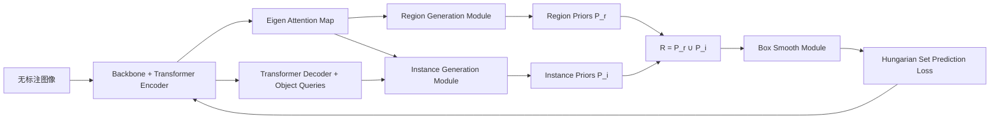

# Unsupervised Object Detection Pretraining with Joint Object Priors Generation and Detector Learning

**论文**：[NeurIPS 论文页面](https://proceedings.neurips.cc/paper_files/paper/2022/hash/50ca96a1a9ebe0b5e5688a504feb6107-Abstract-Conference.html)  
**代码**：未提供  
**发表**：NeurIPS 2022

## 一句话总结

JoinDet 让 Deformable DETR 一边从 encoder 的 eigen attention map 产生 region priors，一边从 decoder 高质量前景预测产生 instance priors，再用 Box Smooth Module 跨轮次平滑融合这些伪框，使“先验生成”和“检测器学习”形成相互促进的闭环。

## 研究背景与问题

无监督检测预训练希望同时预训练 backbone 和 detection head。DETReg 等方法用 Selective Search 生成固定 object priors，再让 DETR 学习这些框；先验生成器与检测器彼此独立，启发式框的漏检和定位误差会成为训练上限，而且检测器训练过程中产生的更好对象知识无法反馈给监督。

JoinDet 从模型自身的两个位置提取互补信息：transformer encoder 的 eigen attention map 能把前景区域从背景中凸显出来，但常把多个实例连成一个区域；decoder 的 query prediction 能分开实例，却在预训练早期包含大量背景框。Region Generation Module 提供区域覆盖，Instance Generation Module 提供实例划分，二者拼接后作为动态 object priors。

动态伪框如果直接替换，会让监督目标跨 epoch 突然出现、消失或跳动。JoinDet 因此使用 Box Smooth Module 把当前 priors 与上轮监督按 IoU 聚类并动量融合，再以 Hungarian set prediction loss 更新 Deformable DETR。每轮更好的检测器产生更好的 priors，改进后的 priors再继续训练检测器。

## 方法总览

## 方法详解

### 1. Region priors

输入 `x` 经 backbone `G` 和 encoder `E` 得到 patch feature `F=E(G(x))`，eigen attention map 为

$$
M=K(F)=K(E(G(x))).
$$

`K(·)` 是论文采用的 eigen attention 计算方法，`M∈R^{h×w}`。阈值取 attention 平均值 `α=(1/hw)Σ_{ij}M_{ij}`，得到二值 mask `m_{ij}=1[M_{ij}>α]`。Region Generation Module 对所有连通前景区域求最小外接矩形，形成 `P^r`。预训练初始监督 `R_0` 则由无监督预训练 backbone 的 attention 直接生成。

### 2. Instance priors

decoder 接收 patch feature `F` 和 object query `q`，输出 `N` 个预测 `P_j=(b̂_j,p̂_j)`，其中 `b̂_j` 是框，`p̂_j` 是前景/背景 logits。softmax 后只保留 argmax 为前景的预测。Instance Generation Module 再计算每个框覆盖的 attention 前景像素数 `N_f` 与总像素数 `N_t`，仅当 `N_f/N_t≥t` 时保留为 `P^i`；论文取 `t=0.5`。这一步用 encoder 的区域证据过滤 decoder 的背景误报。

### 3. Box Smooth Module

当前 priors 为 `R_n=P_n^r∪P_n^i`。模块把 `R_n` 与上一轮监督 `R_{n-1}` 按 IoU 聚成 `K` 个 box cluster。若某 cluster 中有 `T` 个旧框和 `U` 个新框，更新坐标为

$$
b_k=\frac{\sum_{old}m_s s_i b_i+\sum_{new}(1-m_s)s_jb_j}
{\sum_{old}m_s s_i+\sum_{new}(1-m_s)s_j},
$$

分数 `s_k` 取 cluster 内新旧分数的平均。`m_s∈[0,1]` 是旧监督动量，论文设为 0.45；`m_s=1` 时不更新，`m_s=0` 时直接换成当前 priors。该模块同时保留可靠旧框、缓慢修正坐标并抑制伪标签抖动。

### 4. 预训练目标

JoinDet 有前景/背景分类头 `f_cls`、框头 `f_box` 和区域特征重建头 `f_emb`。Box Smooth 后的 `K` 个框 `b_k` 统一赋前景标签 `c_k=1`，并用预训练 SwAV 提取框区域特征 `z_k`，目标为 `y_k=(c_k,b_k,z_k)`。decoder query embedding `v_j` 产生预测 `(p̂_j,b̂_j,ẑ_j)`，Hungarian matching 寻找最小总代价的排列 `σ`。

匹配后损失由 `λ_cL_cls`、目标存在时的 `L_box` 与 `λ_eL_emb` 组成；`L_box` 使用 L1 和 GIoU，`L_emb=||z_j-ẑ_{σ(j)}||_1`。因此预训练不仅学习框和前景性，也重建对象区域的语义特征。

四个步骤按 epoch 交替，而不是每个 iteration 都重新生成伪框：第 `n` 次更新先从当前 encoder/decoder 计算 `P_n^r、P_n^i`，再与 `R_{n-1}` 平滑得到 `R_n`，接下来一段训练日程固定使用 `R_n`。COCO 预训练每 10 epoch 更新一次，既给检测器足够时间拟合当前监督，也避免早期不稳定预测频繁改写目标。Region priors 在初期承担启动器角色；随着 decoder 学到实例定位，instance priors逐步补充分离后的对象框。

JoinDet 与 DETReg 的关键差别并非是否使用 Hungarian loss，两者都沿用 DETR 式集合预测；差别在监督来源。DETReg 的 Selective Search 在预训练前固定，JoinDet 的监督包含模型 encoder 和 decoder 的当前知识。论文可视化显示，训练推进时 eigen attention 的前景响应和生成框同步变得更贴近对象，说明闭环不仅更新伪框，也反过来改善 encoder 的区域表征。

## 实验与证据

JoinDet 以 Deformable DETR 为基线，ResNet-50 backbone 由 SwAV 初始化并在预训练中冻结；在 ImageNet-1K 预训练 5 epoch、COCO 无标签预训练 50 epoch，对象 priors 分别每 1/10 epoch 更新。下游评估为 COCO 和 PASCAL VOC，并与 supervised、SwAV、ReSim、UP-DETR、DETReg 比较。

三个预测头的实现也沿用 DETReg 控制变量：`f_box` 与 `f_emb` 都是带两个 256 维隐藏层和 ReLU 的 MLP，输出维度分别为 4 和 256；`f_cls` 是输出前景/背景两类的单层全连接。预训练数据包括 ImageNet-1K、其 125K 图像的 ImageNet-100 子集以及 COCO，微调数据包括 COCO train2017/val2017 与 VOC trainval07+12/test07。所有主要实验使用 16 张 V100，COCO 预训练加入 large-scale jittering以补偿 attention prior 偏向大目标的问题。

- COCO 低数据微调中，1% 标签下 supervised/DETReg/JoinDet 为 11.31/14.58/15.89 AP；10% 标签下为 26.34/29.12/30.87 AP。JoinDet 相对 DETReg 提升 1.31 和 1.75 AP。
- VOC 全量微调时，COCO 预训练的 DETReg 为 63.4 AP，JoinDet 为 64.4；ImageNet-1K 预训练时为 63.5 与 63.7。
- COCO 全量微调时 JoinDet 为 45.6 AP、64.3 AP50、49.8 AP75，DETReg 为 45.5、64.1、49.9，优势主要体现在低数据和快速收敛。
- 类无关 proposal 评估中，COCO 预训练的 JoinDet 为 3.0 AP、7.4 AP50、17.4 AR@100；DETReg 为 1.3、3.0、11.7。
- 只用模型原始预测作 priors，VOC 25 epoch 微调仅 42.1 AP；只用 region priors 为 53.5，只用 instance priors为 54.8，联合为 55.4。联合方案相对 DETReg 的 53.9 高 1.5 AP。
- priors 直接替换、NMS 更新、Box Smooth 在 VOC 25 epoch 下分别为 53.0、54.5、55.4 AP。Scale jittering 和小框 copy-paste 将固定初始监督的 VOC AP 从 62.3 提升到 63.4、63.5，说明 attention 先验偏向大物体。

ImageNet-100 的类无关 proposal 对比也支持同一结论：JoinDet 为 2.5 AP、5.3 AP50、13.9 AR@100，DETReg 为 1.0、3.1、12.7。换到场景更丰富的 COCO 无标签预训练后，JoinDet 的 AR@100 进一步升至 17.4，论文据此认为动态先验更能利用包含多对象的场景图像。

## 对 YOLO-Agent 的启发

接入点可分成两层。第一层在 YOLO backbone/neck 上生成 eigen attention 或等价的自注意力前景图，构造 region priors；第二层从 YOLO 当前高分解码框中筛 instance priors，再以 Box Smooth 维护跨更新周期的 pseudo-box memory。最终伪框用于预训练 YOLO 的 objectness、分类前景标签与 box regression，而不是照搬 DETR 的 query matching。

对照组建议为：Selective Search 固定伪框；仅 region priors；仅 instance priors；二者直接联合；联合+Box Smooth。预训练质量报告 class-agnostic AP、AP50、AR@100，下游报告 COCO 1%/10% AP 和全量 AP。验收阈值建议：联合 priors 相对单独 instance priors至少提升 0.5 AP，Box Smooth 再提升至少 0.3；COCO 1% 微调需比固定伪框提升 1.0 AP。若 AR@100 上升但低数据 AP 不升，说明伪框覆盖增加却定位/语义质量不足；若小目标 recall 下降，则必须启用 scale jittering 或小框 copy-paste，否则不进入主线。

## 优点

- 先验生成器与检测器共同演化，突破固定启发式 proposal 的上限。
- encoder region 与 decoder instance 信息互补，分别解决覆盖和实例拆分。
- Box Smooth 对动态伪标签的稳定性有直接消融支持。

## 局限

- 依赖 transformer eigen attention，迁移到纯卷积检测器需重新定义区域注意力。
- backbone 在预训练中冻结且区域特征来自外部 SwAV，仍使用了额外表征模型。
- attention 先验偏向大目标；类无关 proposal 与监督训练之间仍有明显差距。

## 评分

- **创新性：9/10**——把对象先验生成纳入检测器自训练闭环。
- **实验充分性：9/10**——覆盖低数据、全量、proposal、先验组合和平滑策略。
- **可迁移性：8/10**——思想通用，但 encoder attention 与 DETR 目标需适配 YOLO。
- **综合评分：8.7/10**
