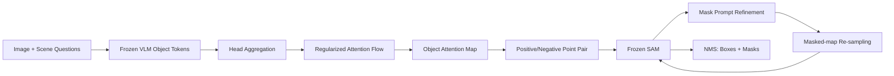

# Training-Free Open-Ended Object Detection and Segmentation via Attention as Prompts

**论文**：[官方论文页面](https://proceedings.neurips.cc/paper_files/paper/2024/hash/80f48ffa8022773973a4a5cec7cce19c-Abstract-Conference.html)  
**代码**：未提供  
**发表**：NeurIPS 2024

## 一句话总结

VL-SAM 不输入预定义类别、也不进行任务训练：CogVLM 先生成图像中的对象词，论文通过 head aggregation 与 regularized attention flow 从这些词回溯图像注意力，再采样正负点提示 SAM，并用 mask prompt、重新采点和 NMS 迭代获得开放式检测框与实例掩码。

## 研究背景与问题

open-set 检测虽能识别训练集外类别，但推理时仍需用户提前给出类别名称；真实驾驶场景中的坑洞、伪装人物或未知障碍往往无法预先枚举。open-ended detection 要求模型自己描述并定位图中对象，不依赖类别清单。已有 GenerateU、LLaVA-Grounding 等方法通常需要在额外图文或 grounding 数据上训练，而且多只输出框。

VL-SAM 将两类冻结基础模型分工：自回归 VLM 负责“有哪些对象”，SAM 负责“对象在哪里”。两者之间的接口不是文本框提示，而是 VLM 生成对象 token 时内部的 attention map。直接平均最后一层注意力质量很差，普通 attention rollout 又会受因果掩码影响发生 attention collapse，因此论文专门设计注意力头加权与正则化跨层传播。

## 方法总览

给定图像，VLM 回答场景问题并列出对象；缓存所有层、所有 head 的 query/key，生成相似矩阵。mean-max head weights 选择重要注意力头，regularized attention flow 跨层传播对象 token 到图像 token 的注意力。Prompt Generation 对注意力图阈值化，最大连通域为正区，采最高响应正点和最低响应负点送入 SAM。Iterative Refinement 先把初始 mask 再作为 mask prompt，然后用 mask 过滤注意力图、重新采正负点，最终 NMS 聚合。多尺度切图与十个问题 prompt ensemble 补足小目标和提问敏感性。

VLM 生成的是自然语言句子，论文先按 Tag2Text 的方式解析对象 tags，再为每个对象 token 单独生成注意力图和 SAM 结果。LVIS 等数据集评测需要固定类别名时，再用 CLIP 文本编码器比较“a {object category}”与数据集类别文本的相似度完成映射。这个类别映射只服务评测；开放式推理本身并不把 LVIS 类别表输入 VLM。

## 方法详解

### 1. Head Aggregation

缓存 VLM 的 query/key，经 causal mask 与 softmax 得到 $S\in\mathbb R^{N\times N\times H\times L}$；$N$ 为 token 数，$H$ 为注意力头数，$L$ 为层数，$S_{i,j}^{h,l}$ 表示第 $l$ 层第 $h$ 个头中 query $i$ 对 key $j$ 的相似度。head weight 为：

$$
W=\mathrm{Mean}(\mathrm{Max}(S,\mathrm{dim}=1),\mathrm{dim}=0),
$$

先取每个 query 的最大 key 响应，再在 query 维平均，衡量每层每头的重要性。聚合结果

$$
S'=\mathrm{Mean}(S\odot W,\mathrm{dim}=2),
$$

$\odot$ 为逐元素乘，dim=2 对所有 head 求平均。

### 2. Regularized Attention Flow

跨层 rollout 递推为

$$
\tilde S_{i,j}^{l}=\sum_{k=1}^{N}(I_{i,k}+S_{i,k}^{prime l})(I_{k,j}+\tilde S_{k,j}^{l-1}),
$$

$I$ 是恒等矩阵，残差项保留 token 自连接。自回归 causal mask 会让左上角 token 在逐层乘法中异常累积；若某列未被 mask 的长度为 $L_0$，论文将该列值乘 $1-(L_0-1)/L$ 进行正则，抑制注意力塌缩。最后选取目标对象 token 对应行和图像 token 列形成二维 attention map。

### 3. SAM Prompt 与迭代

注意力图先阈值过滤弱响应，最大连通域定义正区域，其余为负区域；正点取最高激活位置，负点取最低激活位置。SAM 初始掩码常有粗糙边缘或背景噪声，第一轮把该 mask 再送入 SAM decoder；第二轮用掩码过滤注意力图，再重新采样正负点。多尺度将 $H\times W$ 图像切成四个 $H/2\times W/2$ 角落子图并与整图结果融合；question ensemble 先让 VLM 生成十个适合“列出所有对象”的问题，再汇总各问题结果。

正负点成对输入是为了抑制 attention map 中不稳定的假峰：正点告诉 SAM 要分割哪个实例，负点明确排除最低响应背景。迭代第二阶段再用已有 mask 遮住已解释区域，促使后续采点发现同一对象更准确的部分或其他尚未覆盖的对象。最终 NMS 在多轮、多尺度和多问题输出之间去重，因此其作用对象既包括 box，也包括由 SAM 得到的实例 mask。

## 实验与证据

实现采用 CogVLM-17B（EVA2-CLIP-E + Vicuna-7B-v1.5）和 SAM ViT-H，VLM 输入 490×490、35×35 patches，温度 0.8、top-p 0.1，全部在 80G A800 上以 training-free zero-shot 推理。实验数据为长尾 LVIS minival 与自动驾驶 corner-case 数据集 CODA；比较 GenerateU、LLaVA-Grounding、GroundingDINO、YOLOWorld 等。

- LVIS rare 类 fixed AP 上，VL-SAM box APrare 为 23.4、mask APrare 为 22.7；GenerateU 的 box APrare 为 20.0，VL-SAM 高 3.4，且后者无需在 VG/GRIT 微调并能同时输出 mask。
- CODA 上 VL-SAM 为 40.1 mAR、90.1 AR50、50.5 AR75，高于 LLaVA-Grounding 的 18.4 mAR、YOLOWorld 的 16.1 和 GroundingDINO 的 12.6。GT box 提示 SAM 的 oracle 为 54.1 mAR，VL-SAM 达其 74.1%。
- 主组件消融：naive attention 为 2.2 mAR；attention generation 为 10.1；加入正负点 prompt generation 为 12.3；iterative refinement 为 14.1；再加 multi-scale 为 27.3，最终 question ensemble 为 40.1。
- 注意力生成中，未正则的 attention flow 仅 0.1 mAR，regularization 后 8.5，再加 head weight 达 10.1。模型替换实验中 CogVLM+SAM 为 40.1，MiniGPT-4+SAM 34.7，LLaVA+SAM 37.2，CogVLM+MobileSAM 29.2，均高于论文引用的先前 open-ended 结果 18.4。

CODA 的 oracle 也给出明确上限：即使输入 GT 框，SAM 仍只有 54.1 mAR、64.9 AR75，说明剩余误差不全来自 VLM 注意力，SAM 的过分割和欠分割同样重要。VL-SAM 的 AR50 已达 90.1、接近 oracle 94.1，但 AR75 仅 50.5，后续改进更应关注掩码边界和精确定位，而不只是召回更多对象词。

## 对 YOLO-Agent 的启发

VL-SAM 更适合作为 YOLO-Agent 的“未知对象发现器”而非替换闭集检测头：VLM 生成对象词与注意力候选，SAM 给实例 mask/box，YOLO 负责已知类高速检测；融合层可把与 YOLO 框 IoU 低的 VL-SAM 区域标为 unknown proposal。对照组应为 YOLO-only、naive VLM attention+SAM、完整 VL-SAM、YOLO+VL-SAM；在 CODA 类数据记录 unknown mAR/AR75、已知类 AP、每图延迟和 VLM 幻觉率。

失败阈值需兼顾论文精度与部署：完整 attention generation 若相对 naive attention 不能增加至少 5 mAR，说明 token—图像映射或 causal 正则实现错误；iterative refinement 若增益低于 1 mAR，可删除两轮 SAM；unknown mAR 若低于 20，尚未超过论文中的 LLaVA-Grounding 基线，不应进入 agent 默认链路。若端到端每图延迟超过在线预算，可先关闭十问题 ensemble 和五视图多尺度，因为二者虽把 14.1 推到 40.1 mAR，也是最大计算来源；MobileSAM 版本低于 29.2 mAR 则说明轻量化损失超过论文参考。

## 优点

- 无需预定义类别、额外训练或 grounding 标注，同时输出框与实例 mask。
- attention generation、点提示和迭代细化的接口清晰，可替换不同 VLM/SAM。
- CODA 上相对既有 open-ended 方法提升显著，适合发现长尾角落目标。

## 局限

- 继承 VLM 幻觉，错误对象 token 会产生错误注意力和分割。
- 多问题、多尺度、17B VLM 与 ViT-H SAM 导致推理速度很低。
- SAM 自身存在过分割/欠分割，GT box oracle 也只有 54.1 mAR。
- LVIS 评测还需用 CLIP 把生成对象词映射到预定义类别，类别解析并非完全无歧义。

## 评分

- **方法创新：9/10**——把 VLM 内部注意力变成 SAM 提示，建立免训练开放式链路。
- **实验充分：8.5/10**——覆盖 LVIS、CODA、组件、注意力与模型替换消融。
- **工程可用：6.5/10**——发现能力强，但推理成本和幻觉限制在线部署。
- **综合评分：8.2/10**。
