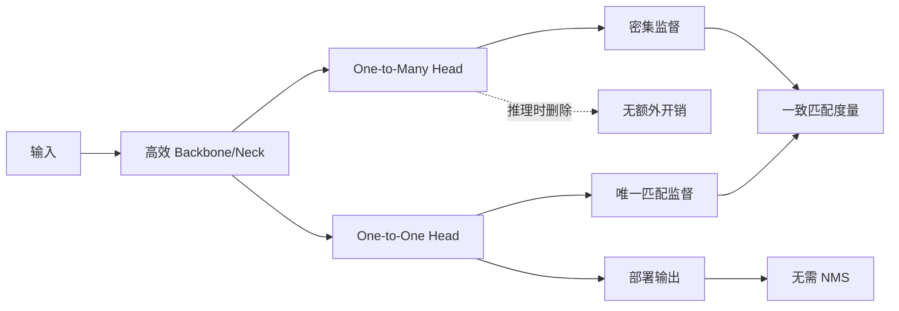

# YOLOv10: Real-Time End-to-End Object Detection

**会议**: NeurIPS 2024  
**论文**: [arXiv](https://arxiv.org/abs/2405.14458)  
**代码**: [THU-MIG/yolov10](https://github.com/THU-MIG/yolov10)  
**任务**: 实时端到端目标检测

## 一句话总结

YOLOv10 用同一个匹配度量协调 one-to-many 与 one-to-one 两个训练头，让密集监督负责学好特征、稀疏监督负责产生唯一预测，推理时只保留 one-to-one 头，从而移除 NMS；同时以延迟而非 FLOPs 为唯一代理，对整条网络进行精度—效率联合设计。

## 背景与问题

传统 YOLO 使用 one-to-many 标签分配，一个真实目标对应多个正样本，训练稳定但会产生重复框，部署时依赖 NMS。NMS 不仅增加延迟，还引入阈值敏感性，并阻碍真正的端到端导出。直接切换为 one-to-one 又会让正样本过少，导致优化困难和精度下降。

另一方面，已有 YOLO 改进经常只看参数量或 FLOPs。深度可分离卷积、复杂检测头等设计在具体硬件上的真实延迟未必与 FLOPs 一致，网络也可能存在通道、下采样和大核模块的冗余。

## 方法总览

## 方法详解

### 1. 一致双重分配

YOLOv10 保留两个检测头：one-to-many 头提供丰富正样本，one-to-one 头学习每个目标只输出一个高质量预测。关键并不是“双头”本身，而是让两个分配策略使用一致的匹配排序。

匹配度量写成分类分数与 IoU 的组合：

$$
m(\alpha,\beta)=s\cdot p^{\alpha}\cdot \operatorname{IoU}(\hat b,b)^{\beta},
$$

其中 one-to-many 与 one-to-one 使用相同的 $\alpha,\beta$，使两头倾向选择相同位置。若两套匹配标准不一致，主干会同时接收互相冲突的监督；保持排序一致后，one-to-many 的丰富监督能够更有效地帮助 one-to-one 头。

### 2. 推理阶段

训练结束后删除 one-to-many 头，仅保留 one-to-one 预测。因此模型直接输出稀疏结果，不再执行 NMS，也不需要为端到端模式额外引入 Transformer 解码器。

### 3. 整体效率—精度设计

- **轻量分类头**：分类与回归的计算需求不同，分类分支使用更轻的结构减少冗余。
- **空间—通道解耦下采样**：先进行空间变换再调整通道，降低传统 stride convolution 的成本。
- **Rank-Guided Block Design**：根据阶段内在秩判断冗余，只在更需要表达能力的阶段使用紧凑倒置块 CIB。
- **大核卷积**：优先放在高分辨率较低的深层阶段，以较低成本扩大感受野。
- **部分自注意力 PSA**：仅对部分通道执行注意力，控制全局建模的延迟。

## 实验与消融

- COCO 上覆盖 N/S/M/B/L/X 六种规模。
- YOLOv10-S 在相近 AP 下比 RT-DETR-R18 快 1.8 倍，参数量和 FLOPs 约小 2.8 倍。
- YOLOv10-B 与 YOLOv9-C 性能相当，但论文报告延迟降低 46%、参数减少 25%。
- YOLOv10-L/X 相比 YOLOv8-L/X 分别提高 0.3/0.5 AP，同时参数量约缩小 1.8/2.3 倍。
- 消融分别验证双重分配、一致匹配度量、轻量头、空间—通道解耦下采样、CIB、大核与 PSA，说明最终结果来自组合设计而非单点技巧。

## 对 YOLO-Agent 的启发

- 将“是否移除 NMS”设为端到端实验开关，必须统计**模型前向 + 解码 + NMS**的全链路延迟。
- 对 one-to-one 分支记录每个 GT 的匹配位置、重复预测率和漏匹配率，检查一致分配是否真正降低监督冲突。
- 架构搜索不应只以 FLOPs 排序，应将目标硬件上的 TensorRT/ONNX 延迟、显存峰值和导出成功率纳入 Harness。
- 建议分两阶段验证：先只接入一致双重分配，再逐项加入效率模块，防止组合改动掩盖负收益组件。

## 优点

- 直接解决 YOLO 部署链路中的 NMS 瓶颈。
- 训练与推理解耦清晰，one-to-many 头不增加部署成本。
- 消融覆盖标签分配和多个架构组件，工程复现路径明确。

## 局限

- one-to-one 训练对标签分配和损失权重更敏感。
- 论文延迟基于特定硬件与官方模型，换后端后排序可能变化。
- 多组件联合优化使得完整复现成本高于只替换单一检测头。

## 评分

- **创新性**: ★★★★☆
- **实验充分度**: ★★★★★
- **部署价值**: ★★★★★
- **YOLO-Agent 参考价值**: ★★★★★
