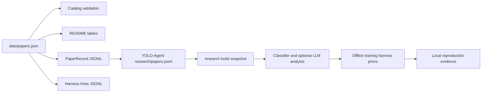

# YOLO-Agent Integration

This repository is an Awesome list and an offline research-prior provider for
[`whut09/YOLO-Agent`](https://github.com/whut09/YOLO-Agent).

## Data Flow



## Export and Sync

```bash
python scripts/catalog.py validate
python scripts/catalog.py export-yolo
python scripts/catalog.py export-hints
python scripts/catalog.py sync-yolo --yolo-root ../YOLO-Agent
cd ../YOLO-Agent
yolo-agent research list --root research --year-from 2021
yolo-agent research build-snapshot --root research --extract-components
```

`sync-yolo` merges by `paper_id`, preserves unrelated records, writes atomically,
and backs up an existing registry to `research/papers.jsonl.bak`.

For a no-LLM snapshot, omit `--extract-components`. Curated `component_ids`,
`task_families`, `detector_family`, and `applicability` remain available.

## Harness Policy

1. Filter by task, deployment constraint, error type, and detector family.
2. Prefer `direct_adapter_candidate` over `recipe_idea_only`.
3. Convert each hint into one minimal paired experiment.
4. Keep imported claims at `paper_prior`; never mix them with local metrics.
5. Promote only improvements reproduced under local data, budget, and seeds.

| Observed problem | Candidate components | Harness action |
|---|---|---|
| Low `AP_small` | SAHI, deformable attention, multi-scale neck | Pilot slicing first, then architecture changes |
| High-score poor boxes | task alignment, IoU-aware classification, DFL | Diagnose confidence-IoU correlation and ablate |
| Duplicate predictions | dual assignment, distinct queries | Compare NMS-free precision and full latency |
| Slow convergence | denoising, hybrid matching | Compare fixed short-budget learning curves |
| New categories | Grounding DINO, YOLO-World, YOLOE | Bootstrap labels, audit precision, retrain |

## Expanding Coverage

```bash
python scripts/discover_arxiv.py --start-year 2021 --max-results 100
```

Review `data/candidates/arxiv.jsonl`, verify links, add accepted records to
`data/papers.json`, and run `python scripts/catalog.py render`.
