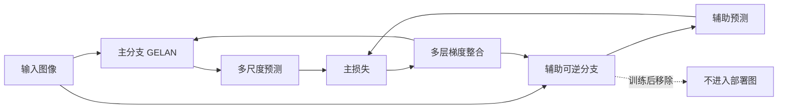

# YOLOv9: Learning What You Want to Learn Using Programmable Gradient Information

**论文**: [arXiv](https://arxiv.org/abs/2402.13616)  
**代码**: [WongKinYiu/yolov9](https://github.com/WongKinYiu/yolov9)  
**任务**: 实时目标检测  
**关键词**: 信息瓶颈、可编程梯度信息、辅助可逆分支、多层辅助信息、GELAN

## 一句话总结

YOLOv9 不只调整检测头或卷积模块，而是追问“损失函数看到的信息是否足够完整”：它用仅训练期存在的 PGI 辅助路径产生更可靠的梯度，再用 GELAN 规划主干中的梯度路径，从而兼顾轻量模型的信息保留、训练效果和推理效率。

## 研究背景与问题

常规检测器默认前向传播得到的深层特征足以代表输入，但下采样、非线性变换和层级压缩会持续丢失信息。若损失函数基于已经严重压缩的特征计算，反向传播的梯度可能只反映残缺信息，浅层网络、窄网络和从零训练模型尤其明显。

作者从信息瓶颈角度区分两个问题：

- **前向信息损失**：输入经过多层变换后，目标相关细节可能不可恢复。
- **监督偏置**：普通深监督中，不同尺度分支只关注各自负责的目标，容易让某层梯度被局部尺度主导。
- **部署约束**：若为了改善训练而永久增加分支，推理成本也会同步增加。

## 核心思路

PGI 把网络拆成三类路径：主分支负责最终推理；辅助可逆分支在训练时保留更完整的输入信息；多层辅助信息模块汇合不同预测层的梯度，使各尺度特征都能获得更完整的目标监督。训练结束后可以删除辅助路径，因此推理图仍保持紧凑。

## 方法详解

### 1. 可编程梯度信息 PGI

PGI 的重点不是一种固定模块，而是一套可按任务配置的梯度路径。主分支保持正常推理结构，辅助分支通过可逆或信息保留能力更强的变换，为损失计算提供更完整的输入线索。这样，主干参数更新不必完全依赖已经经过强压缩的末端特征。

可以把训练目标概括为：

$$
\mathcal{L}=\mathcal{L}_{main}(P_{main},Y)+\lambda\mathcal{L}_{aux}(P_{aux},Y),
$$

其中辅助项的价值不是简单增加一次监督，而是让梯度经过信息更完整的路径返回。辅助分支只服务训练，因此不会直接增加部署延迟。

### 2. 多层辅助信息

目标检测的不同金字塔层通常负责不同尺度目标。普通深监督可能让浅层只学习小目标、深层只学习大目标，其他目标在该分支中被当作背景。YOLOv9 在辅助监督与主分支之间加入整合网络，将多个预测头返回的梯度信息汇总，再传给主分支的不同层级，降低单一尺度监督造成的信息割裂。

### 3. GELAN

GELAN 将 CSPNet 的分流思想与 ELAN 的梯度路径规划结合，并把 ELAN 从“只能堆叠普通卷积”推广为可容纳不同计算块的通用结构。其设计目标不是追逐单一算子，而是在参数量、计算量、梯度路径长度和特征复用之间取得平衡。

### 4. PGI 与 GELAN 的关系

GELAN 优化主网络的信息与梯度流，PGI补充训练时的可靠监督。前者是可部署架构，后者是可拆除训练策略；两者联合才构成论文中的 YOLOv9。

## 实验与证据

- 在 COCO 2017 上从零训练 500 epochs，最后 15 epochs 关闭 Mosaic。
- YOLOv9-C 为 25.3M 参数、102.1G FLOPs，达到 53.0 AP；论文报告其相较 YOLOv7-AF 减少约 42% 参数和 22% 计算量，同时保持相同 AP。
- YOLOv9-E 为 57.3M 参数、189.0G FLOPs，达到 55.6 AP；论文报告其相较 YOLOv8-X 参数减少 16%、计算量减少 27%，AP 提高 1.7。
- 消融实验分别比较 GELAN 深度、不同辅助信息连接方式、普通深监督与完整 PGI，说明收益并非只来自扩大网络。

## 对 YOLO-Agent 的启发

- 将 PGI 作为**训练配方候选**，不要把辅助可逆分支直接并入推理模型。
- Harness 应同时记录主分支与辅助分支的梯度范数、各尺度正样本数和小目标 AP，验证收益是否来自更可靠的多尺度监督。
- 对比实验必须保持主干规模、训练轮数和增强策略一致，并加入“普通深监督”基线，避免把额外监督误判为 PGI 的独特收益。
- 若目标模型已经使用复杂辅助头，优先测试多层梯度整合，而不是继续堆叠预测分支。

## 优点

- 从训练信息质量而非单纯模块堆叠解释检测器改进。
- 辅助结构可在部署时移除，训练收益与推理成本解耦。
- 同一套思想覆盖轻量到大型模型，并配套完整消融。

## 局限

- “信息完整性”较难直接测量，论文主要通过性能与可视化间接证明。
- PGI 增加训练图复杂度、显存占用和实现成本。
- 实验集中于 COCO 检测，迁移到分割、旋转框或开放词汇任务仍需重新验证。

## 评分

- **创新性**: ★★★★☆
- **实验充分度**: ★★★★☆
- **工程可迁移性**: ★★★★☆
- **YOLO-Agent 参考价值**: ★★★★☆
