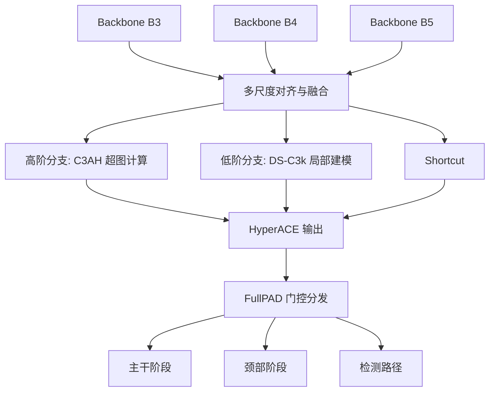

# YOLOv13: Real-Time Object Detection with Hypergraph-Enhanced Adaptive Visual Perception

**论文**: [arXiv](https://arxiv.org/abs/2506.17733)  
**代码**: [iMoonLab/yolov13](https://github.com/iMoonLab/yolov13)  
**任务**: 轻量实时目标检测

## 一句话总结

YOLOv13 认为卷积和普通自注意力主要建模局部或两两关系，难以表达复杂场景中的多对多关联，因此引入自适应超图计算 HyperACE 聚合跨位置、跨尺度的高阶关系，再由 FullPAD 将增强后的全局信息以门控方式送回主干、颈部和检测路径。

## 背景与问题

卷积擅长局部模式，自注意力能够建立 token 两两关系，但复杂检测场景常存在更高阶结构：多个部件共同决定一个物体、多个尺度特征共同描述同一目标、拥挤区域中的多个位置互相约束。若只使用 pairwise correlation，模型可能难以一次表达“一个关系同时连接多个视觉节点”。

## 方法总览

## 方法详解

### 1. 自适应超图计算

普通图的一条边连接两个节点，超边可以同时连接多个节点。YOLOv13 把空间位置或特征单元视为节点，根据特征相似性与可学习关联构造潜在超边，在超边内部聚合多个节点信息，从而表达多对多高阶相关性。

其目标不是固定建立手工超图，而是根据当前输入自适应发现关系，因此不同图像可以形成不同的高阶连接。

### 2. HyperACE

来自 B3/B4/B5 的特征先缩放到共同分辨率并通过 $1\times1$ 卷积融合，然后沿通道拆成三组：

- 高阶分支通过多个并行 C3AH 模块探索不同潜在超图关系；
- 低阶分支使用堆叠 DS-C3k 保留局部细节；
- Shortcut 分支保留原始视觉信息。

最终输出为：

$$
Y=\operatorname{Conv}_{1\times1}(\operatorname{Concat}(X_h,X_l,X_s)).
$$

这种设计避免只追求全局高阶关系而损失局部纹理。

### 3. FullPAD

HyperACE 只生成一次增强特征 $Y$，FullPAD 将其调整到各阶段的分辨率与通道后，通过门控残差分发：

$$
\widetilde F_i=F_i+\gamma_i H_i,
$$

其中 $\gamma_i$ 是可学习缩放系数。论文将增强特征送往七个位置，使高阶信息参与整条流水线，而不是只在 Neck 末端使用一次。

### 4. 轻量模块

为抵消超图计算开销，YOLOv13 使用大核深度可分离卷积构造 DSConv、DS-Bottleneck 和 DS-C3k 等模块，以较少参数保留局部感受野。

## 实验与证据

- 在 MS COCO 上比较 YOLOv6、YOLOv8、YOLOv9、YOLOv10、YOLO11 和 YOLOv12 等实时检测器。
- 论文报告 YOLOv13-N 相比 YOLO11-N 提高 3.0 mAP，相比 YOLOv12-N 提高 1.5 mAP。
- 消融覆盖 HyperACE、高阶/低阶分支、FullPAD 分发位置、门控融合及深度可分离模块，用于区分高阶关系与轻量化带来的收益。
- 论文还报告 CPU 推理结果，强调该结构不仅面向 GPU 吞吐。

## 对 YOLO-Agent 的启发

- 将 HyperACE 视为**跨尺度融合候选**，先替换单个 Neck 聚合节点，不要一次性改完整主干。
- Harness 应比较普通注意力、图注意力与超图模块在匹配参数量和延迟下的收益。
- 记录不同场景复杂度下的效果：拥挤、小目标、多物体共现与遮挡场景最能验证高阶关系假设。
- FullPAD 的分发位置和门控值应被记录；若多个 $\gamma_i$ 收敛到接近零，说明对应注入点没有实际贡献。

## 优点

- 明确瞄准 pairwise 建模不足，并给出高阶关系实现。
- 同时保留全局高阶、局部低阶与原始 shortcut 信息。
- FullPAD 让增强特征贯穿网络，而不是成为孤立插件。

## 局限

- 超图构造与聚合增加实现和部署复杂度。
- 高阶关系的可解释性仍有限，性能提升不能完全证明学到了语义超边。
- 目前主要证据来自 COCO，跨数据集泛化和硬件兼容性仍需独立验证。

## 评分

- **创新性**: ★★★★☆
- **实验充分度**: ★★★★☆
- **部署价值**: ★★★☆☆
- **YOLO-Agent 参考价值**: ★★★★☆
