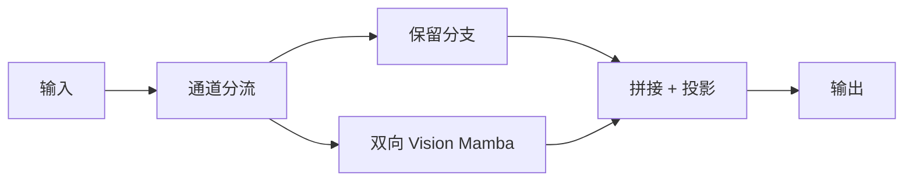

# MambaPSA: A Mamba-based Replacement for C2PSA in YOLO26

**论文**: [arXiv](https://arxiv.org/abs/2607.12681)  
**任务**: 轻量实时检测 / 注意力替换

## 一句话总结

论文把 YOLO26-Nano 中的 C2PSA 注意力块替换为 MambaPSA，并比较在 P3、P4、P5 等不同金字塔层放置双向视觉状态空间模块的效果，目标是在 CPU 和小模型场景下降低全局建模成本。

## 研究背景与问题

YOLO26 的 C2PSA 使用注意力补充全局关系，但矩阵注意力在轻量模型和 CPU 部署中可能带来不成比例的访存与算子开销。状态空间模型以递推状态传递长程信息，理论复杂度随序列长度线性增长。论文因此研究一个很具体的工程问题：不改变 YOLO26 其余训练和检测结构，只替换 C2PSA，是否能获得更好的精度、参数量与实际运行时间折中。

## 方法总览

网络保留 YOLO26-Nano 的 Backbone、Neck 和检测头，只在候选金字塔层把 C2PSA 换成 MambaPSA。作者分别测试单层和多层放置，使实验能够区分“模块本身是否有效”和“放在哪个尺度最有效”。

## 方法详解

MambaPSA 延续 CSP/PSA 的通道分流：一部分特征保留捷径，另一部分进入双向 Vision Mamba，随后拼接和投影。状态空间分支沿两个方向扫描序列，减少单向递推造成的方向偏置。

论文重点不是提出全新检测框架，而是做**放置位置研究**：状态空间模块放在不同尺度层，对感受野、细节保留和运行时间的影响不同。高分辨率 P3 更利于小目标但计算大，低分辨率 P5 成本低但细节有限。

## 实验与证据

- 基于 YOLO26-Nano，在 PASCAL VOC 2007 test 上报告各类别 mAP50:95。
- 比较基线、不同单层放置和多层组合，并报告参数量、FLOPs 与运行时间。
- 结果显示 Mamba 模块并非放得越多越好；位置选择比简单全量替换更重要。
- 论文篇幅和实验规模较小，应视为结构探索而非成熟 SOTA 结论。

## 对 YOLO-Agent 的启发

- 将 `placement={P3,P4,P5}`、扫描方向和状态维度作为 Harness 参数。
- 优先使用 VOC/COCO 小规模短训练筛选位置，再进行完整训练。
- 同时测 GPU、CPU 和导出后端；Mamba 的理论复杂度不等于目标设备延迟。
- 设置 C2PSA、无全局模块和普通卷积大核三个对照组。

## 优点

- 改动边界清晰，适合直接作为 YOLO26 的可插拔模块实验。
- 系统比较不同金字塔位置，而不是只报告一个人工选择的配置。
- 同时关注类别 AP、参数量、FLOPs 与运行时间，评价维度较完整。

## 局限

- 只有两页主体内容，实验数据集和模型规模有限。
- 缺少大规模 COCO 与多硬件验证。
- 状态空间算子在常见边缘推理后端的支持仍不稳定。

## 评分

- **创新性**: ★★★☆☆
- **证据强度**: ★★☆☆☆
- **YOLO-Agent 参考价值**: ★★★☆☆
