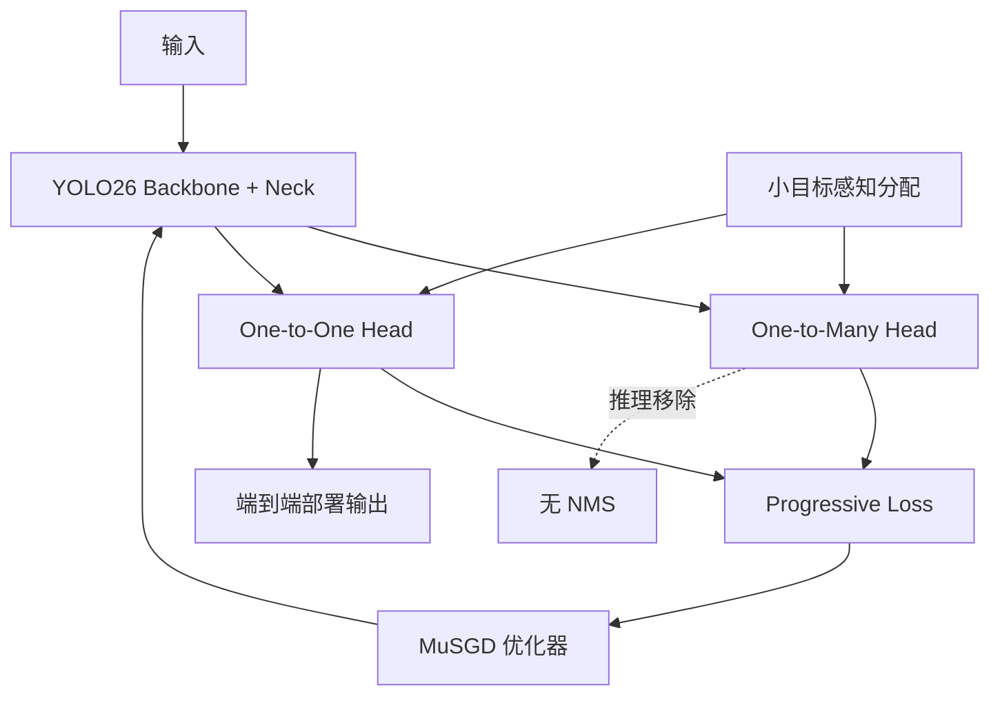

# Ultralytics YOLO26: An End-to-End Edge-Optimized Vision Model

**论文**: [arXiv](https://arxiv.org/abs/2606.03748)  
**代码**: [ultralytics/ultralytics](https://github.com/ultralytics/ultralytics)  
**任务**: 端到端实时检测及统一视觉任务

## 一句话总结

YOLO26 围绕“更容易部署”统一改造 YOLO：双头训练、单头推理实现原生免 NMS；移除 DFL，直接回归边界框以减轻检测头并解除回归范围限制；再用 MuSGD、Progressive Loss 和 STAL 分别解决优化效率、双头监督切换与小目标无正样本问题。

## 背景与问题

论文将现有 YOLO 的工程瓶颈归纳为四点：多数版本推理仍依赖 NMS；DFL 让每个边界回归量扩展为多个离散 logits，检测头偏重且回归范围受限；高精度模型需要很长训练日程；基于中心或尺度约束的标签分配可能让最小目标得不到正样本。

YOLO26 还要求同一套骨干与部署栈支持检测、分割、姿态、分类和旋转框，因此改动不能依赖难以导出的定制算子。

## 方法总览

## 方法详解

### 1. DFL-free 双头架构

YOLO26 延续 one-to-many/one-to-one 双头思路，但回归头不再预测 DFL 的离散分布，而是直接输出四个边界量。相比每个位置输出 $4K$ 个回归 logits，直接回归仅需 4 个标量，减少检测头参数、激活和解码步骤，也避免 `reg_max` 对最大距离的隐式限制。

训练时 one-to-many 头提供密集监督，one-to-one 头对齐实际推理。部署时只保留 one-to-one 头，直接产生端到端预测。

### 2. MuSGD

MuSGD 将 Muon 与 SGD 组合：对适合矩阵更新的二维权重使用 Muon 的正交化更新，对卷积、归一化、偏置等其他参数保留 SGD。其目标是把大模型训练中的优化经验迁移到视觉模型，同时维持 YOLO 训练栈的稳定性。

### 3. Progressive Loss

双头若始终使用固定损失权重，训练目标与推理头可能不一致。Progressive Loss 在训练早期保留较强 one-to-many 监督以稳定特征学习，随后逐渐提高 one-to-one 头权重，让后期优化更贴近部署目标。

可概括为：

$$
\mathcal L(t)=\lambda_{m}(t)\mathcal L_{o2m}+\lambda_{1}(t)\mathcal L_{o2o},
$$

其中 $\lambda_m(t)$ 随训练降低，$\lambda_1(t)$ 随训练提高。

### 4. STAL

STAL 针对极小目标：若按目标自身尺度或中心区域选择候选，目标可能小于当前特征步长，最终没有任何正位置。STAL 引入参考尺度，在不同特征层上保证小目标至少获得合理候选。论文消融中参考尺度 16 的设置使整体 AP 从 46.6 提高到 46.8，小目标 AP 从 29.0 提高到 29.6。

### 5. 多任务扩展

论文还为实例分割加入多尺度 Proto 与辅助语义损失，为姿态估计组合 OKS 与 RLE 损失，为旋转框调整角度定义与角度损失，并将 YOLOE 升级为 YOLOE-26。

## 实验与证据

- 检测模型先在 Objects365-v1 预训练 150 epochs，再按模型规模在 COCO 微调。
- YOLO26 提供 n/s/m/l/x 五个规模；论文报告 COCO 40.9–57.5 mAP，T4 TensorRT FP16 延迟为 1.7–11.8 ms。
- YOLO26s 报告 48.6 mAP、2.5 ms T4 TensorRT 延迟、9.5M 参数和 20.7B FLOPs。
- DFL 消融在 640 与 1280 分辨率上分别比较，论文报告直接回归在完整 YOLO26 配置中均有收益，高分辨率收益更明显。
- MuSGD、Progressive Loss 和 STAL 均有独立消融，避免把训练策略收益混为一体。

## 对 YOLO-Agent 的启发

- 优先验证 DFL-free head：记录检测头参数、输出张量大小、解码时间、远距离/大目标回归误差和量化误差。
- Progressive Loss 应由 Harness 自动扫描起止权重与切换曲线，并同时监控 O2M/O2O 两头 AP 和重复预测率。
- STAL 实验需按目标像素面积分桶，确认收益是否真正集中在小目标，而非整体标签分配变化。
- MuSGD 必须记录训练吞吐、显存、收敛曲线和最终 AP；不能只比较相同 epoch 的结果而忽略每步成本。
- 部署对比应覆盖 ONNX、TensorRT、OpenVINO/TFLite 等目标后端，因为论文的主要价值是导出与边缘运行。

## 优点

- 从检测头、后处理、优化器和标签分配同时面向部署简化。
- 原生覆盖多个视觉任务，并保持标准算子优先。
- 提供跨模型规模的延迟与精度结果及关键组件消融。

## 局限

- 主结果使用 Objects365 预训练与不同长度微调，和纯 COCO 从零训练模型不能直接横向比较。
- MuSGD 引入新的优化器实现与超参数，训练栈兼容性需验证。
- 论文发布较新，第三方复现、量化稳定性和不同边缘芯片结果仍不足。

## 评分

- **创新性**: ★★★★☆
- **实验充分度**: ★★★★☆
- **部署价值**: ★★★★★
- **YOLO-Agent 参考价值**: ★★★★★
